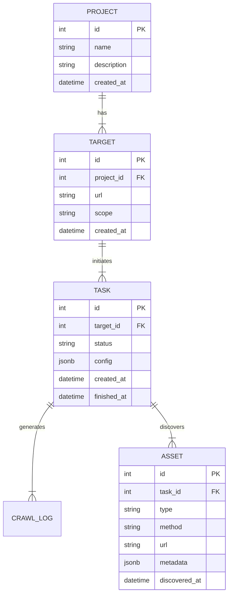

# Database Schema Design

## 1. 개요
EAZY 프로젝트의 데이터 모델링 정의서입니다. `SQLModel` (SQLAlchemy + Pydantic) 기반으로 구현할 예정입니다.
MVP 단계에서는 프로젝트 관리와 공격 표면 식별 데이터를 중점적으로 다룹니다.

## 2. ERD 개략도 (Conceptual)

## 3. 테이블 상세 정의

### 3.1. Projects (프로젝트)
사용자의 진단 그룹 단위.
| Field | Type | Required | Description |
| :--- | :--- | :--- | :--- |
| **id** | Integer | Yes | Primary Key, Auto Increment |
| **name** | String(100) | Yes | 프로젝트 명 |
| **description** | Text | No | 프로젝트 설명 |
| **created_at** | DateTime | Yes | 생성 일시 (UTC) |
| **updated_at** | DateTime | Yes | 수정 일시 (UTC) |

### 3.2. Targets (진단 대상)
프로젝트 내에 포함된 구체적인 진단 URL.
| Field | Type | Required | Description |
| :--- | :--- | :--- | :--- |
| **id** | Integer | Yes | Primary Key |
| **project_id** | Integer | Yes | Foreign Key -> Projects.id |
| **url** | String(2048) | Yes | 진단 대상 Root URL |
| **scope** | Enum | Yes | 진단 범위 (e.g., `DOMAIN`, `SUBDOMAIN`, `URL_ONLY`) |
| **created_at** | DateTime | Yes | 등록 일시 |

### 3.3. Tasks (작업)
크롤링, 스캔, 분석 등 비동기 작업의 실행 단위.
| Field | Type | Required | Description |
| :--- | :--- | :--- | :--- |
| **id** | Integer | Yes | Primary Key |
| **target_id** | Integer | Yes | Foreign Key -> Targets.id |
| **type** | Enum | Yes | 작업 유형 (`ACTIVE_SCAN`, `PASSIVE_SCAN`) |
| **status** | Enum | Yes | 상태 (`PENDING`, `RUNNING`, `COMPLETED`, `FAILED`) |
| **config** | JSONB | No | 작업 실행 옵션 (Depth, Headers, Proxy Port 등) |
| **created_at** | DateTime | Yes | 요청 일시 |
| **started_at** | DateTime | No | 시작 일시 |
| **finished_at** | DateTime | No | 종료 일시 |
| **error_message**| Text | No | 실패 시 에러 로그 |

### 3.4. Assets (공격 표면/자산) - Canonical View
진단 중 식별된 유니크한 애플리케이션 자산 (Deduplicated).
Active/Passive 스캔 모두 이 테이블에 데이터를 UPSERT 합니다.
| Field | Type | Required | Description |
| :--- | :--- | :--- | :--- |
| **id** | Integer | Yes | Primary Key |
| **target_id** | Integer | Yes | Foreign Key -> Targets.id |
| **content_hash**| String(64)| Yes | **Unique Key**. (Method + URL + BodySig)의 Hash. 중복 제거용. |
| **type** | Enum | Yes | 자산 유형 (`URL`, `FORM`, `XHR`) |
| **source** | Enum | Yes | 발견 위치/출처 (`HTML`, `JS`, `NETWORK`, `DOM`) |
| **method** | String(10) | Yes | HTTP Method (GET, POST, etc.) |
| **url** | String(2048) | Yes | 전체 URL 경로 |
| **path** | String(2048) | Yes | URL Path (쿼리 제외) |
| **request_spec** | JSONB | No | 요청 패킷 전체 (Headers, Body, Cookies 등) |
| **response_spec**| JSONB | No | 응답 패킷 전체 (Headers, Body, Status Code) |
| **parameters**   | JSONB | No | 식별된 파라미터 목록 (Name, Type, Location, Value). **JSON은 Flattening 적용 (`key.sub`, `arr[0]`).** |
| **first_seen_at**| DateTime | Yes | 최초 발견 일시 |
| **last_seen_at** | DateTime | Yes | 최근 발견 일시 |
| **last_task_id** | Integer | No | 마지막으로 이 자산을 발견한 Task ID |

### 3.5. AssetDiscoveries (탐지 이력)
특정 Task(스캔)에서 어떤 Asset이 발견되었는지 기록하는 Mapping Table (M:N 관계).
이를 통해 "N번째 스캔 결과"와 "전체 누적 자산"을 구분하여 제공할 수 있습니다.
| Field | Type | Required | Description |
| :--- | :--- | :--- | :--- |
| **id** | Integer | Yes | Primary Key |
| **task_id** | Integer | Yes | Foreign Key -> Tasks.id |
| **asset_id** | Integer | Yes | Foreign Key -> Assets.id |
| **parent_asset_id**| Integer | No | Foreign Key -> Assets.id. (이 자산을 발견하게 된 진입점/부모) |
| **discovered_at**| DateTime | Yes | 발견 시점 |

## 4. 데이터 저장 전략 (Storage Strategy)
1.  **Dual View Strategy (이원화 전략)**:
    *   **Total View (Assets Table)**: 유니크한 공격 표면의 **최신 상태**를 관리합니다. (`content_hash` 기반 중복 제거)
    *   **Scan History (AssetDiscoveries Table)**: 각 스캔 작업(Task)이 발견한 자산의 **이력**을 저장합니다.
    *   *따라서 사용자는 '특정 스캔의 결과'와 '프로젝트 전체 자산'을 언제든지 구분해서 조회할 수 있습니다.*
2.  **JSONB 활용**: 데이터 구조의 유연성을 위해 Request/Response 상세는 JSONB로 저장합니다.
3.  **ORM**: `SQLModel` 사용.
