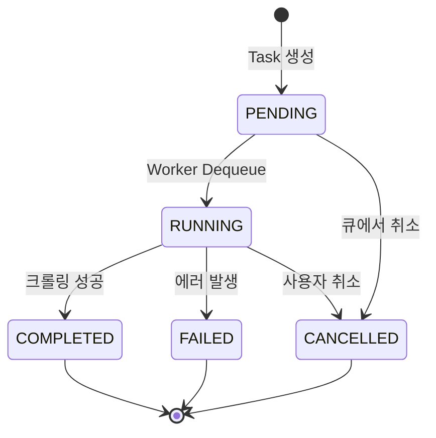
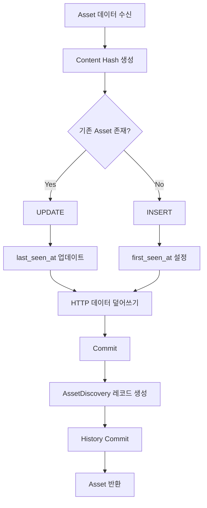
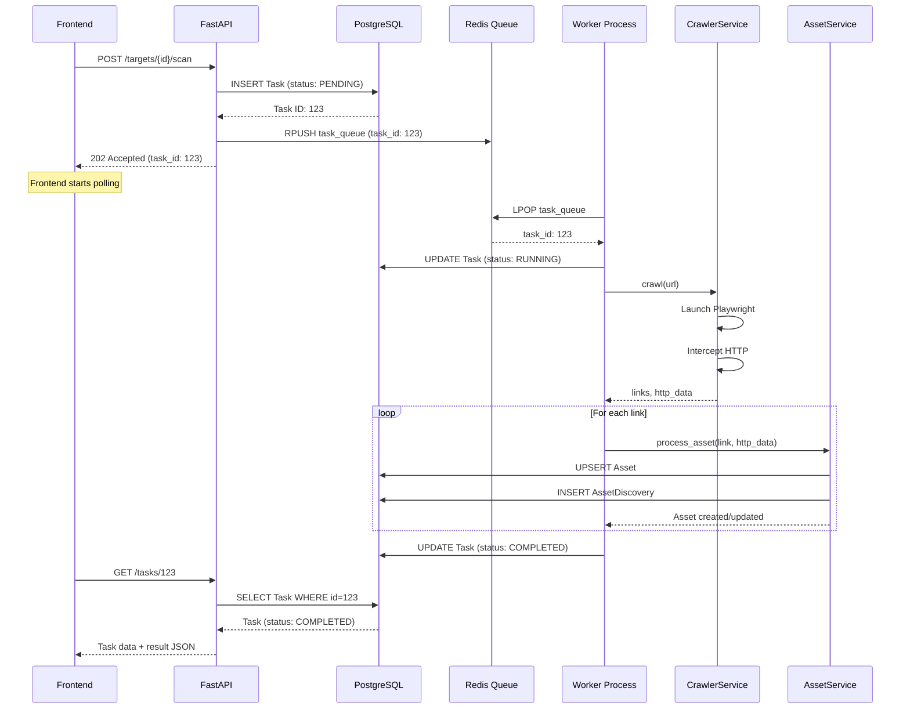
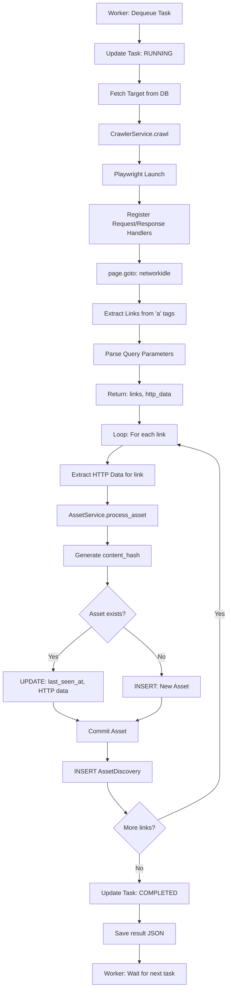
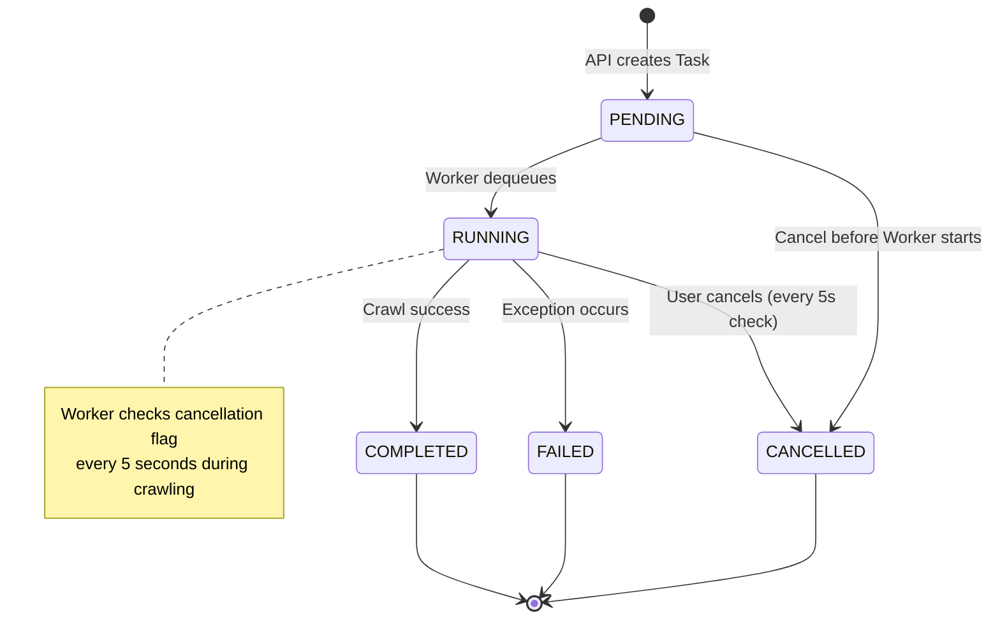

# EAZY Backend 로직 종합 분석

> AI 기반 동적 애플리케이션 보안 테스팅 도구의 백엔드 아키텍처 및 비즈니스 로직 완전 분석

**최종 업데이트**: 2026-01-09
**분석 버전**: 1.0
**프로젝트 버전**: 0.1.0 (MVP)
**분석 범위**: Infrastructure, Services, Task Queue, Crawler, Asset Management

---

## 목차

1. [개요](#1-개요)
2. [인프라스트럭처 레이어](#2-인프라스트럭처-레이어)
3. [도메인 서비스 레이어](#3-도메인-서비스-레이어)
4. [비동기 태스크 관리](#4-비동기-태스크-관리)
5. [웹 크롤링 엔진](#5-웹-크롤링-엔진)
6. [애셋 관리 및 중복 제거](#6-애셋-관리-및-중복-제거)
7. [전체 데이터 플로우](#7-전체-데이터-플로우)
8. [디자인 패턴 및 Best Practices](#8-디자인-패턴-및-best-practices)
9. [성능 및 확장성 고려사항](#9-성능-및-확장성-고려사항)
10. [보안 고려사항](#10-보안-고려사항)
11. [향후 개선 방향](#11-향후-개선-방향)
12. [부록](#부록)

---

## 1. 개요

### 1.1 문서 목적

이 문서는 **EAZY Backend**의 전체 아키텍처와 비즈니스 로직을 심층 분석하여 다음 목적을 달성합니다.

1. **신규 개발자 온보딩**: Backend 구조 및 데이터 플로우 이해
2. **코드 리뷰 기준**: 설계 패턴 및 Best Practices 참조
3. **Phase 6-7 계획**: LLM 통합 및 공격 수행 모듈 설계 시 기반 자료
4. **기술 문서화**: 프로젝트 위키 및 API 문서화 자료

### 1.2 Backend 아키텍처 개요

EAZY Backend는 **Layered Architecture** 패턴을 따르며, 다음 4개 레이어로 구성됩니다.

```
┌─────────────────────────────────────────┐
│   API Layer (Routers/Controllers)       │  FastAPI Endpoints
├─────────────────────────────────────────┤
│   Service Layer (Business Logic)        │  ProjectService, TaskService, CrawlerService, AssetService
├─────────────────────────────────────────┤
│   Repository Layer (Data Access)        │  SQLModel ORM (Async)
├─────────────────────────────────────────┤
│   Infrastructure Layer                  │  DB Engine, Redis, Config, Queue
└─────────────────────────────────────────┘
```

**레이어별 책임**:

| 레이어 | 책임 | 주요 파일 |
|--------|------|----------|
| **API Layer** | HTTP 요청/응답 처리, 데이터 검증 | `app/api/v1/endpoints/*.py` |
| **Service Layer** | 비즈니스 로직, 트랜잭션 관리 | `app/services/*.py` (5개) |
| **Repository Layer** | DB 접근 추상화 (ORM) | SQLModel 모델 (`app/models/*.py`) |
| **Infrastructure** | DB 엔진, Redis, 환경 설정 | `app/core/*.py` |

### 1.3 기술 스택

| 기술 | 버전 | 역할 |
|------|------|------|
| **Python** | 3.12.10 | 백엔드 언어 |
| **FastAPI** | 0.115.0+ | 웹 프레임워크 (비동기, 자동 문서화) |
| **SQLModel** | 0.0.22+ | ORM (Pydantic + SQLAlchemy 통합) |
| **PostgreSQL** | 15 (Alpine) | 메인 데이터베이스 (JSONB 지원) |
| **Redis** | 7 (Alpine) | 비동기 작업 큐 (FIFO Queue) |
| **Playwright** | 1.42.0+ | 브라우저 자동화 (크롤링) |
| **asyncpg** | - | PostgreSQL 비동기 드라이버 |
| **UV** | latest | 고속 Python 패키지 매니저 (Rust 기반) |

---

## 2. 인프라스트럭처 레이어

### 2.1 FastAPI 앱 초기화

**파일 경로**: `/Users/lrtk/Documents/Project/EAZY/backend/app/main.py`

```python
from fastapi import FastAPI
from fastapi.middleware.cors import CORSMiddleware
from app.core.config import settings

app = FastAPI(
    title="EAZY Backend",
    description="AI-Powered DAST Tool API",
    version="0.1.0",
)

# CORS 설정 (MVP: 모든 Origin 허용, 프로덕션: 제한 필요)
app.add_middleware(
    CORSMiddleware,
    allow_origins=["*"],
    allow_credentials=True,
    allow_methods=["*"],
    allow_headers=["*"],
)

# API 라우터 등록
from app.api.v1.endpoints import project, task
api_router = APIRouter()
api_router.include_router(project.router, prefix="/projects", tags=["projects"])
api_router.include_router(task.router, tags=["tasks"])

app.include_router(api_router, prefix=settings.API_V1_STR)

@app.get("/health")
async def health_check():
    """Health check endpoint"""
    return {"status": "ok"}
```

**주요 특징**:
- **자동 문서화**: Swagger UI (`/docs`), ReDoc (`/redoc`)
- **CORS Middleware**: 크로스 오리진 요청 허용 (프론트엔드 통신)
- **모듈화된 라우터**: `project`, `task` 엔드포인트 분리

---

### 2.2 환경 설정 관리

**파일 경로**: `/Users/lrtk/Documents/Project/EAZY/backend/app/core/config.py`

```python
from pydantic_settings import BaseSettings, SettingsConfigDict

class Settings(BaseSettings):
    API_V1_STR: str = "/api/v1"
    PROJECT_NAME: str = "EAZY Backend"

    # PostgreSQL
    POSTGRES_USER: str = "postgres"
    POSTGRES_PASSWORD: str = "postgres"
    POSTGRES_SERVER: str = "localhost"
    POSTGRES_PORT: str = "5432"
    POSTGRES_DB: str = "eazy_db"

    @property
    def DATABASE_URL(self) -> str:
        return f"postgresql+asyncpg://{self.POSTGRES_USER}:{self.POSTGRES_PASSWORD}@{self.POSTGRES_SERVER}:{self.POSTGRES_PORT}/{self.POSTGRES_DB}"

    # Redis
    REDIS_URL: str = "redis://localhost:6379/0"

    # Security
    SECRET_KEY: str = "CHANGE_THIS_TO_A_SECURE_KEY_IN_PRODUCTION"
    ACCESS_TOKEN_EXPIRE_MINUTES: int = 60 * 24 * 8  # 8 days

    model_config = SettingsConfigDict(case_sensitive=True, env_file=".env")

settings = Settings()
```

**Pydantic Settings의 장점**:
1. **환경 변수 자동 로드**: `.env` 파일에서 자동 읽기
2. **타입 검증**: 정수, 문자열 등 타입 자동 변환
3. **Computed Property**: `DATABASE_URL` 동적 생성
4. **설정 중앙화**: 전역 `settings` 객체로 접근

---

### 2.3 데이터베이스 엔진

**파일 경로**: `/Users/lrtk/Documents/Project/EAZY/backend/app/core/db.py`

```python
from sqlalchemy.ext.asyncio import create_async_engine, async_sessionmaker
from sqlmodel.ext.asyncio.session import AsyncSession
from app.core.config import settings

# Async Engine 생성
engine = create_async_engine(
    settings.DATABASE_URL,
    echo=False,  # SQL 로그 출력 (개발: True, 프로덕션: False)
    future=True,  # SQLAlchemy 2.0 스타일
    pool_pre_ping=True,  # Connection 유효성 검사
)

# Session Factory
async_session_maker = async_sessionmaker(
    engine,
    class_=AsyncSession,
    expire_on_commit=False  # Commit 후에도 객체 접근 가능
)

async def get_db():
    """Dependency Injection용 DB 세션 생성기"""
    async with async_session_maker() as session:
        yield session
```

**핵심 개념**:

1. **Connection Pooling**:
   - SQLAlchemy는 기본적으로 5-20개 Connection Pool 유지
   - `pool_pre_ping=True`: 재사용 전 Connection 상태 확인 (Stale Connection 방지)

2. **Async Session**:
   - `async with` 컨텍스트 매니저로 자동 세션 종료
   - `expire_on_commit=False`: Commit 후에도 객체 속성 접근 가능 (추가 쿼리 없음)

3. **Dependency Injection**:
   ```python
   @router.get("/projects/")
   async def get_projects(db: AsyncSession = Depends(get_db)):
       # db는 자동으로 주입되고, 요청 종료 시 close
       pass
   ```

---

### 2.4 Redis 연결

**파일 경로**: `/Users/lrtk/Documents/Project/EAZY/backend/app/core/redis.py`

```python
from redis.asyncio import Redis
from app.core.config import settings

async def get_redis() -> Redis:
    """Dependency Injection용 Redis 클라이언트 생성기"""
    redis = Redis.from_url(
        settings.REDIS_URL,
        decode_responses=True  # 바이트 대신 문자열 반환
    )
    try:
        yield redis
    finally:
        await redis.close()
```

**Redis 용도**:
1. **Task Queue (FIFO)**: `RPUSH` (Enqueue) / `LPOP` (Dequeue)
2. **Task Cancellation Flag**: `SET task:{id}:cancel 1`
3. **Future Caching**: LLM 분석 결과 캐싱 (Phase 7 계획)

**Redis 데이터 구조**:
```
eazy_task_queue (LIST): [task_json, task_json, ...]
task:123:cancel (STRING): "1" (TTL: 3600초)
```

---

### 2.5 Dependency Injection 패턴

FastAPI의 **Depends** 시스템을 활용한 의존성 주입:

```python
from fastapi import Depends
from sqlmodel.ext.asyncio.session import AsyncSession
from redis.asyncio import Redis

@router.post("/projects/{project_id}/targets/{target_id}/scan")
async def trigger_scan(
    project_id: int,
    target_id: int,
    db: AsyncSession = Depends(get_db),
    redis: Redis = Depends(get_redis)
):
    task_service = TaskService(db, redis)
    task = await task_service.create_scan_task(project_id, target_id)
    return {"status": "pending", "task_id": task.id}
```

**장점**:
1. **테스트 용이성**: Mock 객체로 쉽게 교체
2. **자동 리소스 관리**: 요청 종료 시 자동으로 `close()` 호출
3. **코드 간결성**: 보일러플레이트 제거

---

## 3. 도메인 서비스 레이어

### 3.1 Project Service (프로젝트 관리)

**파일 경로**: `/Users/lrtk/Documents/Project/EAZY/backend/app/services/project_service.py`

#### 3.1.1 CRUD 기본 구조

```python
class ProjectService:
    def __init__(self, session: AsyncSession):
        self.session = session

    async def create_project(self, project_in: ProjectCreate) -> Project:
        """프로젝트 생성"""
        db_project = Project.model_validate(project_in)
        self.session.add(db_project)
        await self.session.commit()
        await self.session.refresh(db_project)
        return db_project

    async def get_projects(self, skip: int = 0, limit: int = 100, archived: bool = False) -> List[Project]:
        """프로젝트 목록 조회 (아카이브 필터)"""
        query = select(Project).where(Project.is_archived == archived).offset(skip).limit(limit)
        result = await self.session.exec(query)
        return result.all()

    async def get_project(self, project_id: int) -> Optional[Project]:
        """단일 프로젝트 조회"""
        return await self.session.get(Project, project_id)

    async def update_project(self, project_id: int, project_update: ProjectUpdate) -> Optional[Project]:
        """프로젝트 수정 (Partial Update)"""
        db_project = await self.session.get(Project, project_id)
        if not db_project:
            return None

        # Pydantic의 exclude_unset: 제공된 필드만 업데이트
        update_data = project_update.model_dump(exclude_unset=True)
        for key, value in update_data.items():
            setattr(db_project, key, value)

        db_project.updated_at = utc_now()
        self.session.add(db_project)
        await self.session.commit()
        await self.session.refresh(db_project)
        return db_project
```

**핵심 패턴**:

1. **Pydantic 모델 검증**:
   - `ProjectCreate` (입력 데이터) → `Project` (DB 엔티티) 변환
   - `model_validate()`: 자동 타입 변환 및 유효성 검증

2. **Partial Update**:
   - `exclude_unset=True`: 클라이언트가 보낸 필드만 업데이트
   - 예: `{"name": "New Name"}` → `description`은 그대로 유지

3. **Refresh Pattern**:
   - `await session.refresh(db_project)`: DB 생성 필드 (`id`, `created_at`) 로드

---

#### 3.1.2 Soft Delete 패턴

```python
async def archive_project(self, project_id: int) -> bool:
    """프로젝트 아카이브 (Soft Delete)"""
    db_project = await self.session.get(Project, project_id)
    if not db_project:
        return False

    db_project.is_archived = True
    db_project.archived_at = utc_now()
    db_project.updated_at = utc_now()

    self.session.add(db_project)
    await self.session.commit()
    return True

async def delete_project_permanent(self, project_id: int) -> bool:
    """프로젝트 영구 삭제 (Hard Delete)"""
    db_project = await self.session.get(Project, project_id)
    if not db_project:
        return False

    await self.session.delete(db_project)
    await self.session.commit()
    return True

async def restore_project(self, project_id: int) -> bool:
    """아카이브 프로젝트 복원"""
    db_project = await self.session.get(Project, project_id)
    if not db_project:
        return False

    db_project.is_archived = False
    db_project.archived_at = None
    db_project.updated_at = utc_now()

    self.session.add(db_project)
    await self.session.commit()
    return True
```

**Soft Delete 장점**:
1. **데이터 복구 가능**: 실수로 삭제한 데이터 복원
2. **감사 추적**: 삭제 시점 (`archived_at`) 기록
3. **관계 유지**: 하위 데이터 (Target, Task) 보존

**Trade-off**:
- **쿼리 복잡도 증가**: `WHERE is_archived = false` 필터 필수
- **인덱스 전략**: `is_archived` 컬럼에 인덱스 추가 권장

---

#### 3.1.3 Bulk Operations (일괄 작업)

```python
async def restore_projects(self, project_ids: List[int]) -> int:
    """일괄 복원 (Frontend Bulk Selection용)"""
    count = 0
    for project_id in project_ids:
        if await self.restore_project(project_id):
            count += 1
    return count
```

**최적화 여지**:
- 현재: N번의 개별 `UPDATE` (트랜잭션 N개)
- 개선안: 단일 쿼리로 처리 (트랜잭션 1개)
  ```python
  stmt = update(Project).where(
      Project.id.in_(project_ids),
      Project.is_archived == True
  ).values(is_archived=False, archived_at=None)
  await self.session.exec(stmt)
  ```

---

### 3.2 Target Service (스캔 대상 관리)

**파일 경로**: `/Users/lrtk/Documents/Project/EAZY/backend/app/services/target_service.py`

#### 3.2.1 CASCADE 삭제 체인

```python
class TargetService:
    async def delete_target(self, target_id: int) -> bool:
        """Target 삭제 (CASCADE로 하위 데이터 자동 삭제)"""
        db_target = await self.session.get(Target, target_id)
        if not db_target:
            return False

        await self.session.delete(db_target)
        await self.session.commit()
        return True
```

**삭제 체인 (PostgreSQL CASCADE)**:
```
Target 삭제
  ├─> Tasks (ON DELETE CASCADE)
  │     └─> AssetDiscoveries (ON DELETE CASCADE)
  └─> Assets (ON DELETE CASCADE)
        └─> AssetDiscoveries (parent_asset_id FK)
```

**SQLModel 정의 (Foreign Key Cascade)**:
```python
# models/target.py
class Target(SQLModel, table=True):
    id: int = Field(primary_key=True)
    project_id: int = Field(
        sa_column=Column(ForeignKey("projects.id", ondelete="CASCADE"))
    )

# models/task.py
class Task(SQLModel, table=True):
    target_id: int = Field(
        sa_column=Column(ForeignKey("targets.id", ondelete="CASCADE"))
    )
```

---

#### 3.2.2 TargetScope Enum (스캔 범위 제어)

```python
class TargetScope(str, Enum):
    DOMAIN = "domain"          # 전체 도메인 (example.com + *.example.com)
    SUBDOMAIN = "subdomain"    # 특정 서브도메인만 (api.example.com)
    URL_ONLY = "url_only"      # 단일 URL만

class Target(SQLModel, table=True):
    scope: TargetScope = Field(default=TargetScope.DOMAIN)
```

**크롤러 적용 예시**:
```python
async def should_crawl_url(url: str, target_scope: TargetScope, target_url: str) -> bool:
    target_domain = urlparse(target_url).netloc
    url_domain = urlparse(url).netloc

    if target_scope == TargetScope.URL_ONLY:
        return url == target_url
    elif target_scope == TargetScope.SUBDOMAIN:
        return url_domain == target_domain
    elif target_scope == TargetScope.DOMAIN:
        # 서브도메인 포함 (api.example.com, www.example.com → example.com)
        return url_domain.endswith(target_domain) or url_domain == target_domain
```

---

## 4. 비동기 태스크 관리

### 4.1 Task Manager (Redis Queue)

**파일 경로**: `/Users/lrtk/Documents/Project/EAZY/backend/app/core/queue.py`

#### 4.1.1 FIFO Queue 구조

```python
class TaskManager:
    def __init__(self, redis: Redis):
        self.redis = redis
        self.queue_key = "eazy_task_queue"  # Redis LIST 키

    async def enqueue_crawl_task(self, project_id: int, target_id: int, db_task_id: int) -> str:
        """
        크롤링 작업을 큐에 추가 (FIFO 순서)

        Returns:
            str: 큐 추적용 UUID (Redis 내부 ID)
        """
        task_id = str(uuid.uuid4())
        payload = {
            "id": task_id,
            "db_task_id": db_task_id,  # PostgreSQL Task ID (Worker가 상태 업데이트 시 사용)
            "type": TaskType.CRAWL.value,
            "project_id": project_id,
            "target_id": target_id,
            "timestamp": str(datetime.now())
        }

        # RPUSH: 리스트 오른쪽에 추가 (Enqueue)
        await self.redis.rpush(self.queue_key, json.dumps(payload))
        return task_id

    async def dequeue_task(self) -> Optional[Dict[str, Any]]:
        """
        큐에서 작업 추출 (FIFO)

        Returns:
            Optional[Dict]: 작업 페이로드 또는 None (큐 비어있음)
        """
        # LPOP: 리스트 왼쪽에서 추출 (Dequeue)
        data = await self.redis.lpop(self.queue_key)
        if data:
            return json.loads(data)
        return None
```

**Redis LIST 동작 원리**:
```
RPUSH eazy_task_queue {"id": "1", ...}  # [task1]
RPUSH eazy_task_queue {"id": "2", ...}  # [task1, task2]
LPOP eazy_task_queue                     # task1 반환, [task2] 남음
```

**장점**:
1. **원자성 (Atomicity)**: `LPOP`은 원자적 연산 (동시 Worker도 안전)
2. **순서 보장**: FIFO 순서로 처리
3. **영속성**: Redis AOF/RDB로 큐 데이터 보존

---

### 4.2 Task 생성 및 Enqueue

**파일 경로**: `/Users/lrtk/Documents/Project/EAZY/backend/app/services/task_service.py`

```python
class TaskService:
    def __init__(self, session: AsyncSession, redis: Redis):
        self.session = session
        self.redis = redis
        self.task_manager = TaskManager(redis)

    async def create_scan_task(self, project_id: int, target_id: int) -> Task:
        """
        스캔 작업 생성 (DB 레코드 + Redis 큐)

        1. Task 레코드 생성 (status: PENDING)
        2. Redis Queue에 작업 Enqueue
        3. Worker가 비동기로 처리
        """
        # 1. DB에 Task 레코드 생성
        task = Task(
            project_id=project_id,
            target_id=target_id,
            type=TaskType.CRAWL,
            status=TaskStatus.PENDING
        )
        self.session.add(task)
        await self.session.commit()
        await self.session.refresh(task)

        # 2. Redis Queue에 Enqueue
        queue_id = await self.task_manager.enqueue_crawl_task(
            project_id,
            target_id,
            db_task_id=task.id  # Worker가 DB 업데이트 시 사용
        )

        return task
```

**API 엔드포인트 (스캔 트리거)**:
```python
@router.post("/projects/{project_id}/targets/{target_id}/scan")
async def trigger_scan(
    project_id: int,
    target_id: int,
    db: AsyncSession = Depends(get_db),
    redis: Redis = Depends(get_redis)
):
    task_service = TaskService(db, redis)
    task = await task_service.create_scan_task(project_id, target_id)

    # 202 Accepted: 작업이 큐에 들어갔으나 아직 실행되지 않음
    return {"status": "pending", "task_id": task.id}
```

---

### 4.3 Task 상태 머신

**파일 경로**: `/Users/lrtk/Documents/Project/EAZY/backend/app/models/task.py`

```python
class TaskStatus(str, Enum):
    PENDING = "pending"      # 큐 대기 중
    RUNNING = "running"      # Worker가 실행 중
    COMPLETED = "completed"  # 성공 완료
    FAILED = "failed"        # 에러 발생
    CANCELLED = "cancelled"  # 사용자가 취소
```

**상태 전이 다이어그램**:



**상태 전이 규칙**:

| 현재 상태 | 가능한 전이 | 제약 조건 |
|----------|-----------|----------|
| PENDING | RUNNING, CANCELLED | Worker가 Dequeue 시 RUNNING |
| RUNNING | COMPLETED, FAILED, CANCELLED | 실행 중 5초마다 취소 플래그 확인 |
| COMPLETED | - (종료 상태) | 재실행 불가 |
| FAILED | - (종료 상태) | 재실행 불가 (새 Task 생성 필요) |
| CANCELLED | - (종료 상태) | 재실행 불가 |

---

### 4.4 Task 취소 메커니즘

#### 4.4.1 취소 API

```python
async def cancel_task(self, task_id: int) -> Task:
    """
    Task 취소 (Redis Flag + DB 상태 업데이트)

    Raises:
        ValueError: Task가 이미 완료/실패/취소 상태인 경우
    """
    # 1. Task 조회
    task = await self.session.get(Task, task_id)
    if not task:
        raise ValueError(f"Task {task_id} not found")

    # 2. 상태 검증 (COMPLETED/FAILED/CANCELLED는 취소 불가)
    if task.status in [TaskStatus.COMPLETED, TaskStatus.FAILED, TaskStatus.CANCELLED]:
        raise ValueError(
            f"Cannot cancel task in {task.status} state. "
            f"Only PENDING or RUNNING tasks can be cancelled."
        )

    # 3. Redis 취소 플래그 설정 (Worker가 확인)
    cancel_key = f"task:{task_id}:cancel"
    await self.redis.set(cancel_key, "1", ex=3600)  # 1시간 TTL

    # 4. DB 상태 업데이트
    task.status = TaskStatus.CANCELLED
    task.completed_at = datetime.now(timezone.utc).replace(tzinfo=None)
    self.session.add(task)
    await self.session.commit()
    await self.session.refresh(task)

    return task
```

#### 4.4.2 Worker의 취소 확인 로직

**파일 경로**: `/Users/lrtk/Documents/Project/EAZY/backend/app/worker.py`

```python
async def check_cancellation(task_manager: TaskManager, task_id: int) -> bool:
    """Redis 플래그 확인"""
    cancel_key = f"task:{task_id}:cancel"
    cancel_flag = await task_manager.redis.get(cancel_key)
    return cancel_flag is not None

async def process_one_task(session: AsyncSession, task_manager: TaskManager) -> bool:
    """Worker의 Task 처리 루프"""
    # ... (Dequeue 및 Task 시작)

    # 크롤링 중 5초마다 취소 확인
    last_check_time = asyncio.get_event_loop().time()
    for link in links:
        current_time = asyncio.get_event_loop().time()
        if current_time - last_check_time >= 5.0:
            is_cancelled = await check_cancellation(task_manager, task_id)
            if is_cancelled:
                logger.info(f"Task {task_id} cancelled by user")

                # 상태 업데이트
                task_record.status = TaskStatus.CANCELLED
                task_record.completed_at = utc_now()
                task_record.result = json.dumps({
                    "cancelled": True,
                    "processed_links": saved_count,
                    "total_links": len(links),
                    "message": "Task cancelled by user"
                })
                await session.commit()

                # Redis 플래그 정리
                await task_manager.redis.delete(f"task:{task_id}:cancel")
                return True

            last_check_time = current_time

        # 크롤링 계속...
```

**취소 시나리오**:
1. **사용자가 Frontend에서 취소 버튼 클릭**
2. **API 호출**: `POST /tasks/{id}/cancel`
3. **TaskService**: Redis 플래그 설정 + DB 상태 업데이트
4. **Worker**: 5초마다 플래그 확인 → 감지 시 즉시 중단
5. **결과**: `result` JSON에 처리된 링크 수 기록

---

### 4.5 Worker 프로세스

**파일 경로**: `/Users/lrtk/Documents/Project/EAZY/backend/app/worker.py`

#### 4.5.1 Worker 메인 루프

```python
async def run_worker() -> None:
    """
    독립 프로세스로 실행되는 Worker

    실행 명령:
        uv run python -m app.worker
    """
    # Redis 및 DB 연결 초기화
    redis = Redis.from_url(settings.REDIS_URL, decode_responses=True)
    task_manager = TaskManager(redis)

    engine = create_async_engine(settings.DATABASE_URL, echo=False, future=True)
    async_session = async_sessionmaker(engine, class_=AsyncSession, expire_on_commit=False)

    logger.info("Worker started. Waiting for tasks...")

    try:
        while True:
            async with async_session() as session:
                processed = await process_one_task(session, task_manager)
                if not processed:
                    # 큐가 비어있으면 1초 대기 (CPU 점유율 낮추기)
                    await asyncio.sleep(1)
    except KeyboardInterrupt:
        logger.info("Worker stopped by user")
    finally:
        await redis.close()
        await engine.dispose()

if __name__ == "__main__":
    asyncio.run(run_worker())
```

**Worker 특징**:
1. **독립 프로세스**: API 서버와 별도로 실행 (확장성)
2. **무한 루프**: 큐를 지속적으로 폴링
3. **Graceful Shutdown**: `KeyboardInterrupt`로 안전하게 종료
4. **DB 세션 격리**: 각 작업마다 새 세션 사용 (트랜잭션 격리)

#### 4.5.2 Task 실행 로직

```python
async def process_one_task(session: AsyncSession, task_manager: TaskManager) -> bool:
    """
    단일 Task 처리

    Returns:
        bool: Task 처리 여부 (True: 처리함, False: 큐 비어있음)
    """
    # 1. Dequeue (원자적 연산)
    task_data = await task_manager.dequeue_task()
    if not task_data:
        return False

    logger.info(f"Processing task: {task_data}")

    db_task_id = task_data.get("db_task_id")
    target_id = task_data.get("target_id")

    # 2. Task 레코드 조회
    stmt = select(Task).where(Task.id == db_task_id)
    result = await session.exec(stmt)
    task_record = result.first()

    if not task_record:
        logger.error(f"Task record {db_task_id} not found")
        return True  # 큐에서는 제거 (invalid task)

    # 3. 상태 업데이트: PENDING → RUNNING
    task_record.status = TaskStatus.RUNNING
    task_record.started_at = utc_now()
    session.add(task_record)
    await session.commit()

    # 4. 크롤링 실행
    try:
        target = await session.get(Target, target_id)
        if not target:
            raise ValueError(f"Target {target_id} not found")

        crawler = CrawlerService()
        links, http_data = await crawler.crawl(target.url)

        # 5. Asset 저장
        asset_service = AssetService(session)
        saved_count = 0

        for link in links:
            # 취소 확인 (5초마다)
            # ... (위 4.4.2 참조)

            # HTTP 데이터 추출
            link_http_data = http_data.get(link, {})
            request_data = link_http_data.get("request")
            response_data = link_http_data.get("response")
            parameters_data = link_http_data.get("parameters")

            # Asset 처리
            await asset_service.process_asset(
                target_id=target_id,
                task_id=db_task_id,
                url=link,
                method=request_data.get("method", "GET") if request_data else "GET",
                type=AssetType.URL,
                source=AssetSource.HTML,
                request_spec=request_data,
                response_spec=response_data,
                parameters=parameters_data
            )
            saved_count += 1

        # 6. 상태 업데이트: RUNNING → COMPLETED
        task_record.status = TaskStatus.COMPLETED
        task_record.completed_at = utc_now()
        task_record.result = json.dumps({
            "found_links": len(links),
            "saved_assets": saved_count
        })
        session.add(task_record)
        await session.commit()

    except Exception as e:
        # 7. 에러 처리: RUNNING → FAILED
        logger.error(f"Task execution failed: {e}")
        task_record.status = TaskStatus.FAILED
        task_record.completed_at = utc_now()
        task_record.result = json.dumps({"error": str(e)})
        session.add(task_record)
        await session.commit()

    return True
```

**에러 처리 전략**:
1. **Task 레벨 에러**: `status=FAILED`, `result={"error": "..."}` 저장
2. **로그 기록**: `logger.error()`로 에러 추적
3. **트랜잭션 안전성**: `commit()` 전 에러 발생 시 자동 롤백

---

## 5. 웹 크롤링 엔진

### 5.1 Playwright 자동화

**파일 경로**: `/Users/lrtk/Documents/Project/EAZY/backend/app/services/crawler_service.py`

#### 5.1.1 크롤러 구조

```python
class CrawlerService:
    """Playwright 기반 웹 크롤러 (HTTP Interception 포함)"""

    MAX_BODY_SIZE = 10 * 1024  # 10KB 제한

    async def crawl(self, url: str) -> tuple[List[str], Dict[str, Dict[str, Any]]]:
        """
        단일 페이지 크롤링

        Returns:
            Tuple[List[str], Dict]:
                - 발견된 URL 목록
                - HTTP 데이터 (URL → {request, response, parameters})
        """
        links: Set[str] = set()
        http_data: Dict[str, Dict[str, Any]] = {}

        async with async_playwright() as p:
            browser = await p.chromium.launch()
            context = await browser.new_context(ignore_https_errors=True)
            page = await context.new_page()

            # Request/Response Interceptor 등록
            page.on("request", handle_request)
            page.on("response", handle_response)

            try:
                # 페이지 로드 (JS 렌더링 완료까지 대기)
                await page.goto(url, wait_until="networkidle")

                # <a> 태그에서 링크 추출
                elements = await page.locator("a").all()
                for element in elements:
                    href = await element.get_attribute("href")
                    if href:
                        links.add(href)

                        # Query Parameter 파싱
                        params = parse_query_params(href)
                        if href not in http_data:
                            http_data[href] = {}
                        http_data[href]["parameters"] = params

            except Exception as e:
                print(f"Crawl error: {e}")
            finally:
                await context.close()
                await browser.close()

        return list(links), http_data
```

**Playwright 설정 포인트**:
1. **`ignore_https_errors=True`**: 자체 서명 인증서 무시
2. **`wait_until="networkidle"`**: 네트워크 요청이 500ms 동안 없을 때까지 대기
3. **`page.locator("a").all()`**: CSS 선택자로 모든 링크 추출

---

### 5.2 HTTP Interception (요청/응답 가로채기)

#### 5.2.1 Request Interceptor

```python
async def handle_request(request: Request) -> None:
    """
    브라우저에서 발생하는 모든 HTTP 요청 캡처
    """
    try:
        req_url = request.url
        headers = dict(request.headers)

        # POST/PUT/PATCH의 Body 추출
        body: Optional[str] = None
        if request.method in ["POST", "PUT", "PATCH"]:
            try:
                post_data = request.post_data
                if post_data:
                    # 10KB 초과 시 자르기
                    if len(post_data) > self.MAX_BODY_SIZE:
                        body = post_data[:self.MAX_BODY_SIZE] + "... [TRUNCATED]"
                    else:
                        body = post_data
            except Exception:
                pass

        # HTTP 데이터 저장
        if req_url not in http_data:
            http_data[req_url] = {}

        http_data[req_url]["request"] = {
            "method": request.method,
            "headers": headers,
            "body": body
        }

    except Exception as e:
        print(f"Request interception error: {e}")
```

**캡처 데이터 예시**:
```json
{
  "request": {
    "method": "POST",
    "headers": {
      "Content-Type": "application/json",
      "Authorization": "Bearer token123"
    },
    "body": "{\"username\":\"admin\",\"password\":\"secret\"}"
  }
}
```

---

#### 5.2.2 Response Interceptor

```python
async def handle_response(response: Response) -> None:
    """
    서버에서 반환하는 모든 HTTP 응답 캡처
    """
    try:
        resp_url = response.url
        headers = dict(response.headers)
        content_type = headers.get("content-type", "")

        body: Optional[Any] = None

        # 1. 텍스트 기반 응답 (JSON, HTML, CSS, JS)
        if any(ct in content_type for ct in [
            "application/json",
            "text/html",
            "text/css",
            "text/javascript",
            "application/javascript"
        ]):
            try:
                body_text = await response.text()

                # 10KB 초과 시 자르기
                if len(body_text) > self.MAX_BODY_SIZE:
                    body = body_text[:self.MAX_BODY_SIZE] + "... [TRUNCATED]"
                else:
                    # JSON은 파싱 시도
                    if "application/json" in content_type:
                        try:
                            body = json.loads(body_text)
                        except json.JSONDecodeError:
                            body = body_text
                    else:
                        body = body_text
            except Exception:
                pass

        # 2. 이미지 응답 (Base64 인코딩)
        elif "image/" in content_type:
            try:
                body_bytes = await response.body()

                # 10KB 초과 시 자르기
                if len(body_bytes) > self.MAX_BODY_SIZE:
                    body_bytes = body_bytes[:self.MAX_BODY_SIZE]

                # Base64 인코딩 (JSON 직렬화 가능)
                body = base64.b64encode(body_bytes).decode('utf-8')
            except Exception:
                pass

        # HTTP 데이터 저장
        if resp_url not in http_data:
            http_data[resp_url] = {}

        http_data[resp_url]["response"] = {
            "status": response.status,
            "headers": headers,
            "body": body
        }

    except Exception as e:
        print(f"Response interception error: {e}")
```

**캡처 데이터 예시**:
```json
{
  "response": {
    "status": 200,
    "headers": {
      "Content-Type": "application/json",
      "Cache-Control": "no-cache"
    },
    "body": {
      "success": true,
      "data": [...]
    }
  }
}
```

---

### 5.3 Link Extraction (링크 추출)

```python
# <a> 태그 크롤링
elements = await page.locator("a").all()
for element in elements:
    href = await element.get_attribute("href")
    if href:
        links.add(href)  # Set으로 중복 제거
```

**추출 대상**:
1. **절대 URL**: `https://example.com/page`
2. **상대 URL**: `/page`, `../page`
3. **앵커 링크**: `#section` (제외 필요)
4. **JavaScript URL**: `javascript:void(0)` (제외 필요)

**향후 개선안**:
```python
from urllib.parse import urljoin, urlparse

def is_valid_url(url: str) -> bool:
    """유효한 HTTP(S) URL인지 검증"""
    parsed = urlparse(url)
    return parsed.scheme in ["http", "https"]

def normalize_url(base_url: str, href: str) -> str:
    """상대 URL → 절대 URL 변환"""
    return urljoin(base_url, href)

# 개선된 링크 추출
for element in elements:
    href = await element.get_attribute("href")
    if href:
        absolute_url = normalize_url(url, href)
        if is_valid_url(absolute_url):
            links.add(absolute_url)
```

---

### 5.4 Query Parameter 파싱

**파일 경로**: `/Users/lrtk/Documents/Project/EAZY/backend/app/utils/url_parser.py`

```python
from urllib.parse import urlparse, parse_qs
from typing import Dict, List, Optional

def parse_query_params(url: str) -> Optional[Dict[str, List[str]]]:
    """
    URL에서 Query Parameter 추출

    Example:
        parse_query_params("https://example.com?id=1&name=test")
        → {"id": ["1"], "name": ["test"]}
    """
    parsed = urlparse(url)
    query_string = parsed.query

    if not query_string:
        return None

    params = parse_qs(query_string)
    return params
```

**CrawlerService 통합**:
```python
# 크롤링 중 파라미터 파싱
for element in elements:
    href = await element.get_attribute("href")
    if href:
        links.add(href)

        # Query Parameter 추출
        params = parse_query_params(href)
        if href not in http_data:
            http_data[href] = {}
        http_data[href]["parameters"] = params  # {"id": ["1"], "name": ["test"]}
```

**AssetService 저장**:
```python
# Asset 테이블의 parameters 컬럼 (JSONB)
await asset_service.process_asset(
    url=link,
    parameters={"id": ["1"], "name": ["test"]}  # PostgreSQL JSONB로 저장
)
```

---

### 5.5 HTTP Data 구조

**크롤링 결과 데이터 포맷**:

```python
http_data: Dict[str, Dict[str, Any]] = {
    "https://example.com/api/users": {
        "request": {
            "method": "GET",
            "headers": {
                "User-Agent": "Mozilla/5.0...",
                "Accept": "application/json"
            },
            "body": None
        },
        "response": {
            "status": 200,
            "headers": {
                "Content-Type": "application/json",
                "Content-Length": "1024"
            },
            "body": {
                "users": [
                    {"id": 1, "name": "Alice"},
                    {"id": 2, "name": "Bob"}
                ]
            }
        },
        "parameters": {
            "page": ["1"],
            "limit": ["10"]
        }
    },
    "https://example.com/login": {
        "request": {
            "method": "POST",
            "headers": {
                "Content-Type": "application/x-www-form-urlencoded"
            },
            "body": "username=admin&password=secret"
        },
        "response": {
            "status": 302,
            "headers": {
                "Location": "/dashboard",
                "Set-Cookie": "session=abc123"
            },
            "body": None
        },
        "parameters": None
    }
}
```

---

## 6. 애셋 관리 및 중복 제거

### 6.1 Content Hash 전략

**파일 경로**: `/Users/lrtk/Documents/Project/EAZY/backend/app/services/asset_service.py`

```python
class AssetService:
    def _generate_content_hash(self, method: str, url: str) -> str:
        """
        Asset 고유 식별자 생성

        전략: SHA256(METHOD:URL)
        - 같은 URL이라도 HTTP Method가 다르면 별도 Asset
        - 예: GET /api/users ≠ POST /api/users
        """
        identifier = f"{method.upper()}:{url}"
        return hashlib.sha256(identifier.encode()).hexdigest()
```

**예시**:
```python
# GET /api/users
_generate_content_hash("GET", "https://example.com/api/users")
# → "a1b2c3d4e5f6..."

# POST /api/users (다른 해시값)
_generate_content_hash("POST", "https://example.com/api/users")
# → "f6e5d4c3b2a1..."
```

**중복 제거 원리**:
- PostgreSQL `content_hash` 컬럼에 **UNIQUE 제약조건**
- 동일한 `METHOD:URL` 조합은 한 번만 저장
- 재발견 시 `last_seen_at` 타임스탬프만 업데이트

**Query Parameter 처리**:
- 현재: Full URL 포함 (Query String 포함)
  ```python
  # /api/users?page=1 ≠ /api/users?page=2 (별도 Asset)
  ```
- 향후 개선안: Parameter 정규화
  ```python
  # /api/users?page={int} (단일 Asset)
  ```

---

### 6.2 Dual View 아키텍처

EAZY는 Asset 데이터를 **2개의 View**로 관리합니다.

#### 6.2.1 Total View (현재 상태)

**테이블**: `assets`

**목적**: 유니크한 공격 표면의 **최신 상태** 유지

```sql
CREATE TABLE assets (
    id SERIAL PRIMARY KEY,
    target_id INTEGER NOT NULL,
    content_hash VARCHAR(64) UNIQUE NOT NULL,  -- 중복 제거 키
    type VARCHAR(20) NOT NULL,
    source VARCHAR(20) NOT NULL,
    method VARCHAR(10) NOT NULL,
    url VARCHAR(2048) NOT NULL,
    path VARCHAR(2048) NOT NULL,

    -- HTTP 데이터 (최신 스캔 결과로 덮어씀)
    request_spec JSONB,
    response_spec JSONB,
    parameters JSONB,

    last_task_id INTEGER,  -- 마지막으로 발견한 Task
    first_seen_at TIMESTAMP NOT NULL,
    last_seen_at TIMESTAMP NOT NULL  -- 업데이트됨
);
```

**특징**:
- **UPSERT 패턴**: 존재 시 업데이트, 미존재 시 생성
- **최신 데이터 우선**: HTTP 데이터는 가장 최근 스캔 결과로 덮어씀
- **시간 추적**: `first_seen_at` (처음 발견), `last_seen_at` (마지막 발견)

---

#### 6.2.2 Scan History (이력 관리)

**테이블**: `asset_discoveries`

**목적**: 각 스캔 작업별로 발견한 Asset의 **이력 기록**

```sql
CREATE TABLE asset_discoveries (
    id SERIAL PRIMARY KEY,
    task_id INTEGER NOT NULL,  -- 어떤 Task에서 발견?
    asset_id INTEGER NOT NULL,  -- 어떤 Asset?
    parent_asset_id INTEGER,  -- 어디서 발견? (자기참조 FK)
    discovered_at TIMESTAMP NOT NULL
);
```

**특징**:
- **Many-to-Many 관계**: 1개 Asset은 여러 Task에서 발견 가능
- **발견 계층 추적**: `parent_asset_id`로 자산 발견 경로 기록
  ```
  https://example.com (parent_asset_id: NULL)
    └─> https://example.com/users (parent_asset_id: 1)
          └─> https://example.com/users/123 (parent_asset_id: 2)
  ```
- **이력 조회**: "Task 10에서 발견한 모든 Asset" 쿼리 가능

---

#### 6.2.3 Dual View 비교

| 항목 | assets (Total View) | asset_discoveries (History) |
|------|--------------------|-----------------------------|
| **목적** | 현재 공격 표면 상태 | 스캔 이력 추적 |
| **중복** | content_hash로 유니크 | 같은 Asset이 여러 번 등장 가능 |
| **업데이트** | last_seen_at 업데이트 | 항상 INSERT (이력 누적) |
| **HTTP 데이터** | 최신 데이터로 덮어씀 | 저장 안 함 (assets 참조) |
| **용도** | Dashboard 시각화 | "언제 어디서 발견?" 분석 |

**쿼리 예시**:

```python
# 1. Total View: Target의 모든 유니크 Asset
stmt = select(Asset).where(Asset.target_id == target_id)

# 2. History: Task 10에서 발견한 Asset (중복 포함)
stmt = (
    select(Asset)
    .join(AssetDiscovery, Asset.id == AssetDiscovery.asset_id)
    .where(AssetDiscovery.task_id == 10)
)

# 3. 발견 경로 추적 (재귀 쿼리 필요)
WITH RECURSIVE discovery_chain AS (
    SELECT * FROM asset_discoveries WHERE asset_id = 123
    UNION ALL
    SELECT ad.* FROM asset_discoveries ad
    JOIN discovery_chain dc ON ad.asset_id = dc.parent_asset_id
)
SELECT * FROM discovery_chain;
```

---

### 6.3 Asset Processing Flow

**AssetService.process_asset()** 메서드 상세 분석:

```python
async def process_asset(
    self,
    target_id: int,
    task_id: int,
    url: str,
    method: str = "GET",
    type: AssetType = AssetType.URL,
    source: AssetSource = AssetSource.HTML,
    parent_asset_id: Optional[int] = None,
    request_spec: Optional[Dict[str, Any]] = None,
    response_spec: Optional[Dict[str, Any]] = None,
    parameters: Optional[Dict[str, Any]] = None
) -> Asset:
    """
    Asset 처리 (UPSERT + History)

    Returns:
        Asset: 생성 또는 업데이트된 Asset 객체
    """
    # 1. URL 파싱
    parsed = urlparse(url)
    path = parsed.path if parsed.path else "/"

    # 2. Content Hash 생성
    content_hash = self._generate_content_hash(method, url)

    # 3. Body Truncation (10KB 제한)
    request_spec = self._truncate_body(request_spec)
    response_spec = self._truncate_body(response_spec)

    # 4. 기존 Asset 조회
    statement = select(Asset).where(Asset.content_hash == content_hash)
    result = await self.session.exec(statement)
    existing_asset = result.first()

    current_time = utc_now()

    # 5. UPSERT 로직
    if existing_asset:
        # 5-1. UPDATE: 기존 Asset 업데이트
        asset = existing_asset
        asset.last_seen_at = current_time
        asset.last_task_id = task_id

        # HTTP 데이터 덮어쓰기 (최신 데이터 우선)
        if request_spec is not None:
            asset.request_spec = request_spec
        if response_spec is not None:
            asset.response_spec = response_spec
        if parameters is not None:
            asset.parameters = parameters

        self.session.add(asset)
    else:
        # 5-2. INSERT: 신규 Asset 생성
        asset = Asset(
            target_id=target_id,
            content_hash=content_hash,
            type=type,
            source=source,
            method=method,
            url=url,
            path=path,
            last_task_id=task_id,
            first_seen_at=current_time,
            last_seen_at=current_time,
            request_spec=request_spec,
            response_spec=response_spec,
            parameters=parameters
        )
        self.session.add(asset)

    # 6. Commit (Asset ID 확보)
    await self.session.commit()
    await self.session.refresh(asset)

    # 7. History 레코드 생성 (항상 INSERT)
    discovery = AssetDiscovery(
        task_id=task_id,
        asset_id=asset.id,
        parent_asset_id=parent_asset_id,
        discovered_at=current_time
    )
    self.session.add(discovery)
    await self.session.commit()

    return asset
```

**플로우 다이어그램**:



---

### 6.4 Body Truncation (용량 제한)

```python
MAX_BODY_SIZE = 10 * 1024  # 10KB

def _truncate_body(self, spec: Optional[Dict[str, Any]]) -> Optional[Dict[str, Any]]:
    """
    request/response의 body 필드가 10KB 초과 시 자르기

    이유:
    - PostgreSQL JSONB 컬럼 크기 제한
    - 대용량 HTML/JSON 응답 처리
    """
    if spec is None:
        return None

    spec = spec.copy()  # 원본 변경 방지

    if "body" in spec and spec["body"]:
        body = spec["body"]
        if isinstance(body, str) and len(body) > self.MAX_BODY_SIZE:
            truncate_suffix = "... [TRUNCATED]"
            truncate_at = self.MAX_BODY_SIZE - len(truncate_suffix)
            spec["body"] = body[:truncate_at] + truncate_suffix

    return spec
```

**Truncation 시나리오**:

| Content-Type | 원본 크기 | 처리 방식 |
|--------------|----------|-----------|
| application/json | 50KB | 10KB까지만 저장 + "[TRUNCATED]" |
| text/html | 200KB | 10KB까지만 저장 + "[TRUNCATED]" |
| image/png (Base64) | 15KB | 10KB까지만 저장 (잘린 이미지) |

**향후 개선안**:
1. **외부 저장소 연동**: S3/MinIO에 Full Body 저장, DB는 URL만 기록
2. **압축 저장**: gzip 압축 후 JSONB 저장
3. **선택적 저장**: Content-Type 기반 필터링 (이미지는 메타데이터만)

---

### 6.5 Discovery History (발견 이력)

#### 6.5.1 Parent Tracking (발견 경로 추적)

```python
# Worker에서 Asset 저장 시 parent_asset_id 전달
current_page_asset_id = 1  # https://example.com

for link in extracted_links:
    await asset_service.process_asset(
        url=link,
        parent_asset_id=current_page_asset_id  # 현재 페이지가 부모
    )
```

**계층 구조 예시**:
```
Asset 1: https://example.com (parent: NULL)
  ├─ Asset 2: https://example.com/about (parent: 1)
  ├─ Asset 3: https://example.com/contact (parent: 1)
  └─ Asset 4: https://example.com/api/users (parent: 1)
       └─ Asset 5: https://example.com/api/users/123 (parent: 4)
```

**쿼리 예시 (발견 경로 추적)**:
```python
async def get_discovery_chain(asset_id: int) -> List[AssetDiscovery]:
    """Asset의 발견 경로를 재귀적으로 조회"""
    stmt = text("""
        WITH RECURSIVE chain AS (
            SELECT * FROM asset_discoveries WHERE asset_id = :asset_id
            UNION ALL
            SELECT ad.* FROM asset_discoveries ad
            JOIN chain c ON ad.asset_id = c.parent_asset_id
        )
        SELECT * FROM chain ORDER BY discovered_at ASC;
    """)
    result = await session.exec(stmt, {"asset_id": asset_id})
    return result.all()
```

---

#### 6.5.2 Asset Taxonomy (분류 체계)

**AssetType Enum**:
```python
class AssetType(str, Enum):
    URL = "url"      # 일반 웹 페이지
    FORM = "form"    # HTML Form (추후 구현)
    XHR = "xhr"      # AJAX/Fetch 요청 (추후 구현)
```

**AssetSource Enum**:
```python
class AssetSource(str, Enum):
    HTML = "html"       # <a> 태그에서 추출
    JS = "js"           # JavaScript 코드 파싱 (추후)
    NETWORK = "network" # HTTP Interception (추후)
    DOM = "dom"         # DOM 조작으로 생성된 링크 (추후)
```

**향후 확장 예시**:
```python
# FORM Asset 처리
await asset_service.process_asset(
    url="https://example.com/login",
    type=AssetType.FORM,
    source=AssetSource.HTML,
    parameters={
        "username": {"type": "text", "required": True},
        "password": {"type": "password", "required": True}
    }
)

# XHR Asset 처리
await asset_service.process_asset(
    url="https://example.com/api/users",
    type=AssetType.XHR,
    source=AssetSource.NETWORK,
    method="POST",
    request_spec={
        "headers": {"Content-Type": "application/json"},
        "body": '{"query": "..."}'
    }
)
```

---

## 7. 전체 데이터 플로우

### 7.1 스캔 트리거 시퀀스

**시나리오**: 사용자가 Frontend에서 "Scan" 버튼 클릭



**타임라인**:
1. **T+0ms**: Frontend가 스캔 요청
2. **T+50ms**: API가 Task 생성 (DB) + Redis Enqueue
3. **T+100ms**: Worker가 Dequeue → 크롤링 시작
4. **T+3000ms**: Playwright 페이지 로드 완료
5. **T+5000ms**: 링크 추출 (50개) + HTTP 데이터 캡처
6. **T+8000ms**: Asset 저장 (50개 UPSERT)
7. **T+9000ms**: Task 완료 (status: COMPLETED)
8. **T+10000ms**: Frontend 폴링으로 완료 감지

---

### 7.2 크롤링 및 Asset 저장 흐름

**Worker의 Task 처리 상세 플로우**:



---

### 7.3 상태 업데이트 흐름

**Task 상태 변화 추적**:



**상태별 DB 필드 변화**:

| 상태 | started_at | completed_at | result |
|------|-----------|--------------|--------|
| PENDING | NULL | NULL | NULL |
| RUNNING | NOW() | NULL | NULL |
| COMPLETED | 유지 | NOW() | `{"found_links": 50}` |
| FAILED | 유지 | NOW() | `{"error": "..."}` |
| CANCELLED | 유지 | NOW() | `{"cancelled": true, "processed_links": 20}` |

---

## 8. 디자인 패턴 및 Best Practices

### 8.1 Layered Architecture (계층 아키텍처)

**원칙**: 각 레이어는 바로 아래 레이어만 의존

```
API Layer (project.py)
    ↓ calls
Service Layer (project_service.py)
    ↓ uses
Repository Layer (SQLModel)
    ↓ queries
Database (PostgreSQL)
```

**예시 (올바른 레이어 분리)**:

```python
# ✅ Good: API Layer는 Service Layer만 호출
@router.get("/projects/")
async def get_projects(db: AsyncSession = Depends(get_db)):
    service = ProjectService(db)
    return await service.get_projects()

# ❌ Bad: API Layer가 DB를 직접 조회
@router.get("/projects/")
async def get_projects(db: AsyncSession = Depends(get_db)):
    stmt = select(Project)
    result = await db.exec(stmt)
    return result.all()
```

---

### 8.2 Service Layer Pattern

**역할**: 비즈니스 로직을 중앙화하고 트랜잭션 관리

```python
class ProjectService:
    """
    Service Layer 특징:
    1. DB 세션을 생성자로 주입 (Dependency Injection)
    2. 비즈니스 로직 캡슐화 (CRUD, Soft Delete 등)
    3. 트랜잭션 관리 (commit/rollback)
    """
    def __init__(self, session: AsyncSession):
        self.session = session

    async def create_project_with_targets(
        self,
        project_data: ProjectCreate,
        targets_data: List[TargetCreate]
    ) -> Project:
        """복합 비즈니스 로직 예시: 프로젝트 + 여러 Target 동시 생성"""
        # 1. 프로젝트 생성
        project = Project.model_validate(project_data)
        self.session.add(project)
        await self.session.commit()
        await self.session.refresh(project)

        # 2. Target들 생성
        for target_data in targets_data:
            target = Target(project_id=project.id, **target_data.model_dump())
            self.session.add(target)

        await self.session.commit()
        return project
```

**장점**:
1. **재사용성**: API, CLI, Background Job에서 동일한 로직 사용
2. **테스트 용이성**: Service만 단위 테스트 가능
3. **트랜잭션 관리**: 복잡한 작업도 원자적 처리

---

### 8.3 Dependency Injection

**FastAPI의 Depends 시스템**:

```python
# Dependency 정의
async def get_db():
    async with async_session_maker() as session:
        yield session

async def get_redis():
    redis = Redis.from_url(settings.REDIS_URL)
    try:
        yield redis
    finally:
        await redis.close()

# Endpoint에서 사용
@router.post("/scan")
async def trigger_scan(
    db: AsyncSession = Depends(get_db),
    redis: Redis = Depends(get_redis)
):
    # db, redis는 자동으로 주입되고 요청 종료 시 정리됨
    pass
```

**테스트에서 Mock 주입**:

```python
# 테스트용 DB Override
@pytest.fixture
async def test_db():
    # 테스트용 DB 세션 생성
    yield test_session

def test_get_projects(test_db):
    app.dependency_overrides[get_db] = lambda: test_db
    response = client.get("/projects/")
    assert response.status_code == 200
```

---

### 8.4 Async/Await 패턴

**비동기 프로그래밍 Best Practices**:

```python
# ✅ Good: 비동기 함수는 async/await 사용
async def get_projects(db: AsyncSession):
    result = await db.exec(select(Project))
    return result.all()

# ❌ Bad: 비동기 함수를 동기적으로 호출 (블로킹)
async def get_projects(db: AsyncSession):
    result = db.exec(select(Project))  # await 누락
    return result.all()
```

**병렬 실행 (Concurrency)**:

```python
# 여러 비동기 작업 동시 실행
import asyncio

async def crawl_multiple_targets(urls: List[str]):
    crawler = CrawlerService()

    # 순차 실행 (느림)
    results = []
    for url in urls:
        links, data = await crawler.crawl(url)
        results.append((links, data))

    # 병렬 실행 (빠름)
    tasks = [crawler.crawl(url) for url in urls]
    results = await asyncio.gather(*tasks)
    return results
```

---

### 8.5 Error Handling (에러 처리)

**레이어별 에러 처리 전략**:

```python
# Service Layer: 비즈니스 예외 발생
class ProjectService:
    async def get_project(self, project_id: int) -> Project:
        project = await self.session.get(Project, project_id)
        if not project:
            raise ValueError(f"Project {project_id} not found")
        return project

# API Layer: HTTP 예외로 변환
@router.get("/projects/{project_id}")
async def get_project(project_id: int, db: AsyncSession = Depends(get_db)):
    try:
        service = ProjectService(db)
        return await service.get_project(project_id)
    except ValueError as e:
        raise HTTPException(status_code=404, detail=str(e))
    except Exception as e:
        logger.error(f"Unexpected error: {e}")
        raise HTTPException(status_code=500, detail="Internal server error")
```

**Worker의 에러 처리**:

```python
# Worker: Task 실패 시 상태 업데이트
try:
    # 크롤링 실행
    links, http_data = await crawler.crawl(url)
except Exception as e:
    # 에러 로그 기록
    logger.error(f"Crawl failed: {e}")

    # Task 상태 업데이트
    task.status = TaskStatus.FAILED
    task.result = json.dumps({"error": str(e)})
    await session.commit()
```

---

## 9. 성능 및 확장성 고려사항

### 9.1 Connection Pooling

**PostgreSQL Connection Pool 설정**:

```python
engine = create_async_engine(
    settings.DATABASE_URL,
    pool_size=10,              # 기본 Connection 수
    max_overflow=20,           # 최대 추가 Connection
    pool_pre_ping=True,        # 재사용 전 유효성 검사
    pool_recycle=3600          # 1시간 후 Connection 재생성
)
```

**튜닝 가이드**:
- **pool_size**: Worker 수 × 예상 동시 작업 수
- **max_overflow**: 순간적인 부하 대비
- **pool_pre_ping**: Stale Connection 방지 (DB 재시작 대응)

---

### 9.2 Redis Queue vs Celery

**현재 구현 (Simple Redis Queue)**:

| 항목 | 특징 |
|------|------|
| **장점** | 단순함, 의존성 최소화, 직접 제어 |
| **단점** | 재시도 로직 없음, 우선순위 큐 미지원 |

**Celery 마이그레이션 고려사항**:

```python
# Celery Task 예시
from celery import Celery

app = Celery('eazy', broker='redis://localhost:6379/0')

@app.task(bind=True, max_retries=3)
def crawl_task(self, target_id: int):
    try:
        # 크롤링 로직
        pass
    except Exception as e:
        # 3회까지 자동 재시도 (Exponential Backoff)
        raise self.retry(exc=e, countdown=60 * (2 ** self.request.retries))
```

**Celery 장점**:
1. **재시도 메커니즘**: 자동 재시도 + Exponential Backoff
2. **우선순위 큐**: 중요한 Task 우선 처리
3. **모니터링**: Flower UI로 Task 상태 시각화
4. **분산 실행**: 여러 Worker 서버에 분산

**마이그레이션 시점**: Phase 7 (프로덕션 준비 단계)

---

### 9.3 Crawler 성능 최적화

#### 9.3.1 Browser Reuse (브라우저 재사용)

**현재**: 각 Task마다 Playwright 브라우저 Launch/Close

```python
# Worker에서 브라우저 재사용 전략
class CrawlerService:
    def __init__(self):
        self.browser = None

    async def _ensure_browser(self):
        if self.browser is None:
            playwright = await async_playwright().start()
            self.browser = await playwright.chromium.launch()

    async def crawl(self, url: str):
        await self._ensure_browser()
        context = await self.browser.new_context()
        page = await context.new_page()
        # ... 크롤링 로직
        await context.close()  # Browser는 유지
```

**효과**: 브라우저 시작 시간 제거 (3-5초 → 0.5초)

---

#### 9.3.2 Concurrent Crawling (동시 크롤링)

```python
async def crawl_multiple_pages(urls: List[str]):
    """여러 페이지 동시 크롤링"""
    crawler = CrawlerService()
    await crawler._ensure_browser()

    async def crawl_one(url: str):
        context = await crawler.browser.new_context()
        page = await context.new_page()
        # ... 크롤링
        await context.close()
        return links, http_data

    # 최대 5개 페이지 동시 크롤링
    tasks = [crawl_one(url) for url in urls[:5]]
    results = await asyncio.gather(*tasks)
    return results
```

**주의사항**: Chromium 메모리 사용량 증가 (Context당 ~100MB)

---

#### 9.3.3 Headless Mode (헤드리스 모드)

```python
# 현재: 기본적으로 Headless (GUI 없음)
browser = await playwright.chromium.launch()

# 개발 중 디버깅용 (GUI 표시)
browser = await playwright.chromium.launch(headless=False)
```

---

### 9.4 Body Size Limitation (용량 제한)

**현재 제한**: 10KB

**Trade-off**:
- **장점**: DB 크기 절약, 쿼리 속도 유지
- **단점**: 대용량 응답 데이터 손실

**향후 개선안**:

1. **외부 저장소 연동** (S3/MinIO):
   ```python
   if len(body_text) > 10KB:
       s3_key = f"assets/{asset_id}/response_body.json"
       await s3_client.upload(body_text, s3_key)
       response_spec["body_url"] = s3_key
   ```

2. **압축 저장**:
   ```python
   import gzip
   compressed = gzip.compress(body_text.encode())
   response_spec["body_compressed"] = base64.b64encode(compressed)
   ```

3. **선택적 저장** (Content-Type 필터):
   ```python
   STORE_FULL_BODY_TYPES = ["application/json", "text/html"]
   if content_type not in STORE_FULL_BODY_TYPES:
       response_spec["body"] = None  # 메타데이터만 저장
   ```

---

## 10. 보안 고려사항

### 10.1 SQL Injection 방지

**SQLModel ORM 사용으로 자동 방지**:

```python
# ✅ Safe: Parameterized Query
stmt = select(Project).where(Project.id == project_id)
result = await session.exec(stmt)

# ❌ Unsafe: Raw SQL with String Formatting (절대 금지)
stmt = f"SELECT * FROM projects WHERE id = {project_id}"  # SQL Injection 취약
```

**Raw SQL이 필요한 경우**:

```python
from sqlalchemy import text

# ✅ Safe: Named Parameters
stmt = text("SELECT * FROM projects WHERE name LIKE :pattern")
result = await session.exec(stmt, {"pattern": f"%{user_input}%"})
```

---

### 10.2 CORS 설정

**현재 (MVP)**: 모든 Origin 허용

```python
app.add_middleware(
    CORSMiddleware,
    allow_origins=["*"],  # 모든 도메인 허용
    allow_credentials=True,
    allow_methods=["*"],
    allow_headers=["*"],
)
```

**프로덕션 설정**:

```python
app.add_middleware(
    CORSMiddleware,
    allow_origins=[
        "https://eazy-frontend.example.com",  # Frontend 도메인만 허용
        "https://admin.example.com"
    ],
    allow_credentials=True,
    allow_methods=["GET", "POST", "PATCH", "DELETE"],
    allow_headers=["Content-Type", "Authorization"],
)
```

---

### 10.3 Environment Variables (환경 변수)

**민감 정보 보호**:

```bash
# .env 파일 (Git에서 제외)
POSTGRES_PASSWORD=secure_password_here
SECRET_KEY=your_secret_key_here
REDIS_URL=redis://localhost:6379/0
```

**`.gitignore`**:
```
.env
.env.*
!.env.example
```

**Pydantic Settings 자동 로드**:
```python
settings = Settings()  # .env에서 자동 읽기
```

---

### 10.4 Input Validation (입력 검증)

**Pydantic 모델로 자동 검증**:

```python
from pydantic import BaseModel, Field, validator

class ProjectCreate(BaseModel):
    name: str = Field(min_length=1, max_length=255)
    description: Optional[str] = Field(max_length=1000)

    @validator('name')
    def name_must_not_be_empty(cls, v):
        if not v.strip():
            raise ValueError('Name cannot be empty')
        return v

# FastAPI에서 자동 검증
@router.post("/projects/")
async def create_project(project: ProjectCreate):
    # project.name이 빈 문자열이면 422 Unprocessable Entity 자동 반환
    pass
```

---

## 11. 향후 개선 방향

### 11.1 단기 개선 (MVP 완료 전)

**Phase 5-6 작업**:

1. **Asset API 구현**:
   ```python
   # GET /api/v1/targets/{id}/assets
   # GET /api/v1/assets/{id}
   # GET /api/v1/tasks/{id}/assets
   ```

2. **Target Scope 기능 구현**:
   ```python
   # URL 필터링 로직 (DOMAIN/SUBDOMAIN/URL_ONLY)
   async def should_crawl_url(url, target_scope, target_url):
       # ... 구현
   ```

3. **Pagination 추가**:
   ```python
   # Asset 목록 페이지네이션 (100개 이상 시 필요)
   @router.get("/assets/")
   async def get_assets(skip: int = 0, limit: int = 100):
       pass
   ```

---

### 11.2 중기 개선 (Phase 6-7)

**LLM 통합 모듈**:

1. **LLM Provider 추상화**:
   ```python
   class LLMProvider(ABC):
       @abstractmethod
       async def analyze_business_logic(self, assets: List[Asset]) -> AnalysisResult:
           pass

   class OpenAIProvider(LLMProvider):
       async def analyze_business_logic(self, assets):
           # ChatGPT API 호출
           pass

   class GeminiProvider(LLMProvider):
       async def analyze_business_logic(self, assets):
           # Gemini API 호출
           pass
   ```

2. **Analysis Service**:
   ```python
   class AnalysisService:
       async def trigger_analysis(self, target_id: int, llm_config: LLMConfig):
           # 1. Asset 조회
           assets = await asset_service.get_assets_by_target(target_id)

           # 2. LLM 분석
           provider = LLMProviderFactory.create(llm_config.provider)
           result = await provider.analyze_business_logic(assets)

           # 3. 결과 저장
           analysis = Analysis(
               target_id=target_id,
               vulnerabilities=result.vulnerabilities,
               recommendations=result.recommendations
           )
           await session.commit()
   ```

---

### 11.3 장기 개선 (프로덕션 준비)

1. **인증/인가 시스템**:
   - JWT 기반 인증
   - RBAC (Role-Based Access Control)
   - API Key 관리

2. **감사 로그 (Audit Log)**:
   - 모든 CRUD 작업 기록
   - 변경 이력 추적

3. **Rate Limiting**:
   - 크롤링 요청 제한 (DDoS 방지)
   - LLM API 호출 제한 (비용 절약)

4. **Monitoring & Alerting**:
   - Prometheus + Grafana
   - Sentry (에러 추적)
   - CloudWatch (AWS 배포 시)

5. **CI/CD Pipeline**:
   - GitHub Actions
   - Docker Image 빌드
   - 자동 테스트 + 배포

---

## 부록

### A. 주요 클래스 및 메서드 레퍼런스

#### ProjectService

| 메서드 | 역할 | 파라미터 | 반환 |
|--------|------|---------|------|
| `create_project` | 프로젝트 생성 | `ProjectCreate` | `Project` |
| `get_projects` | 목록 조회 | `skip`, `limit`, `archived` | `List[Project]` |
| `get_project` | 단일 조회 | `project_id` | `Optional[Project]` |
| `update_project` | 수정 | `project_id`, `ProjectUpdate` | `Optional[Project]` |
| `archive_project` | 아카이브 | `project_id` | `bool` |
| `delete_project_permanent` | 영구 삭제 | `project_id` | `bool` |
| `restore_project` | 복원 | `project_id` | `bool` |

#### TaskService

| 메서드 | 역할 | 파라미터 | 반환 |
|--------|------|---------|------|
| `create_scan_task` | 스캔 작업 생성 | `project_id`, `target_id` | `Task` |
| `get_task` | Task 조회 | `task_id` | `Optional[Task]` |
| `get_task_assets` | Task가 발견한 Asset | `task_id` | `List[Asset]` |
| `cancel_task` | Task 취소 | `task_id` | `Task` |
| `get_latest_task_for_target` | Target의 최신 Task | `target_id` | `Optional[Task]` |

#### CrawlerService

| 메서드 | 역할 | 파라미터 | 반환 |
|--------|------|---------|------|
| `crawl` | 페이지 크롤링 | `url` | `Tuple[List[str], Dict]` |

#### AssetService

| 메서드 | 역할 | 파라미터 | 반환 |
|--------|------|---------|------|
| `process_asset` | Asset 처리 (UPSERT) | `target_id`, `task_id`, `url`, `method`, `type`, `source`, `request_spec`, `response_spec`, `parameters` | `Asset` |
| `_generate_content_hash` | 해시 생성 | `method`, `url` | `str` |
| `_truncate_body` | Body 자르기 | `spec` | `Optional[Dict]` |

---

### B. 데이터베이스 스키마 요약

```sql
-- Projects (프로젝트)
CREATE TABLE projects (
    id SERIAL PRIMARY KEY,
    name VARCHAR(255) NOT NULL,
    description TEXT,
    is_archived BOOLEAN DEFAULT FALSE,
    archived_at TIMESTAMP,
    created_at TIMESTAMP NOT NULL,
    updated_at TIMESTAMP NOT NULL
);

-- Targets (스캔 대상)
CREATE TABLE targets (
    id SERIAL PRIMARY KEY,
    project_id INTEGER REFERENCES projects(id) ON DELETE CASCADE,
    name VARCHAR(255) NOT NULL,
    url VARCHAR(2048) NOT NULL,
    scope VARCHAR(20) NOT NULL,
    description TEXT,
    created_at TIMESTAMP NOT NULL,
    updated_at TIMESTAMP NOT NULL
);

-- Tasks (비동기 작업)
CREATE TABLE tasks (
    id SERIAL PRIMARY KEY,
    project_id INTEGER REFERENCES projects(id) ON DELETE CASCADE,
    target_id INTEGER REFERENCES targets(id) ON DELETE CASCADE,
    type VARCHAR(20) NOT NULL,
    status VARCHAR(20) NOT NULL,
    result TEXT,
    created_at TIMESTAMP NOT NULL,
    updated_at TIMESTAMP NOT NULL,
    started_at TIMESTAMP,
    completed_at TIMESTAMP
);

-- Assets (공격 표면)
CREATE TABLE assets (
    id SERIAL PRIMARY KEY,
    target_id INTEGER REFERENCES targets(id) ON DELETE CASCADE,
    content_hash VARCHAR(64) UNIQUE NOT NULL,
    type VARCHAR(20) NOT NULL,
    source VARCHAR(20) NOT NULL,
    method VARCHAR(10) NOT NULL,
    url VARCHAR(2048) NOT NULL,
    path VARCHAR(2048) NOT NULL,
    request_spec JSONB,
    response_spec JSONB,
    parameters JSONB,
    last_task_id INTEGER REFERENCES tasks(id),
    first_seen_at TIMESTAMP NOT NULL,
    last_seen_at TIMESTAMP NOT NULL
);

-- AssetDiscoveries (스캔 이력)
CREATE TABLE asset_discoveries (
    id SERIAL PRIMARY KEY,
    task_id INTEGER REFERENCES tasks(id) ON DELETE CASCADE,
    asset_id INTEGER REFERENCES assets(id) ON DELETE CASCADE,
    parent_asset_id INTEGER REFERENCES assets(id) ON DELETE CASCADE,
    discovered_at TIMESTAMP NOT NULL
);
```

---

### C. API 엔드포인트 요약

#### Projects

| Method | Endpoint | 설명 |
|--------|---------|------|
| POST | `/api/v1/projects/` | 프로젝트 생성 |
| GET | `/api/v1/projects/` | 목록 조회 (archived 필터) |
| GET | `/api/v1/projects/{id}` | 단일 조회 |
| PATCH | `/api/v1/projects/{id}` | 수정 |
| DELETE | `/api/v1/projects/{id}` | Archive (Soft Delete) |
| DELETE | `/api/v1/projects/{id}?permanent=true` | 영구 삭제 |
| PATCH | `/api/v1/projects/{id}/restore` | 복원 |

#### Targets

| Method | Endpoint | 설명 |
|--------|---------|------|
| POST | `/api/v1/projects/{id}/targets/` | Target 생성 |
| GET | `/api/v1/projects/{id}/targets/` | 목록 조회 |
| GET | `/api/v1/projects/{id}/targets/{tid}` | 단일 조회 |
| PATCH | `/api/v1/projects/{id}/targets/{tid}` | 수정 |
| DELETE | `/api/v1/projects/{id}/targets/{tid}` | 삭제 |
| POST | `/api/v1/projects/{id}/targets/{tid}/scan` | 스캔 트리거 |

#### Tasks

| Method | Endpoint | 설명 |
|--------|---------|------|
| GET | `/api/v1/tasks/{id}` | Task 상태 조회 |
| GET | `/api/v1/tasks/{id}/assets` | Task가 발견한 Asset |
| POST | `/api/v1/tasks/{id}/cancel` | Task 취소 |

---

### D. 파일 경로 색인

**Backend Root**: `/Users/lrtk/Documents/Project/EAZY/backend/`

#### Core (Infrastructure)

- `app/main.py` - FastAPI 앱 초기화
- `app/core/config.py` - 환경 설정 (Pydantic Settings)
- `app/core/db.py` - PostgreSQL AsyncEngine
- `app/core/redis.py` - Redis 연결
- `app/core/queue.py` - TaskManager (Redis Queue)

#### Models (Data Layer)

- `app/models/project.py` - Project 엔티티
- `app/models/target.py` - Target 엔티티
- `app/models/task.py` - Task 엔티티 (TaskStatus, TaskType Enum)
- `app/models/asset.py` - Asset, AssetDiscovery 엔티티

#### Services (Business Logic)

- `app/services/project_service.py` - ProjectService (CRUD, Soft Delete)
- `app/services/target_service.py` - TargetService (CRUD)
- `app/services/task_service.py` - TaskService (스캔 트리거, 취소)
- `app/services/crawler_service.py` - CrawlerService (Playwright)
- `app/services/asset_service.py` - AssetService (UPSERT, Dual View)

#### API (Routers)

- `app/api/v1/endpoints/project.py` - Project + Target API
- `app/api/v1/endpoints/task.py` - Task API

#### Worker

- `app/worker.py` - Redis Queue Worker (독립 프로세스)

#### Utils

- `app/utils/url_parser.py` - Query Parameter 파싱

#### Tests

- `tests/conftest.py` - Pytest Fixtures
- `tests/api/` - API 엔드포인트 테스트
- `tests/services/` - 서비스 레이어 테스트
- `tests/core/` - 인프라 테스트
- `tests/integration/` - 통합 테스트

#### Database

- `alembic/versions/` - 마이그레이션 파일 (8개)
- `alembic.ini` - Alembic 설정

#### Docker

- `docker/docker-compose.yml` - PostgreSQL + Redis 컨테이너

---

**문서 끝**

*이 문서는 5개의 python-pro 에이전트 분석 결과를 통합하여 작성되었습니다. Backend 아키텍처 및 비즈니스 로직의 모든 레이어를 포괄하며, 프로젝트 진행 상황에 따라 지속적으로 업데이트됩니다.*

*최종 검토: technical-writer (2026-01-09)*
