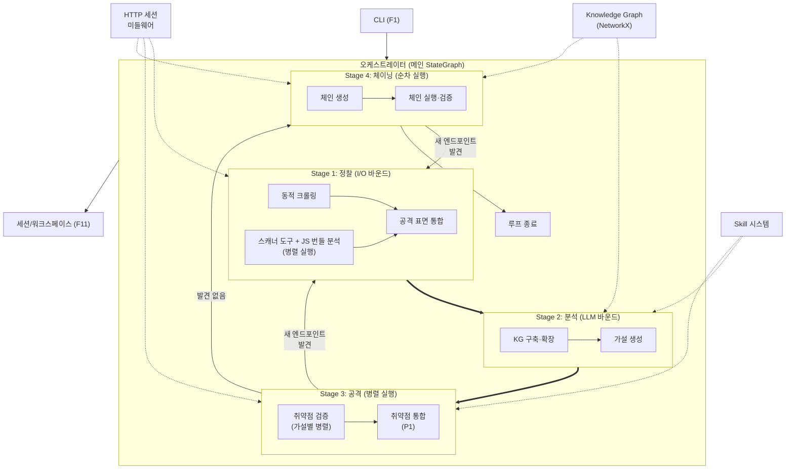

# EAZY — 아키텍처 설계 명세서

> **LLM 기반 웹 모의해킹 에이전트 · LangGraph 파이프라인 · Knowledge Graph · 결정론적 검증**
>
> 문서 버전: v1.0 | 최종 수정일: 2026-03-26 | PRD: `plans/PRD.md`

---

## 이 문서의 역할

```
plans/
├── PRD.md               ← 무엇을 / 왜 / 수락 기준
├── ARCHITECTURE.md      ← 이 문서: 어떤 구조로 / 왜 이 구조 / 기술 스택
├── specs/               ← 기능별 구현 단위 (검증 기준 포함)
│   ├── SPEC-000-*.md
│   └── SPEC-NNN-*.md
└── tasks/               ← SPEC별 TDD 구현 계획
    └── TASK-NNN-*.md
```

- **PRD가 정의한 "무엇"을 "어떤 구조"로 만들 것인지** 기술적으로 설계한다
- **개별 SPEC이 이 문서의 해당 절을 참조**하여 구현한다 (예: `→ ARCHITECTURE.md 3.2절`)
- **검증 기준과 완료 조건은 이 문서에 넣지 않는다** — 각 SPEC에서 정의한다

---

## 1. 개요

### 1.1 목적

웹 애플리케이션의 API 흐름·데이터 플로·비즈니스 로직을 Knowledge Graph로 구조화하고, LLM이 공격 가설을 생성하며, 결정론적 규칙이 취약점을 검증한다. 검증된 취약점을 자동 연계하여 공격 체인을 구성·실행하고, 증거 기반 리포트를 생성한다.

### 1.2 설계 원칙

- **LLM이 발견하고, 규칙이 검증한다:** 취약점 성공/실패 판정에 LLM 사용 금지. LLM은 가설 생성·KG 구축·시나리오 조합에, 결정론적 규칙은 판정·오탐 검증·실행 제어에 사용한다. 규칙으로 판정 불가능한 경우 해당 가설은 '미확인(unverified)'으로 분류하고, 리포트에 수동 확인 필요로 표시한다.
- **Stage 격리:** 각 Stage는 독립된 LangGraph 서브그래프. 하나의 실패가 전체를 중단시키지 않는다.
- **인터페이스 계약:** Stage 간 데이터는 반드시 Pydantic BaseModel. dict 전달 금지.
- **확장성 우선:** 스캐너 도구·Skill 추가 시 코어 코드 수정 0줄. 확장 가능한 아키텍처.
- **안전장치 항상 적용:** 스코프 제한·감사 로그·마스킹은 실행 모드와 무관하게 항상 동작한다.

### 1.3 버전 이력

| 버전 | 주요 변경 |
|------|-----------|
| v1.0 | 초기 설계 |

---

## 2. 전체 아키텍처

### 2.1 메인 파이프라인

| Stage | 이름 | 역할 | PRD 기능 | 핵심 패턴 |
|-------|------|------|----------|-----------|
| 1 | 정찰 | 크롤링 + 스캐너 도구 + 공격 표면 통합 | F2 + F3 | I/O 바운드, 병렬 스캐너 |
| 2 | 분석 | KG 구축·확장 + 공격 가설 생성 | F4 + F5 | LLM 바운드 |
| 3 | 공격 | 취약점 검증 + 취약점 통합 | F6 + F7 | 병렬 검증, 결정론적 판정 |
| 4 | 체이닝 | 체인 생성 + 체인 실행·검증 | F8 + F9 | 순차 실행, 데이터 전달 |

> 리포트(F10)는 P1이고 루프 밖이므로 Stage에 포함하지 않는다.

### 2.2 횡단 시스템

| 시스템 | 역할 | 연결 대상 |
|--------|------|-----------|
| HTTP 세션 미들웨어 | 쿠키/JWT/CSRF 토큰 자동 관리 | 전 Stage |
| Skill 시스템 | 공격 패턴 + PoC 템플릿 + 판정 규칙 | Stage 2, 3, 4 |
| 스캐너 도구 관리 | 외부 도구 등록·실행·결과 파싱 | Stage 1 |
| 스코프 가드 | 스코프 밖 요청 차단 | 전 Stage |
| 감사 로그 | history.jsonl, audit.jsonl 기록 | 전 Stage |
| 트래픽 제어 | 요청 속도/동시 연결 수 제한 | Stage 1, 3, 4 |
| RAG 지식 베이스 (P1) | 최신 CVE, 과거 성공 패턴 참조. P0에서는 Skill 시스템의 CWE 매핑으로 대체 | Stage 2, 4 |

### 2.3 전체 구조 다이어그램



---

## 3. Stage 간 인터페이스 계약

> **이 섹션은 아키텍처의 핵심이다.** Stage 간 데이터 형식이 확정되어야 각 Stage를 독립적으로
> 개발할 수 있다. 모든 모델은 Pydantic BaseModel로 구현한다.

### 3.1 Stage 1 → Stage 2: ReconOutput

```python
class ReconOutput(BaseModel):
    """Stage 1(정찰)의 최종 출력. Stage 2(분석)의 입력."""
    endpoints: list[Endpoint]
    waf_profile: WAFProfile | None = None  # WAF 탐지 스캐너(wafw00f 등)의 결과를 파서가 WAFProfile로 변환하여 할당
    technologies: list[Technology]
    scanner_results: list[ScannerResult]  # ScannerResult에 scanner_id 필드 포함
    new_endpoints_found: bool  # 루프 재진입 판단용 (이전 루프 대비)
```

### 3.2 Stage 2 → Stage 3: AnalysisOutput

```python
class KGNode(BaseModel):
    """KG 노드. 15.2절 노드 타입 참조."""
    id: str
    node_type: str  # endpoint, parameter, business_flow, vulnerability, waf_profile, technology
    properties: dict[str, Any]  # 노드 타입별 속성이 상이하여 예외적으로 dict[str, Any] 허용

class KGEdge(BaseModel):
    """KG 엣지. 15.3절 엣지 타입 참조."""
    source_id: str
    target_id: str
    edge_type: str  # calls, sends_data, part_of_flow, has_parameter, has_vulnerability, protected_by, uses_technology, chains_to
    properties: dict[str, Any] = {}

class KGMetadata(BaseModel):
    """KG 스냅샷 메타데이터."""
    node_count: int
    edge_count: int
    loop_iteration: int
    last_updated: datetime

class KnowledgeGraphSnapshot(BaseModel):
    """NetworkX 그래프의 Pydantic 직렬화. NetworkX 의존성은 Stage 2 내부로 격리."""
    nodes: list[KGNode]
    edges: list[KGEdge]
    metadata: KGMetadata

class AnalysisOutput(BaseModel):
    """Stage 2(분석)의 최종 출력. Stage 3(공격)의 입력."""
    knowledge_graph: KnowledgeGraphSnapshot
    hypotheses: list[Hypothesis]
    business_flows: list[BusinessFlow]
```

### 3.3 Stage 3 → Stage 4: AttackOutput

```python
class AttackOutput(BaseModel):
    """Stage 3(공격)의 최종 출력. Stage 4(체이닝)의 입력."""
    verified_vulns: list[Vulnerability]
    new_endpoints_found: bool  # 루프 재진입 판단용
```

### 3.4 Stage 4 → 루프 종료: ChainOutput

```python
class ChainOutput(BaseModel):
    """Stage 4(체이닝)의 최종 출력. 루프 종료 또는 재진입 판단."""
    chain_results: list[ChainResult]
    new_endpoints_found: bool  # 루프 재진입 판단용
```

### 3.5 체인 단계 간 데이터 전달: ChainContext

```python
class Credential(BaseModel):
    """탈취한 크레덴셜."""
    username: str
    password: str | None = None
    token: str | None = None
    source: str  # 어떤 취약점/단계에서 획득했는지

class SessionToken(BaseModel):
    """세션/JWT 토큰."""
    token_type: str  # jwt, session, bearer 등
    value: str
    source: str

class SessionCookie(BaseModel):
    """획득한 쿠키."""
    name: str
    value: str
    domain: str | None = None
    source: str

class ChainContext(BaseModel):
    """체인의 각 단계가 이전 단계의 결과를 전달하는 컨텍스트."""
    credentials: list[Credential] = []
    tokens: list[SessionToken] = []
    cookies: list[SessionCookie] = []
    extracted_data: dict[str, Any] = {}  # 예외: 체인 실행 시 추출 데이터는 예측 불가능 (SQLi 결과, IDOR 데이터 등)
    current_auth_level: str = "none"     # 현재 권한 수준
```

### 3.6 인터페이스 계약 원칙

- **래퍼 모델 필수:** Stage 출력은 반드시 하나의 Pydantic 모델로 묶는다 (dict 전달 금지)
- **Optional 명시:** 아직 구현되지 않은 필드는 `| None`으로 선언하고 기본값 `None`
- **직렬화 가능:** 모든 모델은 `.model_dump_json()`으로 JSON 저장 가능해야 한다
- **역호환:** 필드 추가는 OK, 필드 삭제/타입 변경은 버전 올리고 마이그레이션

---

## 4. Stage 1: 정찰 상세

### 4.1 동적 크롤링

| 항목 | 상세 |
|------|------|
| 패턴 | 헤드리스 브라우저 (Playwright) + DOM 이벤트 트리거 |
| LLM 사용 | X — 결정론적 크롤링 |
| 입력 | 타겟 URL + 스코프 + 크레덴셜(선택) |
| 출력 | 엔드포인트 목록 (→ 3.1절 ReconOutput.endpoints) |

**크레덴셜 제공 시:**
- 제공된 크레덴셜로 인증 후 크롤링 (인증 상태 공격 표면 확보)
- 비인증 크롤링도 병행하여 공격 표면 차이를 KG에 기록
- 복수 계정 시 각 권한별로 크롤링하여 접근 가능 엔드포인트 차이 식별

**크레덴셜 미제공 시:**
- 비인증 상태로 전수 크롤링
- 403 응답은 `requires_auth=true`로 기록
- 회원가입 페이지 자동 탐지 + 자동 가입 시도 (실행 모드 승인 정책 적용)

### 4.2 스캐너 도구 + JS 번들 분석 (병렬 실행)

| 항목 | 상세 |
|------|------|
| 패턴 | 등록된 스캐너 + JS 번들 분석기를 asyncio.gather()로 병렬 실행 |
| LLM 사용 | X |
| 입력 | 타겟 URL + 스캐너 설정 + 크롤링에서 수집한 JS 파일 |
| 출력 | 스캐너별 결과 (→ ReconOutput.scanner_results) + JS 분석 엔드포인트 (→ ReconOutput.endpoints에 병합) |
| JS 번들 분석 | JS 번들에서 API 호출 패턴을 추출. 구체적 분석 전략(AST 파싱, 정규식, 폴백 체인)은 SPEC에서 정의. 스캐너 도구와 동일한 병렬 실행 단위로 처리. |

### 4.4 공격 표면 통합

| 항목 | 상세 |
|------|------|
| 패턴 | 결정론적 규칙 우선, 애매한 케이스만 LLM 배치 처리 |
| LLM 사용 | △ — 애매한 케이스 배치 처리만 |
| 입력 | 크롤링 결과 + 스캐너 결과 |
| 출력 | 정규화된 엔드포인트 목록 (ReconOutput) |

---

## 5. Stage 2: 분석 상세

### 5.1 KG 구축·확장

| 항목 | 상세 |
|------|------|
| 패턴 | 구조적 관계는 규칙, 의미적 관계는 LLM |
| LLM 사용 | △ — 구조적 관계(403→requires_auth)는 규칙, API 간 데이터 흐름 추론은 LLM |
| 입력 | ReconOutput (3.1절) |
| 출력 | KnowledgeGraphSnapshot (→ 3.2절 AnalysisOutput.knowledge_graph) |

### 5.2 비즈니스 플로우 그룹화

| 항목 | 상세 |
|------|------|
| 패턴 | LLM이 엔드포인트 관계를 분석하여 비즈니스 프로세스로 그룹화 |
| LLM 사용 | O |
| 입력 | KG (노드 + 엣지) |
| 출력 | BusinessFlow 목록 (→ AnalysisOutput.business_flows) |

### 5.3 가설 생성

| 항목 | 상세 |
|------|------|
| 패턴 | 기술적 가설: CWE 매핑 규칙 + LLM 보강. 비즈니스 로직 가설: LLM |
| LLM 사용 | 기술적: △, 비즈니스: O |
| 입력 | KG + WAFProfile + Skill 시스템의 공격 패턴 |
| 출력 | 가설 목록 (→ AnalysisOutput.hypotheses) |

---

## 6. Stage 3: 공격 상세

### 6.1 취약점 검증

| 항목 | 상세 |
|------|------|
| 패턴 | 가설별 병렬 실행 (LangGraph Send API) |
| LLM 사용 | PoC 생성: △ (Skill 우선, 없으면 LLM). 적응 전략: △ (인코딩 순서는 규칙, 창의적 우회는 LLM). 판정: X (결정론적 규칙만). 오탐 검증: X (정상 입력 비교) |
| 입력 | AnalysisOutput (3.2절) |
| 출력 | 검증된 취약점 목록 (→ 3.3절 AttackOutput.verified_vulns) |
| 병렬 제어 | 세마포어로 동시 검증 수 제한 (트래픽 제어) |

### 6.2 취약점 통합

> 취약점 통합 노드는 P0에서 pass-through로 동작하며, 루프 재진입 판단은 항상 이 노드 이후에 수행한다.
> P1에서 실제 통합 로직(근본 원인 기준 병합)으로 교체한다. 파이프라인 구조 변경 없음.

| 항목 | 상세 |
|------|------|
| 패턴 | P0: pass-through (입력을 그대로 출력). P1: 동일 엔드포인트+파라미터의 파생 취약점을 근본 원인 기준 병합 |
| LLM 사용 | X — 규칙 기반 (CWE 계층, 엔드포인트 매칭) |
| 입력 | 검증된 취약점 목록 |
| 출력 | 중복 제거된 취약점 목록 (AttackOutput) |

---

## 7. Stage 4: 체이닝 상세

### 7.1 체인 생성

| 항목 | 상세 |
|------|------|
| 패턴 | KG 경로 탐색(그래프 알고리즘) + LLM 시나리오 조합 |
| LLM 사용 | △ — 경로 탐색은 규칙, 시나리오 조합은 LLM |
| 입력 | AttackOutput + KG (chains_to 엣지 포함) |
| 출력 | 체인 시나리오 목록 (→ 3.4절 ChainOutput.chain_results) |

### 7.2 체인 실행·검증

| 항목 | 상세 |
|------|------|
| 패턴 | 순차 실행, ChainContext로 단계 간 데이터 전달 |
| LLM 사용 | 판정: X (결정론적 규칙만) |
| 입력 | 체인 시나리오 + ChainContext (3.5절) |
| 출력 | ChainOutput |
| 데이터 전달 | 각 단계가 ChainContext에 크레덴셜/토큰/데이터를 축적, 다음 단계가 이를 사용 |

---

## 8. Skill 시스템

### 8.1 Skill 구성 요소

PRD 정의: "공격 패턴 + PoC 템플릿 + 판정 규칙 포함, 코어 수정 없이 추가"

| 구성 요소 | 역할 | 사용 위치 |
|-----------|------|-----------|
| 공격 패턴 (attack patterns) | CWE별 공격 벡터 목록 | Stage 2 (가설 생성) |
| PoC 템플릿 (poc templates) | 요청 템플릿 + 변수 치환 | Stage 3 (취약점 검증) |
| 판정 규칙 (detection rules) | 성공/실패 판정 조건 | Stage 3 (취약점 검증) |

### 8.2 Skill 파일 포맷

> 구체적 포맷은 SPEC에서 결정. 초안:

```yaml
# skills/sqli_union.yaml
id: sqli-union-based
cwe: CWE-89
name: "Union-based SQL Injection"
version: "1.0"

attack_patterns:
  - pattern: "' UNION SELECT {cols} --"
    locations: [query, body]
    encoding: [plain, url, double_url]

poc_templates:
  - name: "union_column_count"
    request:
      method: "{{original_method}}"
      url: "{{original_url}}"
      params:
        "{{param_name}}": "' ORDER BY {{n}} --"
    variables:
      n: { type: range, start: 1, end: 50 }

detection_rules:
  - type: "status_diff"
    condition: "baseline_status != response_status"
  - type: "content_diff"
    condition: "response contains 'UNION' result pattern"
  - type: "error_based"
    condition: "response contains SQL error signature"
```

### 8.3 Skill 등록

- `skills/` 디렉토리에 YAML 파일 배치 → 자동 로딩
- 코어 코드 수정 0줄
- Skill이 없는 CWE → LLM이 PoC 생성 (폴백)

---

## 9. 스캐너 도구 관리

### 9.1 등록 인터페이스

PRD 정의: "실행 방법 + 출력 파서 필수, 파서 없이는 등록 거부"

```yaml
# scanners/registry.yaml
scanners:
  - id: whatweb
    name: "WhatWeb"
    docker_image: "eazy/whatweb:latest"
    command: "whatweb -a 3 --log-json=/output/result.json {{target}}"
    output_parser: "parsers.whatweb"  # Python 모듈 경로
    timeout: 120
    enabled: true

  - id: wafw00f
    name: "wafw00f"
    docker_image: "eazy/wafw00f:latest"
    command: "wafw00f {{target}} -o /output/result.json -f json"
    output_parser: "parsers.wafw00f"
    timeout: 60
    enabled: true
```

### 9.2 출력 파서 인터페이스

```python
class ScannerParser(Protocol):
    """모든 스캐너 출력 파서가 구현해야 하는 인터페이스."""

    def parse(self, raw_output: str) -> ScannerResult:
        """스캐너 원본 출력을 정규화된 ScannerResult로 변환."""
        ...
```

### 9.3 실행 방식

- 각 스캐너는 Docker 컨테이너로 격리 실행
- `asyncio.gather(return_exceptions=True)`로 병렬, 하나 실패해도 나머지 계속
- 타임아웃 초과 시 해당 스캐너 건너뜀

---

## 10. HTTP 세션 미들웨어

### 10.1 핵심 기능

| 기능 | 설명 |
|------|------|
| 쿠키 관리 | Set-Cookie 자동 저장, 후속 요청에 주입 |
| JWT 관리 | 만료 추적, 자동 갱신 시도 |
| CSRF 관리 | 응답에서 CSRF 토큰 추출, POST/PUT/DELETE에 자동 삽입 |
| 크레덴셜 관리 | 제공된 크레덴셜로 인증 수행, 세션 유지 |

### 10.2 크레덴셜 제공 방식

```bash
# 파일로 제공 (권장)
eazy new --target https://example.com --creds creds.json

# CLI 플래그로 제공 (단일 계정)
eazy new --target https://example.com --username admin --password pass123

# 인터랙티브 프롬프트 (민감 데이터)
eazy new --target https://example.com --creds-prompt
```

크레덴셜 파일 포맷:

```json
{
  "accounts": [
    {
      "role": "admin",
      "type": "form",
      "username": "admin",
      "password": "admin123",
      "login_url": "/api/auth/login"
    },
    {
      "role": "user",
      "type": "bearer",
      "token": "eyJhbG..."
    },
    {
      "role": "api_client",
      "type": "api_key",
      "header": "X-API-Key",
      "value": "sk-..."
    }
  ]
}
```

---

## 11. 스코프 시스템

### 11.1 스코프 포맷 문법

> 구체적 파싱 규칙은 SPEC에서 결정. 초안:

```
# 도메인 와일드카드
*.example.com

# 경로 제한
https://example.com/api/*

# 복수 호스트
api.example.com
cdn.example.com

# IP + 포트
192.168.1.100:3000
localhost:8080
```

- 한 줄에 하나의 스코프 항목
- `*`은 글로브 패턴 (정규식 아님)
- `#`으로 시작하는 줄은 주석

### 11.2 스코프 가드

- 모든 HTTP 요청 전에 스코프 체크
- 스코프 밖 요청은 차단 + audit.jsonl에 기록
- 실행 모드와 무관하게 항상 적용 (Auto에서도 우회 불가)

---

## 12. RAG 지식 베이스 (P1)

> **P1에서 구현.** P0에서는 Skill 시스템의 CWE 매핑 + LLM 자체 학습 데이터로 대체한다.
> P0 목표는 파이프라인 루프가 한 바퀴 도는 것이며, 과거 성공 패턴은 데이터 축적 후 의미가 생긴다.

### 12.1 용도

- 가설 생성 시 최신 CVE 참조 (Stage 2)
- 체인 생성 시 과거 성공 패턴 재활용 (Stage 4)
- 기술 스택별 알려진 취약점 DB

### 12.2 구현 방식

> 구체적 벡터 DB·임베딩 모델은 SPEC에서 결정. 초안:

| 항목 | 초안 | TBD |
|------|------|-----|
| 벡터 DB | ChromaDB (로컬, 서버 불필요) | SPEC에서 확정 |
| 임베딩 | LiteLLM 경유 (프로바이더 교체 가능) | SPEC에서 확정 |
| 데이터 소스 | CVE DB, CWE 설명, 과거 세션 성공 패턴 | SPEC에서 확정 |
| 갱신 주기 | 세션 시작 시 + 수동 업데이트 | SPEC에서 확정 |

---

## 13. 안전장치 + 경계

> PRD 경계 섹션의 구체적 수락 기준은 반복하지 않는다. 여기서는 구현 위치만 명시.

### 13.1 안전 메커니즘

| 안전장치 | 구현 위치 | 상세 |
|----------|-----------|------|
| 스코프 가드 | HTTP 세션 미들웨어 | 모든 요청 전 체크, 차단 시 audit.jsonl 기록 |
| 감사 로그 | HTTP 세션 미들웨어 | history.jsonl (요청/응답), audit.jsonl (승인/거부) |
| 민감 데이터 마스킹 | 로깅 레이어 | 크레덴셜·키·토큰을 `***` 처리 |
| 트래픽 제어 | HTTP 세션 미들웨어 | asyncio.Semaphore + rate limiter |
| 루프 종료 조건 | 오케스트레이터 | 자연종료 + 최대 횟수 + 최대 시간 |
| 가설 재시도 제한 | Stage 3 | 가설당 최대 N회 적응 재시도 |
| 체인 재시도 제한 | Stage 4 | 체인당 최대 재시도 횟수 |
| 실행 모드 승인 | 오케스트레이터 | Supervised/Guided/Auto 정책 적용 |

---

## 14. 아키텍처 요약

### 14.1 컴포넌트별 LLM 사용 여부

| 컴포넌트 | LLM | 규칙 | 비고 |
|----------|-----|------|------|
| 동적 크롤링 | X | O | 헤드리스 브라우저 |
| JS 번들 분석 | X | O | AST 파싱 |
| WAF 탐지 | X | O | 프로브 요청+응답 패턴 |
| 공격표면 통합 | △ | O | 규칙 우선, 애매한 케이스만 LLM 배치 |
| KG 구축 | △ | O | 구조적 관계는 규칙, 의미적 관계는 LLM |
| 비즈니스 플로우 그룹화 | O | X | LLM만 가능 |
| 기술적 가설 생성 | △ | O | CWE 매핑 규칙 + LLM 보강 |
| 비즈니스 로직 가설 | O | X | LLM만 가능 |
| PoC 생성 | △ | O | Skill 템플릿 우선, 없으면 LLM |
| PoC 판정 | X | O | 결정론적 규칙만 |
| 오탐 검증 | X | O | 정상 입력 비교 |
| 적응 전략 | △ | O | 인코딩 순서는 규칙, 창의적 우회는 LLM |
| 체인 생성 | △ | O | 경로 탐색은 그래프 알고리즘, 시나리오 조합은 LLM |
| 체인 단계 판정 | X | O | 결정론적 규칙만 |
| CVSS 산출 | △ | O | 공식 계산은 규칙(FIRST), 메트릭 판단은 LLM 보조 |
| 대응방안 생성 | O | X | LLM 생성 |

> 범례: O=주 담당, △=보조 (규칙이 주, LLM이 보조), X=사용 안 함

### 14.2 LLM 모델 라우팅 전략

> LiteLLM으로 프로바이더 추상화. 구체적 모델 매핑은 SPEC에서 결정.

| 작업 유형 | 요구사항 | 모델 등급 |
|-----------|----------|-----------|
| KG 구축, 비즈니스 분석, 체인 시나리오 | 높은 추론 능력 | Heavy (예: Claude Sonnet/Opus) |
| 가설 생성 보강, PoC 생성 | 중간 추론 + 빠른 속도 | Medium (예: Claude Haiku/Sonnet) |
| 공격표면 통합 배치, 적응 전략 | 빠른 속도 우선 | Light (예: Claude Haiku) |
| 대응방안 생성, CVSS 보조 | 텍스트 생성 | Medium |

- 설정 파일 1줄 변경으로 프로바이더 교체 (PRD 비기능 요구사항)
- 모델 라우팅은 config.yaml에서 작업 유형 → 모델 매핑

---

## 15. Knowledge Graph 상세

### 15.1 엔진

- **NetworkX** (인메모리)
- 별도 서버 불필요, 로컬 실행 도구 철학과 일치
- PRD 비기능 요구사항 "노드 10,000개 이하"에서 충분
- 그래프 접근 레이어를 추상화하여 향후 Neo4j 마이그레이션 가능

### 15.2 노드 타입

| 노드 타입 | 주요 필드 | 설명 |
|-----------|-----------|------|
| Endpoint | url, method, params, auth_info, status_code | API 엔드포인트. auth_info: AuthInfo \| None (required, auth_type, auth_level) |
| Parameter | name, type, location, sample_value | 요청 파라미터 |
| BusinessFlow | name, steps | 비즈니스 프로세스 |
| Vulnerability | cwe_id, severity, endpoint, parameter, poc, verified | 검증된 취약점 |
| WAFProfile | vendor, detected_rules | WAF 정보 |
| Technology | name, version | 기술 스택 (서버/JS 프레임워크 등) |

### 15.3 엣지 타입

| 엣지 타입 | 방향 | 설명 |
|-----------|------|------|
| calls | Endpoint → Endpoint | API 간 호출 관계 |
| sends_data | Endpoint → Endpoint | 데이터 전달 관계 |
| part_of_flow | Endpoint → BusinessFlow | 비즈니스 플로우 소속 |
| has_parameter | Endpoint → Parameter | 파라미터 소유 |
| has_vulnerability | Endpoint → Vulnerability | 취약점 연결 |
| protected_by | Endpoint → WAFProfile | WAF 보호 |
| uses_technology | Endpoint → Technology | 기술 스택 사용 |
| chains_to | Vulnerability → Vulnerability | 체인 관계 (다음 루프에서 재활용) |

---

## 16. 프로젝트 구조

### 16.1 전체 디렉토리 구조

```
EAZY/
├── src/
│   ├── core/                # 코어 엔진
│   │   ├── orchestrator.py  # 메인 오케스트레이터 (LangGraph)
│   │   ├── state.py         # 파이프라인 상태 모델
│   │   └── config.py        # 설정 로딩
│   ├── stages/              # 파이프라인 Stage
│   │   ├── recon/           # Stage 1: 정찰
│   │   │   ├── crawler.py
│   │   │   └── surface_merger.py
│   │   ├── analysis/        # Stage 2: 분석
│   │   │   ├── kg_builder.py
│   │   │   ├── flow_grouper.py
│   │   │   └── hypothesis_generator.py
│   │   ├── attack/          # Stage 3: 공격
│   │   │   ├── verifier.py
│   │   │   ├── poc_generator.py
│   │   │   ├── detector.py
│   │   │   └── integrator.py
│   │   └── chaining/        # Stage 4: 체이닝
│   │       ├── chain_generator.py
│   │       └── chain_executor.py
│   ├── middleware/           # 횡단 시스템
│   │   ├── session.py       # HTTP 세션 미들웨어
│   │   ├── scope_guard.py   # 스코프 가드
│   │   ├── audit_logger.py  # 감사 로그
│   │   ├── traffic_control.py
│   │   └── masking.py       # 민감 데이터 마스킹
│   ├── knowledge/           # Knowledge Graph
│   │   ├── graph.py         # NetworkX 래퍼 (추상화 레이어)
│   │   ├── models.py        # KG 노드/엣지 Pydantic 모델
│   │   └── serializer.py    # KG 직렬화/역직렬화
│   ├── skills/              # Skill 시스템 로더
│   │   ├── loader.py
│   │   └── registry.py
│   ├── scanners/            # 스캐너 도구 관리
│   │   ├── runner.py        # Docker 실행기
│   │   ├── registry.py
│   │   └── parsers/         # 출력 파서
│   ├── rag/                 # RAG 지식 베이스
│   │   ├── store.py
│   │   └── retriever.py
│   ├── models/              # 공유 Pydantic 모델
│   │   ├── endpoints.py     # Endpoint, Parameter
│   │   ├── findings.py      # Vulnerability, Finding
│   │   ├── chains.py        # ChainResult, ChainContext
│   │   ├── interfaces.py    # Stage 간 인터페이스 (3절)
│   │   └── session.py       # Session, Workspace
│   ├── cli/                 # CLI
│   │   └── main.py
│   └── backend/             # REST API (P2)
│       └── app.py
├── skills/                  # Skill YAML 파일 (사용자 확장)
├── scanners/                # 스캐너 등록 + 파서
│   ├── registry.yaml
│   └── parsers/
├── dockers/                 # 스캐너 Dockerfile
├── workspaces/              # 세션 데이터 (.gitignore)
├── tests/                   # src/ 미러 구조
├── plans/                   # 문서 계층
│   ├── PRD.md
│   ├── ARCHITECTURE.md      # 이 문서
│   ├── specs/
│   ├── tasks/
│   └── templates/
├── pyproject.toml
├── cli.py                   # CLI 진입점
└── README.md
```

### 16.2 설계 원칙

- **아키텍처 = 디렉토리:** 이 명세서의 각 Stage/시스템이 디렉토리에 1:1 매핑
- **코드와 데이터 분리:** `src/`(불변)와 `workspaces/`(가변) 완전 분리
- **독립 테스트:** 각 Stage는 mock 입력으로 독립 테스트 가능
- **Skill/스캐너 분리:** `skills/`, `scanners/`는 src/ 밖에 위치 (사용자 확장 영역)

---

## 17. 세션/워크스페이스 관리

### 17.1 디렉토리 구조

```
workspaces/
└── {session_id}/
    ├── config.json           # 세션 설정 (타겟, 스코프, 모드, 크레덴셜 참조)
    ├── state/                # 파이프라인 상태
    │   ├── checkpoint.json   # LangGraph checkpointer 데이터
    │   ├── loop_count.json   # 루프 횟수, 시작 시각
    │   └── current_stage.json
    ├── recon/                # Stage 1 결과
    │   ├── endpoints.json
    │   └── scanner_results/
    ├── analysis/             # Stage 2 결과
    │   ├── knowledge_graph.json
    │   └── hypotheses.json
    ├── attack/               # Stage 3 결과
    │   ├── verified_vulns.json
    │   └── pocs/
    ├── chaining/             # Stage 4 결과
    │   ├── chains.json
    │   └── chain_contexts/
    ├── logs/                 # 감사 로그
    │   ├── history.jsonl
    │   └── audit.jsonl
    └── report/               # 리포트 (P1)
        ├── report.json
        └── report.md
```

### 17.2 핵심 원칙

- **세션 간 격리:** 각 세션은 독립 디렉토리, 다른 세션 데이터 접근 불가
- **재개 가능:** checkpoint.json에서 마지막 Stage·노드 위치를 복원
- **Git 미추적:** `workspaces/`는 `.gitignore`에 포함

---

## 18. 기술 스택

### 18.1 개요

| 분류 | 기술 | 선정 사유 |
|------|------|-----------|
| 언어 | Python 3.11+ | 비동기 지원, AI/보안 도구 생태계 |
| 에이전트 프레임워크 | LangChain + LangGraph | 그래프 기반 파이프라인, 서브그래프, checkpointer |
| LLM 추상화 | LiteLLM | 프로바이더 교체 = 설정 1줄 |
| HTTP 클라이언트 | httpx (async) | 비동기 필수, requests 금지 |
| 헤드리스 브라우저 | Playwright | SPA 크롤링, DOM 이벤트 트리거 |
| Knowledge Graph | NetworkX | 인메모리, 경량, 10K 노드 충분 |
| 데이터 검증 | Pydantic v2 | 인터페이스 계약 + 직렬화 |
| CLI | TBD (typer 또는 click) | SPEC에서 결정 |
| 백엔드 (P2) | FastAPI + uvicorn | async 네이티브 |
| 프론트엔드 (P2) | React + TypeScript | SPEC에서 결정 |
| 벡터 DB (RAG) | TBD (ChromaDB 초안) | SPEC에서 결정 |
| 테스트 | pytest + pytest-asyncio | 비동기 테스트 지원 |
| 린트 | ruff | 빠르고 포괄적 |
| 타입 체크 | mypy | --strict 목표 |
| 패키지 관리 | uv | pip 절대 사용 금지 |

### 18.2 커맨드

```bash
# 개발 환경
uv sync
uv run uvicorn src.backend.app:app --reload

# CLI
uv run python cli.py new --target <URL>
uv run python cli.py scan --workspace <ID>

# 품질 관리
uv run pytest tests/ -v --cov=src
uv run ruff check src/
uv run mypy src/

# 패키지 관리
uv add <패키지>   # pip 절대 금지
```

---

## 19. 개발 로드맵

### 19.1 Phase → SPEC 매핑

> 각 Phase의 상세 검증 기준과 완료 조건은 해당 SPEC에서 정의한다.
> 이 표는 전체 흐름만 보여준다. SPEC 번호는 확정 후 업데이트.

| Phase | 범위 | 해당 SPEC (TBD) | 의존성 |
|-------|------|-----------------|--------|
| 0 | 테스트 인프라 (L1 픽스처 + L2 벤치마크) | SPEC-000 | 없음 |
| 0 | CLI + 세션 관리 기반 | SPEC-001~002 | SPEC-000 |
| 1 | Stage 1: 정찰 | SPEC-010~014 | Phase 0 |
| 2 | Stage 2: 분석 | SPEC-020~024 | Phase 1 |
| 3 | Stage 3: 공격 | SPEC-030~034 | Phase 2 |
| 4 | Stage 4: 체이닝 | SPEC-040~044 | Phase 3 |
| 5 | 취약점 통합(P1) + 리포트(P1) | SPEC-050~054 | Phase 3 |
| 6 | L3 벤치마크(P1) + Skill 관리(P1) + 스캐너 관리(P1) | SPEC-060~064 | Phase 4 |
| 7 | 웹 대시보드 (P2) | SPEC-070~075 | Phase 5 |

### 19.2 개발 순서 원칙

- **SPEC-000(테스트 인프라)이 가장 먼저.** 다른 모든 SPEC의 검증이 이에 의존
- 각 Phase가 CLI로 완전히 동작한 뒤 다음 Phase로 진행
- Phase 내 SPEC 순서는 의존성 그래프가 결정
- P0 → P1 → P2 순서
- 기능별 기준선 확보: 각 Stage 최초 구현 후 해당 성공 지표 측정

---

## 부록 A: 웹 서비스 개발 순서

```
Phase 1~4: 코어 엔진 (CLI 동작 가능)
  └── 유닛테스트 + L1 픽스처 + L2 벤치마크로 검증

Phase 7: REST API 레이어 (프론트 없이 동작 가능)
  └── API 통합테스트 + OpenAPI 계약테스트로 검증

Phase 7: 프론트엔드 (확정된 API를 소비)
  └── E2E 테스트로 검증
```

- 백엔드와 프론트엔드를 동시에 개발하지 않는다
- OpenAPI 스펙이 프론트-백엔드 "계약"이다
- 테스트 피라미드: 유닛(70%) + API 통합(20%) + E2E(10%)

---

## 부록 B: 벤치마크 전략

| 계층 | 벤치마크 | 용도 | 우선순위 |
|------|----------|------|----------|
| L1 유닛 | 자체 제작 미니 앱 (5~10 엔드포인트) | 기능별 정확도 (ground truth 100%) | P0 필수 |
| L2 정확도 | OWASP Benchmark, WIVET, RealWorld(Conduit) | F1 score / 엔드포인트 발견율 | P0 필수 |
| L3 실전 | Broken Crystals, VAmPI, DVGA, crAPI | E2E 실전 검증 | P1 |

SPEC-000(테스트 인프라)에서 L1·L2 벤치마크 환경을 구축한다.
