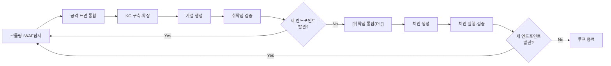

## 개요

**한 줄 설명:** 웹 애플리케이션의 취약점을 자동 발견하고 체이닝하여 공격 시나리오를 생성·실행하는 LLM 기반 모의해킹 에이전트

**문제:**

- 기존 도구(sqlmap, Nuclei, Burp 등)는 단일 취약점만 탐지한다. 취약점 간 연계 공격(체이닝)은 전문가가 수동으로 구성해야 한다.
- API 호출 관계, 데이터 흐름, 비즈니스 로직 분석은 시간 소모가 크고 전문가 역량에 의존한다.
- 비즈니스 로직 취약점(가격 변조, 단계 건너뛰기, 레이스 컨디션)은 자동화 도구가 거의 없다.
- "SQLi로 크레덴셜 탈취 → 관리자 로그인 → 가격 변조"같은 체이닝 시나리오는 완전히 수동이다.

**타겟 사용자:**

- **주요 사용자:** 웹 모의해킹 보안 전문가
- **기술 수준:** OSCP/OSCE 수준, Burp Suite·sqlmap·Nuclei 등 기존 도구 숙련자
- **고충점:** 취약점 간 연계 분석에 과도한 시간 소모, 비즈니스 로직 취약점 자동화 부재, 반복적인 정찰·검증 작업
- **사용 환경:** CLI 우선, 웹 대시보드 선택적(P2)

**성공 지표:**

1. 크롤링 + 엔드포인트·파라미터 식별
   - 측정: WIVET에서 입력 벡터 발견율
   - 측정: RealWorld(Conduit) API 스펙 대비 엔드포인트 발견율 (React/Vue/Angular 각각)

2. KG 자동 구조화 정확도
   - 측정: 자체 KG 픽스처(비즈니스 로직이 포함된 테스트 앱 + 정답 KG JSON)에서:
     - (a) 노드 Precision/Recall — 엔드포인트를 빠짐없이, 잘못 없이 찾았는가
     - (b) 엣지 Precision/Recall — API 간 관계(calls, sends_data, requires_auth)를 정확히 찾았는가
     - (c) 비즈니스 흐름 식별율 — 비즈니스 프로세스를 하나의 흐름으로 묶었는가

3. 공격 가설 생성 정확도
   - 측정: 자체 픽스처에서 파라미터별 공격 유형 가설의 Precision/Recall
   - Precision: 가설 중 실제 취약한 비율 (쓸데없는 가설이 적은가)
   - Recall: 실제 취약점 중 가설로 잡힌 비율 (놓친 게 없는가)

4. 단일 취약점 탐지 정확도 (= 가설 검증)
   - 측정: 자체 CWE별 픽스처(ground_truth.json)에서 F1 score
   - 측정: OWASP Benchmark에서 CWE별 Youden's Index
   - 측정 (P1): Broken Crystals에서 문서화된 취약점 대비 탐지율 (REST)
   - 측정 (P1): VAmPI에서 문서화된 취약점 대비 탐지율 (REST API)
   - 측정 (P1): DVGA에서 문서화된 취약점 대비 탐지율 (GraphQL)
   - 측정 (P1): crAPI에서 문서화된 취약점 대비 탐지율 (API Security Top 10)

5. 공격 시나리오 자동 생성 (기술적 체이닝 + 비즈니스 로직)
   - 측정: 자체 체인 픽스처에서:
     - (a) 기술적 체인 Precision/Recall (SQLi→권한상승 등)
     - (b) 비즈니스 로직 가설 Precision/Recall (가격 변조, 단계 건너뛰기 등)
     - (c) 체인 불가능 경로를 체인으로 생성하지 않았는가 (FP 검증)

> 구체적 목표 수치는 각 기능 최초 구현 후 점진적으로 기준선을 확보한다:
> - 기능 2 구현 후 → 지표 1(크롤링) 기준선, 기능 4 → 지표 2(KG), 기능 5 → 지표 3(가설), 기능 6 → 지표 4(탐지), 기능 8+9 → 지표 5(체인)
> - 기준선 수치와 목표 수치는 별도 벤치마크 결과 문서에 기록한다. PRD는 "무엇을 측정할지"만 유지한다.

---

## 기능

### 기능 0: 테스트 인프라 — 우선순위 P0

> **다른 모든 기능의 검증이 이에 의존한다. 가장 먼저 구축.**

**유저 스토리:** 개발자로서, 각 파이프라인 단계의 정확성을 정량적으로 검증할 수 있는 테스트 환경이 필요하다.

**산출물:**

- L1 마이크로 픽스처 (P0): 자체 제작 미니 앱(엔드포인트 5~10개, 비즈니스 로직 취약점 의도 포함) + CWE별 ground_truth.json, KG 정답 JSON, 체인 정답 JSON. 기존 오픈소스 앱이 아닌 자체 제작 — 정답 KG를 100% 통제하여 정량 측정 가능해야 함. 구체적 설계는 SPEC-000 범위.
- L2 벤치마크 (P0): OWASP Benchmark, WIVET, RealWorld(Conduit)
- L3 통합 테스트 대상 (P1): Broken Crystals (REST), VAmPI (REST API), DVGA (GraphQL), crAPI (API Security Top 10)

> L1은 개발 중 단위 테스트, L2는 성공 지표 측정 도구 → P0 필수.
> L3는 실전 앱 통합 테스트이나, ground truth 정리 작업량이 크고 L1+L2 검증 후 진행해도 됨 → P1.

**수락 기준 (P0):**

- Given 테스트 환경 구동 명령, When 실행, Then L1 픽스처 전체 가동
- Given L1 픽스처, When pytest 실행, Then ground truth 대비 Precision/Recall/F1 산출 가능
- Given L2 벤치마크, When Docker Compose 실행, Then 벤치마크 환경 가동

**수락 기준 (P1):**

- Given L3 통합 대상, When Docker Compose 실행, Then 각 앱 정상 접근 가능
- Given L3 통합 대상, When 각 앱의 ground truth 정리, Then 문서화된 취약점 대비 탐지율 측정 가능

### 기능 1: CLI — 우선순위 P0

**유저 스토리:** 모의해킹 전문가로서, CLI에서 타겟을 지정하고 스캔을 실행하여 결과를 확인하길 원한다.

**트리거:** 사용자가 CLI 커맨드 실행

**동작:**

1. `new --target <URL>` — 새 세션 생성, 워크스페이스 초기화
2. `scan --workspace <ID>` — 파이프라인 루프 실행
3. 실행 중 실시간 진행 상태 출력
4. 각 기능 개발 시 해당 커맨드 추가 (모듈형 구조)

**사용자 화면:** 터미널 출력 — 진행 상태, 발견 사항, 승인 요청 프롬프트

**수락 기준:**

- Given 유효한 타겟 URL, When `new --target <URL>` 실행, Then 워크스페이스가 생성되고 세션 ID가 출력된다
- Given 유효한 세션, When `scan --workspace <ID>` 실행, Then 파이프라인 루프가 시작된다
- Given 실행 모드 옵션, When `--mode supervised|guided|auto` 지정, Then 해당 모드로 실행된다
- Given 실행 중, When Ctrl+C, Then 현재 단계를 안전하게 중단하고 세션 상태를 저장한다
- Given 중단된 세션, When `scan --workspace <ID> --resume` 실행, Then 마지막 checkpoint에서 복원되어 계속 실행된다

**부정 수락 기준:**

- Given 유효하지 않은 URL, When `new --target <잘못된URL>` 실행, Then 명확한 에러 메시지 출력
- Given 존재하지 않는 워크스페이스, When `scan --workspace <잘못된ID>`, Then 에러 메시지 출력

### 기능 2: 크롤링 + 엔드포인트·파라미터 식별 + WAF 탐지 — 우선순위 P0

**유저 스토리:** 모의해킹 전문가로서, 타겟 웹 앱의 모든 엔드포인트·파라미터·WAF 정보를 자동으로 수집하길 원한다. 수동 정찰 시간을 줄이기 위해.

**트리거:** 파이프라인 루프 시작 또는 권한 상승 후 재진입

**동작:**

1. 동적 크롤링 (SPA 포함) — JS 렌더링 후 DOM에서 엔드포인트 추출
2. JS 번들 분석 — API 호출 패턴 추출
3. API 엔드포인트·파라미터 식별 — REST API + GraphQL API 대상, URL, 바디, 헤더, 쿠키 파라미터 분류
4. WAF 존재 여부 및 벤더 식별
5. 등록된 스캐너 도구 실행 — 결과는 공격 표면 통합(기능 3)에서 병합
6. 크레덴셜 제공 시: 인증 후 크롤링 (인증 상태 공격 표면 확보) + 비인증 크롤링도 병행하여 공격 표면 차이를 KG에 기록
   - 지원 크레덴셜 형태: 아이디/패스워드(폼 기반), Bearer 토큰(JWT 등), 쿠키(세션 쿠키), API 키(헤더/쿼리)
   - 복수 계정 지원: 권한별 계정(일반 사용자 + 관리자 등)을 각각 크롤링
   - 제공 방식(CLI 플래그, 파일, 프롬프트)은 ARCHITECTURE에서 정의
7. 크레덴셜 미제공 시: 비인증 상태로 전수 크롤링, 403 응답은 requires_auth=true로 기록, 회원가입 페이지 자동 탐지 + 자동 가입 시도
   - 자동 가입은 데이터 변경(계정 생성)이므로 실행 모드 승인 정책을 따른다: Supervised=사용자 승인 후 시도, Guided=자동(Medium 영향도), Auto=자동
   - 크레덴셜이 이미 제공된 경우 자동 가입을 시도하지 않는다
   - 가입 실패 시 비인증 상태로 계속 진행 (파이프라인 중단 안 함)
   - 가입 시도/성공/실패를 audit.jsonl에 "data_mutation: account_creation" 태그로 기록
   - 생성된 계정 정보는 세션에 저장하여 이후 루프에서 재사용

**수락 기준:**

- Given SPA 웹 앱(React/Vue/Angular), When 크롤링 실행, Then JS 렌더링 후 동적 생성된 엔드포인트를 발견한다
- Given JS 번들, When 분석 실행, Then API 호출 패턴(fetch, axios, XMLHttpRequest)을 추출한다
- Given 엔드포인트 목록, When 파라미터 식별 실행, Then URL/바디/헤더/쿠키 파라미터를 분류한다
- Given WAF가 있는 타겟, When WAF 탐지 실행, Then WAF 존재 여부와 벤더를 식별한다
- Given 크레덴셜 제공, When 크롤링 실행, Then 인증 상태 + 비인증 상태 양쪽 모두 크롤링하여 공격 표면 차이를 KG에 기록한다
- Given 복수 계정 크레덴셜 제공, When 크롤링 실행, Then 각 권한별로 크롤링하여 권한별 접근 가능 엔드포인트 차이를 식별한다
- Given 크레덴셜 미제공, When 크롤링 실행, Then 비인증 상태로 전수 크롤링하고 403 응답을 requires_auth=true로 기록한다
- Given 회원가입 페이지 존재, When 자동 탐지, Then 실행 모드 승인 정책에 따라 자동 가입을 시도하고 결과를 audit.jsonl에 기록한다
- Given 크레덴셜이 이미 제공된 상태, When 회원가입 페이지 발견, Then 자동 가입을 시도하지 않는다
- Given 자동 가입 실패, When 실패, Then 비인증 상태로 계속 진행하고 파이프라인을 중단하지 않는다

**부정 수락 기준:**

- Given 스코프 밖 URL로의 리다이렉트, When 크롤링 중 발견, Then 해당 URL로 요청하지 않는다
- Given 트래픽 제어 설정, When 크롤링 실행, Then 요청 속도가 설정값을 초과하지 않는다

### 기능 3: 공격 표면 통합 — 우선순위 P0

**유저 스토리:** 모의해킹 전문가로서, 크롤러와 스캐너 도구의 결과가 하나의 정규화된 공격 표면으로 통합되길 원한다. 중복 제거와 일관된 형식을 위해.

**트리거:** 크롤링 + 스캐너 실행 완료

**동작:**

1. 크롤러 결과와 스캐너 도구 결과를 정규화된 스키마로 변환
2. URL 정규화 + 파라미터 기반 중복 제거
3. 결정론적 규칙으로 병합 (LLM은 애매한 케이스 배치 처리만)

**수락 기준:**

- Given 크롤러 + 스캐너 도구 결과, When 통합 실행, Then 정규화된 단일 엔드포인트 목록이 생성된다
- Given 동일 엔드포인트의 중복 결과, When 통합 실행, Then 하나로 병합되고 출처가 기록된다
- Given 결정론적 규칙으로 판단 불가한 케이스, When LLM 배치 처리, Then 병합 여부가 결정되고 근거가 기록된다

**부정 수락 기준:**

- Given 파라미터가 다른 동일 경로, When 통합 실행, Then 별도 엔드포인트로 유지한다 (잘못된 병합 방지)

### 기능 4: Knowledge Graph 구축·확장 — 우선순위 P0

**유저 스토리:** 모의해킹 전문가로서, 웹 앱의 API 관계·데이터 흐름·비즈니스 로직이 그래프로 구조화되길 원한다. 체이닝 경로를 자동 탐색하기 위해.

**트리거:** 공격 표면 통합 완료

**동작:**

1. 통합된 엔드포인트를 노드로, API 간 관계(calls, sends_data, requires_auth)를 엣지로 구조화
2. 비즈니스 프로세스를 하나의 흐름으로 그룹화
3. 권한 상승 시 기존 KG에 새 노드/엣지 추가 (전체 재구축 아님)

**수락 기준:**

- Given 통합된 엔드포인트 목록, When KG 구축 실행, Then 엔드포인트가 노드로, 관계가 엣지로 구조화된다
- Given API 간 호출 관계, When KG 구축 실행, Then calls/sends_data/requires_auth 엣지가 생성된다
- Given 비즈니스 프로세스(주문→결제→배송), When KG 구축 실행, Then 하나의 흐름으로 그룹화된다
- Given 권한 상승 후 새 엔드포인트 발견, When KG 확장 실행, Then 기존 KG에 새 노드/엣지가 추가된다

**부정 수락 기준:**

- Given 권한 상승 후 KG 확장, When 실행, Then 기존 노드/엣지가 삭제되지 않는다

### 기능 5: 공격 가설 생성 — 우선순위 P0

**유저 스토리:** 모의해킹 전문가로서, KG와 파라미터 컨텍스트를 기반으로 공격 가설이 자동 생성되길 원한다. 수동 분석 없이 테스트할 취약점 후보를 확보하기 위해.

**트리거:** KG 구축/확장 완료

**동작:**

1. 파라미터별 컨텍스트 분석 (이름, 타입, 위치, 사용 패턴)
2. 기술적 취약점 가설 생성 (CWE 매핑)
3. 비즈니스 로직 취약점 가설 생성 (가격 변조, 단계 건너뛰기, 레이스 컨디션 등)
4. WAF 존재 시 우회 전략 포함

**수락 기준:**

- Given 파라미터 컨텍스트, When 가설 생성 실행, Then 파라미터별 공격 유형 가설이 CWE와 매핑되어 생성된다
- Given 비즈니스 프로세스 흐름, When 가설 생성 실행, Then 비즈니스 로직 가설(가격 변조, 단계 건너뛰기 등)이 생성된다
- Given WAF 탐지 결과, When 가설 생성 실행, Then WAF 우회 전략이 가설에 포함된다

**부정 수락 기준:**

- Given 파라미터와 무관한 CWE, When 가설 생성, Then 해당 CWE로 가설을 생성하지 않는다 (예: 파일 업로드 없는 엔드포인트에 파일 업로드 취약점 가설 금지)

### 기능 6: 취약점 검증 — 우선순위 P0

**유저 스토리:** 모의해킹 전문가로서, 생성된 가설이 자동으로 PoC 실행·판정되길 원한다. 오탐을 최소화하고 실제 취약점만 확인하기 위해.

**트리거:** 가설 생성 완료

**동작:**

1. 가설별 PoC 생성 (Read-only PoC 우선)
2. PoC 실행
3. 결정론적 규칙으로 성공/실패 판정 (LLM 미사용)
4. 오탐 검증 — 정상 입력 대비 비교로 FP 필터링
5. 실패 시 적응 전략 — 인코딩 변경, 벡터 전환, 전략 심화 (가설당 최대 N회 재시도, 설정 가능, 초과 시 해당 가설 포기하고 다음 가설로 진행)

**수락 기준:**

- Given 공격 가설, When PoC 생성, Then CWE에 맞는 PoC가 생성된다
- Given PoC, When 실행, Then 결정론적 규칙으로 성공/실패가 판정된다
- Given 성공 판정된 PoC, When 오탐 검증 실행, Then 정상 입력 대비 비교로 FP 여부를 확인한다
- Given PoC 실패, When 적응 전략 적용, Then 인코딩 변경/벡터 전환 후 재시도한다
- Given 실행 모드, When 승인 정책에 따라, Then Supervised는 모든 PoC에 승인 요청, Guided는 High만, Auto는 전부 자동 실행

**부정 수락 기준:**

- Given LLM 응답, When 취약점 성공/실패 판정, Then LLM 응답을 판정 근거로 사용하지 않는다 (결정론적 규칙만 사용)
- Given 스코프 밖 URL을 포함한 PoC, When 실행, Then 스코프 밖 요청이 차단된다

### 기능 7: 취약점 통합 — 우선순위 P1

**유저 스토리:** 모의해킹 전문가로서, 동일 근본 원인의 파생 취약점이 하나로 통합되길 원한다. 리포트의 가독성과 정확성을 위해.

**트리거:** 취약점 검증 완료

**동작:**

1. 동일 엔드포인트+파라미터에서 발생한 파생 취약점을 근본 원인 기준으로 병합
2. PoC는 전부 보존 (병합 시 삭제하지 않음)
3. 병합 근거 기록

**수락 기준:**

- Given 동일 파라미터의 여러 파생 취약점(예: SQLi 변형 3개), When 통합 실행, Then 하나의 근본 원인으로 병합된다
- Given 병합된 취약점, When 결과 확인, Then 모든 PoC가 보존되어 있다
- Given 서로 다른 근본 원인의 취약점, When 통합 실행, Then 별도로 유지된다

### 기능 8: 공격 체인 생성 — 우선순위 P0

**유저 스토리:** 모의해킹 전문가로서, 검증된 취약점을 연계한 공격 시나리오가 자동으로 구성되길 원한다. 단일 취약점으로는 불가능한 고위험 시나리오를 발견하기 위해.

**트리거:** 취약점 검증 완료 (P0에서는 기능 7 없이 직접 연결)

**동작:**

1. KG 경로 탐색 + 검증된 취약점 조합으로 체인 시나리오 생성
2. 기술적 체인 (SQLi → 크레덴셜 탈취 → 관리자 로그인)
3. 비즈니스 로직 체인 (가격 변조, 단계 건너뛰기)
4. 실행 가능성·위험도 순으로 우선순위 부여

**수락 기준:**

- Given KG + 검증된 취약점, When 체인 생성 실행, Then 실행 가능한 체인 시나리오가 생성된다
- Given 생성된 체인 시나리오, When 결과 확인, Then 실행 가능성·위험도 순으로 우선순위가 부여되어 있다
- Given 기술적 취약점 조합, When 체인 생성, Then 데이터 의존성이 있는 취약점만 연계된다
- Given 비즈니스 프로세스 흐름, When 체인 생성, Then 비즈니스 로직 체인(가격 변조, 단계 건너뛰기)이 생성된다

**부정 수락 기준:**

- Given 체인 불가능한 경로(취약점 간 데이터 의존성 없음), When 체인 생성, Then 해당 경로를 체인으로 생성하지 않는다

### 기능 9: 공격 체인 실행·검증 — 우선순위 P0

**유저 스토리:** 모의해킹 전문가로서, 생성된 체인 시나리오가 자동으로 실행·검증되길 원한다. 체인의 실제 성공 여부를 확인하고, 새 공격 표면을 발견하기 위해.

**트리거:** 체인 생성 완료

**동작:**

1. 체인 시나리오를 단계별로 순서대로 실행
2. 각 단계 성공을 결정론적으로 판정 (LLM 미사용)
3. 새 엔드포인트 발견 시 크롤링부터 루프 재진입
4. 종료 조건: 새 엔드포인트 발견 없이 루프 종료

**수락 기준:**

- Given 체인 시나리오, When 실행, Then 단계별로 순서대로 실행되고 각 단계 결과가 기록된다
- Given 체인의 N번째 단계, When 실행, Then 이전 단계의 결과(크레덴셜, 세션/토큰, 추출된 데이터 등)를 사용하여 실행된다
- Given 체인 단계 실행, When 각 단계 완료, Then 결정론적 규칙으로 성공/실패를 판정한다 (LLM 미사용)
- Given 체인 단계 중 하나 실패, When 판정, Then 해당 체인은 실패로 기록하고 다음 체인으로 진행한다
- Given 체인 실행 중 새 엔드포인트 발견, When KG에 없는 엔드포인트, Then 크롤링부터 루프 재진입한다
- Given 새 엔드포인트 발견 없이 모든 체인 완료, When 루프 재진입 조건 확인, Then 루프를 종료한다

**부정 수락 기준:**

- Given 데이터 변경이 필요한 체인, When Supervised/Guided 모드, Then 사용자에게 경고 후 승인을 요청한다
- Given LLM 응답, When 체인 단계 성공/실패 판정, Then LLM 응답을 판정 근거로 사용하지 않는다

### 기능 10: 분석·리포트 — 우선순위 P1

**유저 스토리:** 모의해킹 전문가로서, 발견 사항과 체인 결과가 구조화된 리포트로 출력되길 원한다. 고객사에 전달할 수 있는 형식으로.

**트리거:** 파이프라인 루프 종료

**동작:**

1. 단독 취약점별 CVSS 산출
2. 체인 시나리오별 CVSS 산출 (단독 대비 체인의 추가 위험도)
3. 대응방안 포함
4. 민감 데이터 마스킹된 리포트 생성

**수락 기준:**

- Given 발견된 취약점 + 체인, When 리포트 생성, Then 취약점별/체인별 CVSS가 산출된다
- Given 리포트, When CVSS 확인, Then CVSS v3.1로 산출되어 있다 (v4.0 옵션 선택 가능)
- Given 체인 시나리오, When CVSS 산출, Then 단독 취약점 CVSS와 체인 CVSS가 별도로 표시된다
- Given 리포트, When 내용 확인, Then 각 취약점에 대응방안이 포함되어 있다
- Given 민감 데이터가 포함된 PoC, When 리포트 생성, Then 크레덴셜/키가 마스킹된다
- Given 루프 종료, When 리포트 생성, Then JSON(기계 판독용) + Markdown(사람 판독용) 형식으로 출력된다

### 기능 11: 세션/워크스페이스 관리 — 우선순위 P0

**유저 스토리:** 모의해킹 전문가로서, 고객사별로 독립된 세션을 관리하고, 중단된 작업을 재개할 수 있길 원한다.

**트리거:** CLI에서 세션 생성/조회/재개 커맨드 실행

**동작:**

1. 고객사별 독립 워크스페이스 생성
2. 각 파이프라인 단계별 checkpoint 저장
3. 중단 후 재개 시 마지막 checkpoint부터 복원
4. 세션 간 데이터 격리

**수락 기준:**

- Given 새 타겟 URL, When 세션 생성, Then 독립된 워크스페이스가 생성된다
- Given 실행 중 세션, When 중단(Ctrl+C 또는 시스템 종료), Then 현재 단계의 checkpoint가 저장된다
- Given 중단된 세션, When 재개 명령 실행, Then 마지막 checkpoint에서 복원되어 계속 실행된다
- Given 여러 세션, When 각각 실행, Then 세션 간 데이터가 격리된다

**부정 수락 기준:**

- Given 세션 A의 데이터, When 세션 B에서 접근 시도, Then 접근이 차단된다

### 기능 12: 웹 대시보드 — 우선순위 P2

**유저 스토리:** 모의해킹 전문가로서, 웹 브라우저에서 실시간 진행 상태를 모니터링하고 승인 게이트를 처리하길 원한다.

**트리거:** 대시보드 서버 실행

**동작:**

1. 실시간 파이프라인 진행 상태 모니터링
2. 승인 게이트 UI (Supervised/Guided 모드의 승인 요청 처리)
3. KG 시각화
4. 리포트 조회

**수락 기준:**

- Given 실행 중 파이프라인, When 대시보드 접속, Then 실시간 진행 상태가 표시된다
- Given 승인 대기 중인 공격, When 대시보드에서 승인/거부, Then 파이프라인이 해당 결정대로 진행된다
- Given 대시보드 서버 종료, When 파이프라인 실행 중, Then 코어 엔진은 중단 없이 계속 동작한다

### 기능 13: 스캐너 도구 관리 — 우선순위 P1

**유저 스토리:** 모의해킹 전문가로서, 코어 코드 수정 없이 새 스캐너 도구를 추가하길 원한다. 도구 생태계에 맞춰 확장하기 위해.

**트리거:** 새 스캐너 도구 등록

**동작:**

1. 도구 등록 — 실행 방법 + 출력 파서 필수 (파서 없이는 공격 표면 통합에서 병합 불가)
2. 등록된 도구가 파이프라인에서 자동으로 사용됨

**수락 기준:**

- Given 새 스캐너 도구, When 실행 방법 + 출력 파서와 함께 등록, Then 파이프라인에서 자동으로 사용된다
- Given 등록된 스캐너, When 코어 코드 diff 확인, Then 코어 코드 변경이 0줄이다

**부정 수락 기준:**

- Given 출력 파서 없이 등록 시도, When 등록, Then 등록이 거부되고 에러 메시지가 출력된다

### 기능 14: Skill 관리 — 우선순위 P1

**유저 스토리:** 모의해킹 전문가로서, 코어 코드 수정 없이 새 공격 패턴(Skill)을 추가하길 원한다. 새로운 취약점 유형이나 우회 기법을 빠르게 반영하기 위해.

**트리거:** 새 Skill 파일 추가

**동작:**

1. 코어 수정 없이 새 공격 패턴 추가
2. Skill은 필요한 파이프라인 노드(가설 생성, 취약점 검증, 체인 생성 등)에 연결하여 사용하는 구조
3. Skill에 공격 패턴, PoC 템플릿, 판정 규칙 포함

**수락 기준:**

- Given 새 Skill 파일, When 추가, Then 가설 생성 시 해당 Skill의 공격 패턴이 반영된다
- Given 새 Skill 파일, When 추가, Then 취약점 검증 시 해당 Skill의 PoC 템플릿이 사용된다
- Given 새 Skill 파일, When 코어 코드 diff 확인, Then 코어 코드 변경이 0줄이다

---

## 파이프라인 루프



- **루프 재진입 조건은 하나:** "새 엔드포인트가 발견되었는가?"
- 취약점 검증 중 발견 (에러 메시지, DB에서 내부 경로 등) → 크롤링부터 재실행
- 체인 실행 후 발견 (권한 상승으로 이전에 403이었던 엔드포인트 접근 가능) → 크롤링부터 재실행
- KG는 매번 새로 만들지 않고 기존 KG에 새 노드/엣지를 추가(확장)한다
- 취약점 통합(P1)은 선택적 — P0에서는 검증 결과가 직접 체인 생성으로 전달된다
- **종료 조건 (어느 것이든 먼저 도달하면 종료):**
  1. 새 엔드포인트 발견 없이 루프 종료 (자연 종료)
  2. 최대 루프 횟수 도달 (안전장치, 설정 가능 — 기본값은 기준선 확보 후 설정)
  3. 최대 실행 시간 도달 (안전장치, 설정 가능 — 모의해킹 프로젝트는 보통 일정이 정해져 있음)
- **종료 시 동작:** 현재까지의 결과를 보존하고 리포트 생성 가능

---

## 실행 모드

| 모드 | 승인 정책 | 사용 시나리오 |
|------|-----------|-------------|
| Supervised (기본) | H/M/L 모두 수동 승인 | 첫 테스트, 민감한 프로덕션 환경 |
| Guided | H=수동, M/L=자동 | 반복 테스트, 개발/스테이징 환경 |
| Auto | H/M/L 모두 자동 | CI/CD 통합, 벤치마크 실행, 알려진 타겟 재테스트 |

모드와 무관하게 항상 적용되는 안전장치:

- 스코프 밖 URL 요청 차단 (Auto 모드에서도 절대 우회 불가)
- 모든 HTTP 요청/응답을 history.jsonl에 기록
- 모든 승인/거부를 audit.jsonl에 기록 (Auto 모드는 "auto_executed" 태그)
- 민감 데이터 마스킹
- 단일 체인당 최대 재시도 횟수 제한

부작용 최소화 원칙:

- Read-only PoC를 우선 생성 (데이터 변경 없이 취약점 증명)
- 데이터 변경이 필요한 경우 Supervised/Guided 모드에서는 사용자 경고 후 실행
- Auto 모드에서도 데이터 변경 공격은 audit.jsonl에 "data_mutation" 경고 기록

세션 실행 중 모드 변경 가능 — 다음 단계부터 즉시 적용.

---

## 크로스커팅 관심사

다음은 별도 기능이 아니라 모든 기능에 공통 적용되는 관심사다.

- **실행 모드:** Supervised/Guided/Auto 모드에 따른 승인 정책
- **안전장치:** 스코프 제한, 감사 로그(history.jsonl, audit.jsonl), 민감 데이터 마스킹
- **HTTP 세션 미들웨어:** 쿠키/JWT/CSRF 토큰 자동 관리
- **실패 시 적응 전략:** 인코딩 변경, 벡터 전환, 전략 심화
- **결정론적 검증 원칙:** LLM이 발견하고, 규칙이 검증한다 — 취약점 성공/실패 판정에 LLM 사용 금지
- **RAG 기반 지식 참조:** 최신 CVE, 과거 성공 패턴, 기술 스택별 취약점 DB
- **트래픽 제어:** 요청 속도 제한, 동시 연결 수 제한 — 타겟 과부하 방지 + WAF 차단 회피

---

## 사용자 플로

### 메인 플로

```
1. CLI에서 새 세션 생성
   → eazy new --target https://target.example.com --scope "*.example.com"
   → 결과: 워크스페이스 ID 출력, 세션 초기화

2. 스캔 실행 (실행 모드 선택)
   → eazy scan --workspace <ID> --mode guided
   → 파이프라인 루프 시작

3. [루프] 크롤링 + KG 구축
   → 엔드포인트 발견 → 공격 표면 통합 → KG 구조화
   → 실시간 진행 상태 출력

4. [루프] 가설 생성 + 취약점 검증
   → 가설 목록 출력
   → Guided 모드: High 영향도 공격만 승인 요청 프롬프트 표시
   → PoC 실행 + 판정
   → 새 엔드포인트 발견 시 → 3번으로 재진입

5. [루프] 체인 생성 + 실행·검증
   → 체인 시나리오 출력
   → 실행 결과 출력
   → 새 엔드포인트 발견 시 → 3번으로 재진입

6. 루프 종료 → 결과 요약 출력
   → 발견된 취약점 수, 체인 수, 최종 도달 권한
```

### 에러 플로: 중단 및 재개

```
1. 스캔 실행 중
2. Ctrl+C 또는 시스템 종료
3. 현재 단계 checkpoint 자동 저장
4. eazy scan --workspace <ID> --resume
   → 마지막 checkpoint에서 복원
```

### 에러 플로: 스코프 밖 요청

```
1. 크롤링/검증 중 스코프 밖 URL 발견
2. 요청 차단 + 차단 기록을 audit.jsonl에 저장
3. 파이프라인 계속 진행 (중단하지 않음)
```

---

## 취약점 분류 체계

- **분류 기준:** CWE Base 레벨 사용 (Variant까지 세분화하지 않음)
- **지원 범위:** 웹 관련 CWE Base 전체 (약 60-80개)
- **초기 목표:** CWE Top 25 중 웹 관련 항목
- **DOM XSS 포함:** 헤드리스 브라우저로 JS 렌더링 후 DOM 조작을 감지. Reflected/Stored/DOM XSS 모두 범위 안.
- **비목표:** 메모리/하드웨어/네이티브 CWE

---

## 비목표 (만들지 않을 것)

- **네트워크 레벨 공격:** 포트스캔, OS 핑거프린팅, 네트워크 피벗. 웹 애플리케이션만 대상.
- **모바일 앱 바이너리 분석:** 웹 앱의 API 레벨만 대상.
- **데스크톱/네이티브 앱 테스트:** 웹 애플리케이션만 대상.
- **DDoS / 가용성 공격:** 취약점 탐지·검증만 수행, 서비스 거부 공격 안 함.
- **소셜 엔지니어링 / 피싱:** 기술적 취약점만 대상.
- **상시 모니터링 SaaS:** 일회성(또는 반복 가능) 테스트 도구. 상시 모니터링이 아님.
- **패치 추적/관리:** 취약점 발견 + 리포트까지만. 패치 관리는 범위 밖.
- **멀티테넌트 SaaS:** 사용자 로컬 환경에서 실행하는 도구. 호스팅 서비스가 아님.
- **0-day 취약점 발견:** 알려진 취약점 패턴과 로직 결함만 탐지. 바이너리 분석이나 퍼징 안 함.
- **포스트 익스플로잇:** 래터럴 무브먼트, 피벗팅, 권한 유지(persistence) 안 함. 단, 체인 내에서 탈취한 크레덴셜로 로그인하여 후속 공격을 수행하는 것은 체이닝의 일부로 허용.
- **WebSocket 프로토콜 자체의 취약점 공격:** 공격 대상은 HTTP 기반 REST/GraphQL API만. 단, SPA가 WebSocket으로 전달하는 API 호출 패턴 관찰·추출은 크롤링(기능 2) 범위 안.
- **무제한 자율 모드:** 스코프·감사 로그·마스킹 등 안전장치 없이 실행하는 모드는 만들지 않음. Auto 모드에서도 안전장치는 항상 적용.
- **메모리/하드웨어/네이티브 CWE:** 웹 관련 CWE Base만 대상.
- **CIDR 기반 네트워크 범위 스코프:** 개별 IP+포트는 지원하나, CIDR(`192.168.1.0/24`) 기반 네트워크 범위 스코프는 비목표.

---

## 경계

### 스코프 지원 범위

- **도메인 와일드카드:** `*.example.com` (서브도메인 포함)
- **경로 제한:** `https://example.com/api/*` (특정 경로만)
- **복수 도메인/호스트:** `api.example.com` + `cdn.example.com`
- **IP + 포트:** `192.168.1.100:3000`, `localhost:8080`
- **CIDR 기반 네트워크 범위:** 비목표 (`192.168.1.0/24` 등 — 웹 앱 단위 테스트이므로 개별 호스트 지정)
- **스코프 미지정 시:** 타겟 URL의 호스트로 자동 설정

> 스코프 포맷의 구체적 문법(regex, glob 등)은 ARCHITECTURE에서 정의한다.

### 안전장치

- ✅ **항상:** 스코프 제한 적용, 감사 로그 기록, 민감 데이터 마스킹, 트래픽 제어, Read-only PoC 우선, 루프 종료 조건 적용
- ⚠️ **먼저 확인:** High 영향도 공격(Supervised/Guided 모드), 데이터 변경 공격(Auto 모드에서도 audit.jsonl에 "data_mutation" 경고 기록)
- 🚫 **절대 금지:** 스코프 밖 요청, 외부 SaaS에 모의해킹 데이터 전송, 안전장치 없는 실행 모드

---

## 비기능 요구사항

| 항목 | 요구사항 | 측정 방법 |
|------|----------|-----------|
| 성능 | 내부 처리 오버헤드가 외부 호출(LLM API + 타겟 HTTP) 대비 10% 미만 | 외부 호출 시간 vs 내부 처리 시간 비율 측정 |
| 성능 | 독립적인 취약점 검증은 동시에 수행 | 직렬 대비 처리 시간 비교 |
| 성능 | KG 경로 탐색 응답 시간 (노드 10,000개 이하) | 그래프 탐색 벤치마크 |
| 성능 | 트래픽 제어 — 요청 속도/동시 연결 수 제한이 설정값대로 동작 | 설정값 변경 후 실제 요청 수 측정 |
| 성능 | 동시 실행 세션 수 제한 (리소스 보호) | 제한 초과 시 대기열 동작 확인 |
| 성능 | 가설당 적응 전략 최대 재시도 횟수 제한 (설정 가능) | 제한 초과 시 해당 가설 포기 동작 확인 |
| 안정성 | 하나의 스캐너/검증 실패가 전체 파이프라인을 중단시키지 않음 | 의도적 실패 주입 테스트 |
| 안정성 | 세션 중단 후 재개 시 정확한 중단 지점에서 복원 | kill → restart → 진행 상태 확인 |
| 안정성 | 파이프라인 루프 중 예외 발생 시 해당 단계만 실패하고 세션 상태 보존 | 각 단계 예외 주입 후 세션 복원 테스트 |
| 보안 | 스코프 밖 요청 100% 차단 (모든 실행 모드에서) | 스코프 밖 URL 테스트 |
| 보안 | 민감 데이터 마스킹 (크레덴셜, 키, 취약점 증거) | history.jsonl + audit.jsonl에서 평문 패턴 검색 |
| 보안 | 외부 SaaS에 모의해킹 데이터 전송 금지 | 네트워크 트래픽 모니터링 |
| 확장성 | 스캐너 추가 시 코어 코드 수정 0줄 | 새 스캐너 추가 후 코어 diff 확인 |
| 확장성 | Skill 추가 시 코어 코드 수정 0줄 | 새 Skill 추가 후 코어 diff 확인 |
| 확장성 | LLM 프로바이더 교체 = 설정 1줄 변경 | 프로바이더 전환 테스트 |

> 구체적 수치(N초, N개)는 기준선 확보 후 설정한다.
