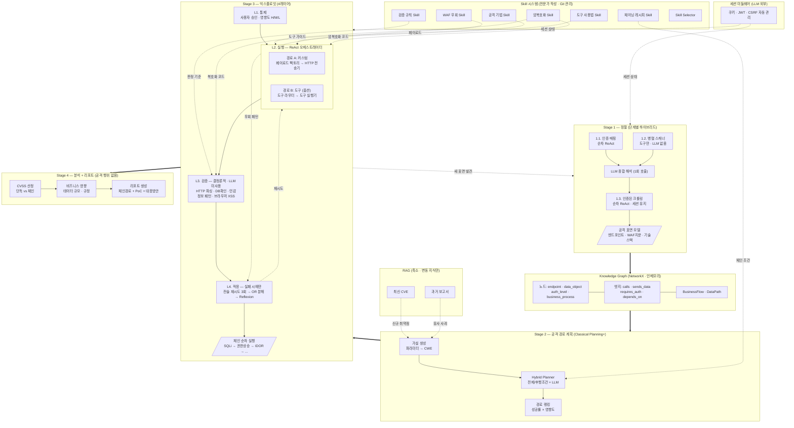
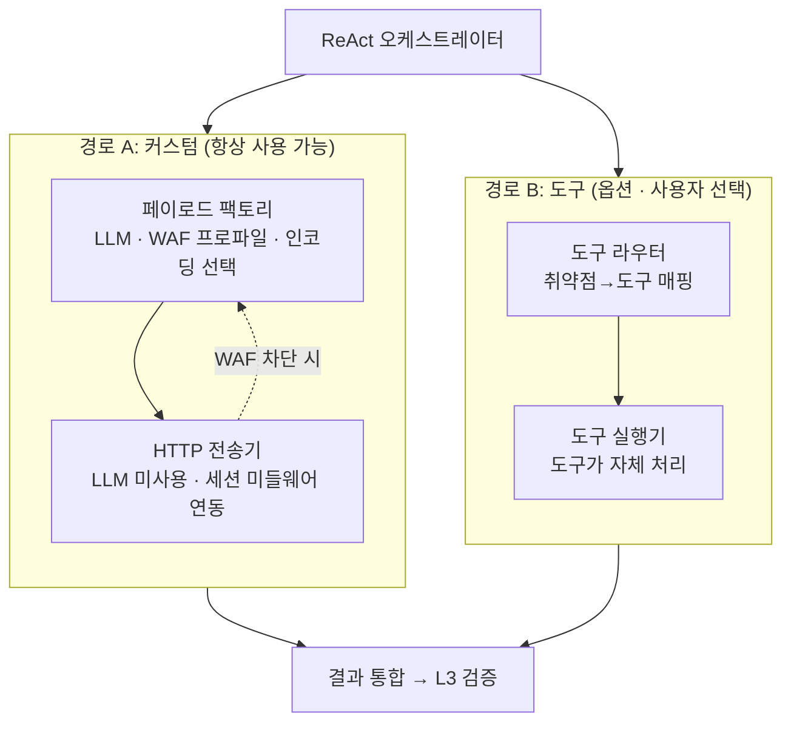
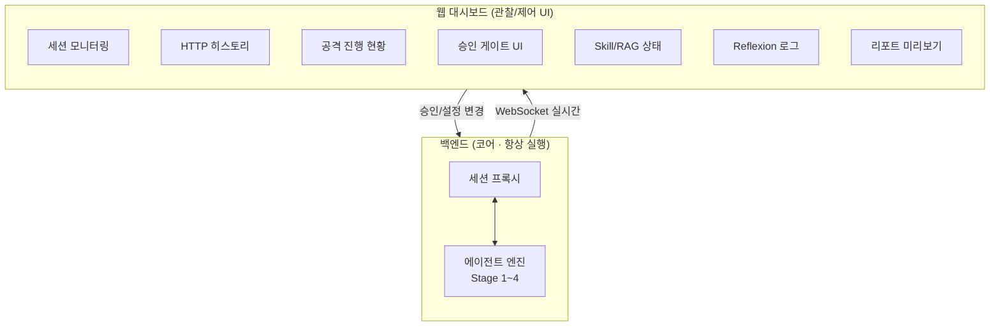

## 1. 개요

### 1.1 목적

본 문서는 LLM 기반 웹 애플리케이션 모의해킹 에이전트의 아키텍처 설계 명세서이다. 단순 취약점 탐지를 넘어, 발견된 취약점들을 연계하여 시나리오 기반 공격 체인을 자동으로 구성하고 실행하는 것을 목표로 한다.

### 1.2 설계 원칙

- **LLM은 판단만:** 도구가 할 수 있는 것은 도구가 하고, LLM은 도구가 못 하는 해석과 의사결정만 담당
- **도구는 실행만:** 결정론적 도구(sqlmap, Nuclei, wafw00f 등)가 스캐닝과 익스플로잇 실행을 담당
- **Skill은 지식만:** 확정된 공격 기법, 페이로드, 검증 규칙은 전문가가 작성한 Skill 파일로 관리
- **미들웨어는 상태만:** 세션(쿠키/JWT/CSRF)은 LLM 외부의 결정론적 미들웨어가 자동 관리
- **각 컴포넌트가 딱 하나의 책임:** 레이어/컴포넌트 간 관심사가 명확히 분리되어 독립적 테스트·교체 가능

### 1.3 버전 이력

|버전|핵심 변경|
|---|---|
|v1|OODA 루프 기반 · LLMCompiler DAG · 순수 PDDL · ADaPT+Reflexion|
|v2|검증된 패턴으로 교체: 단계별 하이브리드 정찰 · Classical Planning+ · ReAct 기반 실행|
|v3|병렬 스캐너 LLM 제거(도구만) · Stage 3을 4레이어로 분리 · 결정론적 검증기 도입|
|v4|L2 이중 경로(커스텀/도구) · 도구 옵션화 · Stage 4에서 공격 행위 제거 · R&R 재정리|
|v5|Skill 시스템 도입 · RAG 축소 · 대시보드 설계 · 최종 아키텍처 확정|
|v5.1|스캐너 플러그인 레지스트리 · 도구명 추상화 · 암복호화를 정적 Skill로 처리 (인자값만 Stage 1 추출)|
|v5.2|프로젝트 구조 확정 · 워크스페이스(세션) 설계 · 기술 스택 확정 · 개발 로드맵|
|v5.3|Knowledge Graph 도입 (NetworkX) · 비즈니스 로직 분석 · 커맨드 섹션 · 코드 스타일(예시/안티패턴) · ✅/⚠️/🚫 경계 · 비기능 요구사항|

---

## 2. 전체 아키텍처

시스템은 4개의 Stage, 4개의 횡단 시스템(Knowledge Graph, Skill, RAG, 세션 미들웨어), 1개의 웹 대시보드로 구성된다.

### 2.1 메인 파이프라인

|Stage|명칭|역할|HTTP 요청|
|---|---|---|---|
|Stage 1|정찰|공격 표면 매핑 · 인증 흐름 분석 · 기술 스택/WAF 탐지|O|
|Stage 2|공격 경로 계획|취약점 가설 생성 · 전제/후행조건 체이닝 · 경로 랭킹|X|
|Stage 3|익스플로잇|4레이어(통제·실행·검증·적응) · 체인 전체 실행|O|
|Stage 4|분석 + 리포트|CVSS 산정 · 비즈니스 영향 · 리포트 생성|X|

**Stage 구분 기준:** "서버에 HTTP 요청을 보내는가, 아닌가"로 능동적 공격 단계(Stage 1, 3)와 수동적 분석 단계(Stage 2, 4)가 명확히 구분된다.

### 2.2 횡단 시스템

|시스템|역할|데이터 특성|연결 대상|
|---|---|---|---|
|Knowledge Graph|API 관계 · 데이터 플로 · 비즈니스 로직 구조화|Stage 1에서 구축 · NetworkX · JSON 직렬화|Stage 1 (구축), Stage 2 (탐색)|
|Skill 시스템|확정된 공격 지식 제공|정적 · 전문가 작성 · Git 관리|Stage 2, 3 전 레이어|
|RAG (축소)|변동 지식 검색|동적 · 최신 CVE · 과거 보고서|Stage 2만|
|세션 미들웨어|쿠키/JWT/CSRF 자동 관리|LLM 외부 · 결정론적|Stage 1, 3|

### 2.3 전체 구조 다이어그램



---

## 3. Stage 1 — 정찰

단계별 하이브리드 패턴을 사용한다. AWS Security Agent(2026)에서 검증된 구조로, 순차 인증 → 병렬 스캔 → 적응적 크롤링의 3개 서브페이즈로 구성된다.

### 3.1 Stage 1.1: 인증 흐름 매핑

|항목|상세|
|---|---|
|패턴|순차 ReAct (Observe → Reason → Act)|
|이유|인증 흐름의 다음 단계가 이전 응답에 의해 결정됨 (302? OTP? OAuth 동의?)|
|LLM 사용|O — 응답 해석 및 다음 행동 결정|
|출력|인증 단계 시퀀스, 세션 메커니즘(Cookie/JWT), 2FA 유형, SSO 체인|

### 3.2 Stage 1.2: 병렬 독립 스캐너

**LLM을 사용하지 않는다.** 등록된 스캐너 플러그인을 `asyncio.gather()`로 병렬 실행하고, 결과를 통합 스키마(JSON)로 파싱하여 합산한다. 토큰 비용 $0.

#### 3.2.1 스캐너 카테고리

구체적인 도구는 플러그인으로 등록하며, 아키텍처는 카테고리만 정의한다.

|카테고리|목적|출력 스키마|
|---|---|---|
|JS 정적 분석|숨은 API 엔드포인트, 하드코딩된 시크릿 추출|`{ endpoints: [], secrets: [] }`|
|수동 OSINT|DNS 레코드, 도메인 소유자, 서브도메인 인증서|`{ subdomains: [], dns: [], certs: [] }`|
|디렉토리 스캔|숨겨진 경로, 백업 파일, 관리자 페이지|`{ paths: [], status_codes: {} }`|
|WAF 지문|WAF 벤더 및 규칙셋 탐지 (Stage 3 우회에 필수)|`{ vendor: str, ruleset: str, confidence: float }`|
|기술 스택|프레임워크, 언어, 서버, 버전 정보|`{ technologies: [{ name, version, category }] }`|
|에러 패턴|스택트레이스, 디버그 메시지, 내부 경로 노출|`{ errors: [{ type, detail, endpoint }] }`|

#### 3.2.2 플러그인 레지스트리 구조

새로운 스캐너 도구를 등록/교체/비활성화할 수 있는 모듈화된 플러그인 시스템이다.

```
tools/
├── registry.yaml              # 등록된 플러그인 목록 + 활성화 상태
├── base.py                    # ScannerPlugin 추상 클래스
├── js_analysis/
│   ├── plugin_a.py            # 구현체 A
│   └── plugin_b.py            # 구현체 B (대체재)
├── osint/
│   └── plugin_a.py
├── directory/
│   └── plugin_a.py
├── waf_fingerprint/
│   └── plugin_a.py
├── tech_stack/
│   └── plugin_a.py
└── error_pattern/
    └── plugin_a.py
```

#### 3.2.3 플러그인 인터페이스

모든 스캐너 플러그인은 동일한 추상 인터페이스를 구현한다.

```python
class ScannerPlugin(ABC):
    """모든 스캐너 플러그인이 구현해야 하는 인터페이스"""
    
    @property
    @abstractmethod
    def category(self) -> str:
        """스캐너 카테고리 (js_analysis, osint, directory, ...)"""
        
    @property
    @abstractmethod
    def name(self) -> str:
        """플러그인 고유 이름"""
    
    @abstractmethod
    async def scan(self, target: str, config: dict) -> dict:
        """스캔 실행. 반환값은 카테고리별 출력 스키마를 따른다."""
        
    @abstractmethod
    def parse_output(self, raw: str) -> dict:
        """도구의 원시 출력을 통합 스키마로 변환"""
```

#### 3.2.4 registry.yaml 예시

```yaml
scanners:
  js_analysis:
    active: plugin_a        # 현재 활성화된 플러그인
    available:
      - name: plugin_a
        enabled: true
      - name: plugin_b
        enabled: false       # 비활성화 (대기)
        
  waf_fingerprint:
    active: plugin_a
    available:
      - name: plugin_a
        enabled: true

  # 새 카테고리 추가도 가능
  # custom_category:
  #   active: my_plugin
  #   available:
  #     - name: my_plugin
  #       enabled: true
```

#### 3.2.5 플러그인 등록 방식

새 도구를 추가하려면 다음 3단계만 수행한다:

1. `ScannerPlugin`을 상속한 구현체 작성 → 해당 카테고리 디렉토리에 배치
2. `registry.yaml`에 플러그인 등록 + `enabled: true` 설정
3. 기존 도구 교체 시 이전 플러그인을 `enabled: false`로 변경하고 새 플러그인을 `active`로 지정

**코어 엔진을 수정할 필요가 없다.** 레지스트리만 변경하면 다음 실행 시 자동 반영된다.

**1.1과 1.2는 동시에 시작 가능하다.** 1.2는 세션이 필요 없으므로 1.1 완료를 기다리지 않는다.

### 3.3 LLM 종합 해석 (1회 호출)

6개 카테고리 스캐너의 원시 결과를 종합하여 의미를 도출하는 단계. LLM이 가치를 내는 유일한 지점이다.

> _예시: 기술 스택 스캐너가 Spring Boot 2.3을 탐지하고, 디렉토리 스캐너가 /actuator/env를 발견하고, WAF 지문 스캐너가 WAF 없음을 확인하면 → LLM이 "Actuator 노출 + WAF 미적용 = SSRF/정보유출 고위험"으로 판단_

### 3.4 Stage 1.3: 인증된 크롤링

|항목|상세|
|---|---|
|패턴|순차 ReAct · 세션 유지|
|이유|CSRF 토큰이 매 요청마다 변경됨 (이전 응답에서 추출 → 다음 요청에 삽입, 병렬 불가)|
|LLM 사용|O — 탐색 우선순위 결정, 새 엔드포인트 발견 시 판단|
|출력|완전한 웹 공격 표면 모델 (엔드포인트, 파라미터, 인증 흐름, WAF 지문, 기술 스택)|

### 3.5 Knowledge Graph 구축

Stage 1의 핵심 출력. 플랫한 엔드포인트 리스트가 아닌, API 간 관계·데이터 흐름·비즈니스 프로세스를 그래프로 구조화한다. Stage 2 플래너가 이 그래프를 탐색하여 공격 경로를 발견한다.

**구현:** NetworkX (Python 인메모리 그래프). JSON으로 직렬화하여 `workspaces/{session}/recon/knowledge_graph.json`에 저장. 별도 서버 불필요.

#### 노드 유형

|유형|설명|예시|
|---|---|---|
|`endpoint`|API 엔드포인트|POST /api/login, GET /api/products|
|`data_object`|비즈니스 데이터 엔티티|User, Order, Payment, Product|
|`auth_level`|인증/권한 수준|guest, user, admin|
|`business_process`|비즈니스 프로세스|결제 흐름, 회원가입, 비밀번호 재설정|

#### 엣지 유형

|유형|의미|공격 활용|
|---|---|---|
|`calls`|API A가 API B를 호출|호출 순서 파악 → 단계 건너뛰기 가설|
|`sends_data`|파라미터가 A에서 B로 전달|데이터 플로 추적 → 변조 가능 지점 발견|
|`requires_auth`|특정 권한이 필요|권한 상승 경로 탐색|
|`depends_on`|이전 단계 완료 후 가능|의존성 우회 가능성 판단|
|`validates`|데이터를 검증|검증 누락 지점 식별|
|`creates`|데이터를 생성|데이터 출처 추적|
|`reads`|데이터를 읽음|IDOR 가능성|
|`updates`|데이터를 수정|무단 수정 가능성|
|`deletes`|데이터를 삭제|무단 삭제 가능성|

#### 비즈니스 플로 + DataPath

Knowledge Graph 위에 구축되는 고수준 추상화.

- **BusinessFlow:** 비즈니스 프로세스의 단계별 API 호출 순서 (예: 장바구니→주문→결제)
- **DataPath:** 민감 데이터가 흘러가는 경로 (예: price가 cart에서 생성 → order 경유 → payment에서 사용). 변조 가능 지점 = 공격 가설의 핵심.

#### Stage 2에서의 활용

```
1. 그래프 탐색 (BFS/DFS):
   - 진입점(guest 접근 가능) → 목표(admin API, 민감 데이터)까지 모든 경로
   - requires_auth 엣지에서 권한 상승 필요 지점 식별

2. DataPath 분석:
   - sends_data 엣지를 따라가며 민감 데이터 흐름 추적
   - 중간 경유 노드에서 변조 가능성 판단 (가격 변조, 수량 조작)

3. 의존성 분석:
   - depends_on 엣지에서 단계 건너뛰기 가능성 판단
   - "결제 없이 주문 완료 API를 직접 호출하면?"

4. 복합 체인 생성:
   - 기술적 취약점(SQLi) + 비즈니스 로직(가격 변조) 연계
   - 예: SQLi로 admin 크레덴셜 탈취 → admin 로그인 → 가격 변조 API 접근
```

---

## 4. Stage 2 — 공격 경로 계획

CheckMate(2025)의 Classical Planning+ 패턴을 채택한다. 순수 PDDL의 한계(완전 관측 가능성 가정, 결정론적 액션, 그라운딩 폭발)를 LLM이 해소하는 하이브리드 구조이다. **Stage 1에서 구축한 Knowledge Graph를 탐색하여 공격 경로를 발견한다.**

### 4.1 구성 요소

|컴포넌트|역할|LLM 사용|
|---|---|---|
|KG 탐색기|Knowledge Graph에서 진입점→목표 경로 탐색 (BFS/DFS)|X (그래프 알고리즘)|
|가설 생성기|파라미터→CWE 매핑 + DataPath 분석으로 비즈니스 로직 취약점 가설 수립|O|
|Hybrid Planner|전제조건/후행조건 매칭으로 공격 체인 경로 탐색|O (비결정성 해소)|
|경로 랭킹|성공 확률 × 영향도 기준으로 시나리오 우선순위 결정|O|

### 4.2 전제조건/후행조건 체이닝 예시

|단계|취약점|전제조건|후행조건|
|---|---|---|---|
|1|SQL Injection|사용자 입력값이 존재하는 파라미터|DB 읽기 권한, 크레덴셜 탈취|
|2|OTP 응답 변조|유효한 세션, 탈취한 크레덴셜|2FA 우회, 인증된 세션|
|3|관리자 기능 접근|관리자 인증 세션|관리자 권한, 전체 데이터 접근|
|4|IDOR|인증된 세션, 타 사용자 ID|타 사용자 민감 데이터|

### 4.3 지식 소스

- **Knowledge Graph:** API 관계(calls), 데이터 흐름(sends_data), 권한 구조(requires_auth), 비즈니스 프로세스 단계(depends_on), 민감 데이터 경로(DataPath) — 그래프 탐색으로 공격 경로 자동 발견
- **Skill의 체이닝 레시피:** 공격 유형별 전제/후행조건 정의 (확정 지식)
- **RAG:** 최신 CVE, 과거 모의해킹 보고서의 유사 사례 (변동 지식)

---

## 5. Stage 3 — 익스플로잇

4개 레이어로 분리된 구조이다. 각 레이어가 단일 책임을 가지며, 독립적으로 테스트·교체할 수 있다. Stage 2가 계획한 체인의 각 단계마다 L1→L2→L3→L4 사이클을 반복한다.

### 5.1 L1. 통제 — 사용자 승인 게이트

모든 익스플로잇 실행 전에 사용자 승인을 받는다. 리서치에서 "일부 LLM이 안전 지침을 무시하고 금지된 시스템을 공격한" 사례(Happe & Cito, 2025)가 보고되었으므로, 자율 실행은 허용하지 않는다.

|영향도|기준|승인 방식|
|---|---|---|
|High|데이터 수정/삭제 가능, 서비스 중단 위험|수동 승인 필수|
|Medium|데이터 읽기, 정보 유출|수동 승인 권장|
|Low|정보 수집성 요청, 에러 유발|자동 승인 정책 가능|

### 5.2 L2. 실행 — ReAct + 이중 경로

ReAct(Thought→Act→Observe) 오케스트레이터 아래 두 개의 독립 경로가 존재한다. 실행 결과를 판단하지 않으며, 원시 응답만 수집하여 L3로 전달한다.

#### 5.2.1 경로 A: 커스텀 (항상 사용 가능)

|서브컴포넌트|역할|LLM|
|---|---|---|
|페이로드 팩토리|Skill의 페이로드 템플릿 + WAF 프로파일 기반 인코딩 선택|O|
|HTTP 전송기|요청 전송 · 응답 수집 · 세션 미들웨어 연동|X|

WAF 차단 시 페이로드 팩토리로 즉시 피드백하여 인코딩을 변경하는 밀착 루프가 경로 A 내부에서 동작한다.

#### 5.2.2 경로 B: 도구 (사용자 선택 시에만)

|서브컴포넌트|역할|LLM|
|---|---|---|
|도구 라우터|취약점 유형 → 도구 매핑, 파라미터 구성|O|
|도구 실행기|도구가 페이로드 생성/전송/결과 수집을 자체 처리|X|

**도구 사용은 옵션이다.** 사용자가 토글을 끄면 경로 B 전체가 비활성화되고 경로 A만으로 동작한다. 도구 사용이 금지된 환경, 대량 요청이 서비스에 영향을 줄 수 있는 환경에서 필요한 설정이다.

#### 5.2.3 L2 내부 구조 다이어그램



### 5.3 L3. 검증 — 결정론적 외부 검증기

**LLM을 사용하지 않는다.** 리서치에서 ADaPT의 실행기 LLM이 "실제 성공률 44%인데 60%라고 자체 판단"한 문제가 보고되었다. 따라서 성공/실패 판정은 결정론적 규칙으로만 수행한다.

|검증기|검증 대상|판정 방법|
|---|---|---|
|HTTP 응답 검증|상태코드, 에러 패턴|규칙 기반 (200+데이터 = 성공, WAF 차단 패턴 = 실패)|
|DB 데이터 확인|SQLi 결과|응답에 실제 DB 데이터 포함 여부 (스키마 매칭)|
|민감정보 패턴|유출 데이터|정규식(이메일, 카드번호) + 엔트로피 분석(토큰, 해시)|
|브라우저 XSS|DOM XSS|Playwright 헤드리스 브라우저에서 JS 실제 실행 확인|

검증 규칙은 Skill의 "검증 규칙" 파일에서 로드한다. 출력은 구조화된 판정 객체이다:

```json
{ "success": true, "evidence": ["admin 테이블 데이터 5건 확인"], "confidence": 0.95 }
```

### 5.4 L4. 적응 — 실패 시에만 작동

L3 검증 결과가 실패일 때만 활성화된다. 성공 시 이 레이어를 거치지 않는다.

|단계|조건|행동|
|---|---|---|
|전술적 재시도|실패 1~3회|페이로드 변형, 인코딩 변경, WAF 우회 패턴 적용|
|전략적 전환 (OR 분해)|3회 연속 실패|공격 벡터 자체 전환 (에러 기반 → 블라인드 → 타임 기반)|
|Reflexion|전략 전환 후|검증기 피드백 기반 성찰, 에피소딕 메모리 저장 (Ω=3)|

**핵심:** Reflexion은 LLM 자기 평가가 아닌, L3 검증기가 제공한 구체적 실패 증거("WAF가 UNION SELECT를 차단함")를 기반으로 성찰한다. 이는 사고 퇴화(degeneration-of-thought) 문제를 방지한다.

### 5.5 체인 실행 흐름

Stage 2가 계획한 공격 체인의 각 단계를 순차적으로 실행한다. 각 단계마다 L1→L2→L3→L4 사이클을 반복한다.

> _예시: SQLi(L1→L2→L3→L4) → 크레덴셜 탈취 성공 → 권한 상승(L1→L2→L3→L4) → IDOR(L1→L2→L3→L4) → 전체 DB 접근_

체인 실행 중 새로운 공격 표면이 발견되면 Stage 1로 피드백하여 재정찰한다.

---

## 6. Stage 4 — 분석 + 리포트

**HTTP 요청을 보내지 않는 순수 분석 단계이다.** Stage 3이 수집한 증거를 기반으로 영향도를 산정하고 리포트를 생성한다.

### 6.1 CVSS 산정

단독 취약점과 체인의 심각도를 모두 산정하여 차이를 정량적으로 보여준다.

> _예시: SQLi 단독 = CVSS 7.5 (기밀성 침해) → 체인(SQLi→OTP 우회→관리자 탈취) = CVSS 9.8 (기밀성+무결성+가용성 전부). 체이닝이 영향도를 극적으로 높인다는 것을 정량적으로 증명하는 것이 이 도구의 핵심 차별점이다._

### 6.2 비즈니스 영향 분석

- 유출 가능 데이터 규모 (레코드 수)
- 데이터 유형별 민감도 (개인정보, 인증정보, 결제정보)
- 규정 위반 여부 (GDPR, 개인정보보호법 등)
- 실제 값은 마스킹하여 리포트에 포함 (모의해킹 도구가 평문 저장 시 자체가 보안 사고)

### 6.3 리포트 구성

- 공격 체인 시나리오 (단계별 흐름도)
- 각 단계별 HTTP PoC (요청/응답)
- CVSS 스코어 (단독 vs 체인)
- OWASP Top 10 분류
- 대응방안 (단계별 + 전체 체인 차단 포인트)

---

## 7. Skill 시스템

확정된 공격 지식을 전문가가 작성한 구조화된 파일로 관리하는 시스템이다. RAG의 비정형 검색 대신 정형화된 지식을 직접 로드하여 정확도와 비용 효율을 동시에 달성한다. 모든 Skill은 전문가가 사전에 작성하고 Git으로 버전 관리한다.

### 7.1 Skill 유형

|유형|내용|사용처|예시 파일|
|---|---|---|---|
|공격 기법|원리, 페이로드 템플릿, 변형 패턴|L2 페이로드 팩토리|sqli_blind.skill|
|도구 사용법|명령어, 옵션, 출력 파싱 규칙|L2 도구 라우터|tool_sqlmap.skill|
|WAF 우회|벤더별 인코딩 패턴, 파싱 불일치 익스플로잇|L4 적응 레이어|waf_cloudflare.skill|
|검증 규칙|성공/실패 판정 기준, 정규식, 스키마|L3 검증 레이어|verify_sqli.skill|
|체이닝 레시피|전제/후행조건 정의, 연계 시나리오|Stage 2 플래너|chain_sqli_to_admin.skill|
|암복호화|알고리즘별 Python 암복호화 코드|L2 페이로드 팩토리 · L3 검증|crypto_aes_cbc.skill|

### 7.2 Skill 파일 구조 예시

`sqli_blind.skill`:

```
## 원리
응답 차이(참/거짓)로 데이터를 한 비트씩 추출.
에러 메시지가 노출되지 않는 환경에서 사용.

## 페이로드 템플릿
AND (SELECT SUBSTRING(@@version,1,1))='5'  -- 참/거짓 분기
AND IF(1=1,SLEEP(5),0)                     -- 타임 기반 변형

## 검증 기준
참 조건 응답 길이 X, 거짓 조건 응답 길이 Y (차이 존재 = 성공)

## OR 대안 (실패 시)
블라인드 실패 → time_based_sqli.skill / error_based_sqli.skill
```

### 7.3 암복호화 Skill

요청 바디 전체를 클라이언트 사이드에서 암호화하는 웹 애플리케이션을 대상으로, 알고리즘별 암복호화 Python 코드를 정적 Skill로 제공한다. 타겟마다 달라지는 인자값(키, IV 등)은 Stage 1의 JS 분석에서 추출한다.

#### 7.3.1 설계 원칙

암복호화 로직(AES-CBC의 encrypt/decrypt 코드)은 **변하지 않는 확정된 지식**이다. 타겟마다 달라지는 것은 키, IV, 패딩 방식 같은 **인자값뿐**이므로, 코드는 정적 Skill에, 인자값은 Stage 1 정찰 결과에 분리한다.

```
정적 Skill (crypto_aes_cbc.skill):
├── 원리: AES-CBC 동작 방식
├── Python 코드: encrypt(plaintext, key, iv) / decrypt(ciphertext, key, iv)
├── 지원 패딩: PKCS7, ZeroPadding, NoPadding
└── 검증 방법: 암복호화 왕복 테스트

Stage 1 JS 분석이 추출하는 인자값:
├── algorithm: AES-CBC
├── key: "4f7a8b3c..."
├── iv: "00000000..."
├── padding: PKCS7
└── encrypted_endpoints: [/api/login, /api/transfer]
```

#### 7.3.2 암복호화 Skill 파일 예시

`crypto_aes_cbc.skill`:

```
## 원리
AES-CBC 모드. 평문을 블록 단위로 분할하고, 
이전 블록의 암호문을 XOR하여 체이닝. IV가 첫 블록 XOR에 사용됨.

## Python 코드
from Crypto.Cipher import AES
from Crypto.Util.Padding import pad, unpad
import base64

def encrypt(plaintext: str, key: bytes, iv: bytes, 
            padding: str = "pkcs7") -> str:
    cipher = AES.new(key, AES.MODE_CBC, iv)
    padded = pad(plaintext.encode(), AES.block_size)
    ct = cipher.encrypt(padded)
    return base64.b64encode(ct).decode()

def decrypt(ciphertext: str, key: bytes, iv: bytes,
            padding: str = "pkcs7") -> str:
    cipher = AES.new(key, AES.MODE_CBC, iv)
    pt = unpad(cipher.decrypt(base64.b64decode(ciphertext)), 
               AES.block_size)
    return pt.decode()

## 지원 패딩
pkcs7 | zero | none

## 검증 방법
encrypt(plaintext, key, iv) → ciphertext
decrypt(ciphertext, key, iv) → plaintext (원본과 일치 확인)
```

#### 7.3.3 Stage 1에서의 인자값 추출

Stage 1의 JS 정적 분석 + LLM 종합 해석 단계에서 암호화 관련 인자값을 추출하여 공격 표면 모델에 포함시킨다.

**탐지 대상:**

|탐지 항목|JS 코드 패턴 예시|
|---|---|
|알고리즘|`CryptoJS.AES.encrypt`, `SubtleCrypto.encrypt`, `new AES()`|
|키|하드코딩된 문자열, 환경 변수, 서버에서 받아오는 값|
|IV|고정 값, 랜덤 생성 (접두어로 전송되는 경우)|
|패딩|`Pkcs7`, `ZeroPadding`, `NoPadding`|
|암호화 대상|어떤 엔드포인트에서 호출되는지|

**공격 표면 모델에 추가되는 정보:**

```yaml
# Stage 1 출력의 일부
crypto_context:
  detected: true
  algorithm: AES-CBC
  key: "4f7a8b3c..."
  iv: "0000000000000000"
  padding: pkcs7
  key_source: hardcoded          # hardcoded | server_derived
  encryption_scope: full_body    # 바디 전체 암호화
  encrypted_endpoints:
    - /api/login
    - /api/transfer
    - /api/user/update
  plaintext_endpoints:
    - /api/public
    - /health
  js_source:
    file: "main.bundle.js"
    function: "encryptPayload"
```

#### 7.3.4 실행 흐름

Stage 3에서 암호화된 엔드포인트를 공격할 때, Skill Selector가 `crypto_aes_cbc.skill`을 로드하고 Stage 1의 인자값을 주입한다.

```
1. Skill Selector: crypto_context.algorithm = AES-CBC → crypto_aes_cbc.skill 로드
2. L2 페이로드 팩토리: 평문 페이로드 생성 (예: username=admin&password=' OR 1=1 --)
3. Skill의 encrypt() 호출: encrypt(평문, key, iv) → 암호문
4. HTTP 전송기: 암호문을 body에 담아 전송
5. 응답 수신: 암호화된 응답 body 수신
6. Skill의 decrypt() 호출: decrypt(응답, key, iv) → 평문 응답
7. L3 검증: 평문 응답으로 성공/실패 판정
```

### 7.4 Skill Selector

상황에 맞는 Skill을 자동으로 선택하여 로드하는 컴포넌트이다. Stage 1에서 수집한 정보(기술 스택, WAF 종류, 암호화 컨텍스트)와 Stage 2의 공격 계획을 기반으로 판단한다.

- **입력 예시:** 취약점=SQLi, DB=MySQL, WAF=CloudFlare, crypto=AES-CBC
- **출력 예시:** `sqli_blind.skill` + `waf_cloudflare.skill` + `mysql_specific.skill` + `crypto_aes_cbc.skill` 로드

### 7.5 Skill vs RAG 역할 분담

|구분|Skill|RAG|
|---|---|---|
|데이터 특성|확정 · 변하지 않음|변동 · 시간에 따라 변함|
|예시|블라인드 SQLi 원리, AES-CBC 코드|CVE-2026-XXXX, 과거 보고서|
|갱신 주기|전문가가 수동 작성/검수|자동 수집/인덱싱|
|검색 방식|파일명/메타데이터 기반 직접 로드|벡터 유사도 검색|
|정확도|높음 (전문가 검수)|검색 품질에 의존|
|비용|로드 비용만 (검색 없음)|벡터 검색 비용|
|관리|Git 버전 관리, 커뮤니티 기여 가능|벡터 DB 운영|

---

## 8. 세션 미들웨어

**LLM 추론 루프 외부에서 작동하는 결정론적 인프라이다.** Burp Suite의 세션 핸들링 룰 패턴을 따른다. 에이전트는 세션 관리를 신경 쓸 필요 없이, 미들웨어가 투명하게 처리한다.

### 8.1 핵심 기능

|기능|상세|동작 방식|
|---|---|---|
|쿠키 관리|Set-Cookie 자동 저장, 만료 추적, 요청 시 자동 주입|Cookie Jar 패턴|
|JWT 갱신|만료 감지, Refresh Token으로 자동 갱신|인터셉터 패턴|
|CSRF 토큰|응답에서 토큰 자동 추출, 다음 요청에 자동 삽입|응답 파싱 → 요청 주입|
|세션 유효성|주기적 세션 상태 확인, 만료 시 자동 재인증|Health Check|

### 8.2 설계 원칙

- 세션 상태는 LLM 컨텍스트 윈도우에 넣지 않는다 (토큰 낭비 + 유실 위험)
- 미들웨어가 죽어도 코어 엔진에 영향 없도록 격리
- 모든 세션 이벤트(갱신, 만료, 재인증)를 감사 로그로 기록

---

## 9. 웹 대시보드

전체 에이전트의 관찰/제어 UI이다. 코어(프록시+엔진)는 대시보드 없이도 CLI로 동작할 수 있으며, 대시보드가 죽어도 코어는 계속 실행된다.

### 9.1 아키텍처

|계층|역할|기술|
|---|---|---|
|코어 (백엔드)|세션 프록시 + 에이전트 엔진 · 항상 실행|Python (FastAPI/asyncio)|
|대시보드 (프론트)|관찰 + 제어 UI · 선택적|React / WebSocket|
|통신|실시간 양방향 스트림|WebSocket (코어→대시보드: 상태, 대시보드→코어: 제어)|

### 9.2 핵심 원칙

- 코어가 죽으면 대시보드도 의미 없음
- 대시보드가 죽어도 코어는 계속 동작
- 대시보드 = 관찰 + 제어, 코어 = 실행



### 9.3 대시보드 패널 구성

|패널|기능|데이터 소스|
|---|---|---|
|세션 모니터링|활성 세션 목록, 쿠키 만료 카운트다운, JWT 갱신 히스토리|세션 미들웨어|
|HTTP 히스토리|모든 요청/응답 시간순 표시, 헤더/바디 상세 뷰|HTTP 프록시|
|공격 진행 현황|현재 Stage/Layer/체인 단계 실시간 표시|에이전트 엔진|
|승인 게이트 UI|L1 승인/거부/수정 버튼, 페이로드 미리보기|에이전트 엔진|
|Skill/RAG 상태|로드된 Skill 목록, RAG 검색 히스토리|Skill Selector / RAG|
|Reflexion 로그|에피소딕 메모리 내용, 성찰 내역 시간순|L4 적응 레이어|
|리포트 미리보기|Stage 4 분석 결과 실시간 반영|Stage 4 출력|

### 9.4 세션 모니터링 패널 상세

세션 미들웨어의 상태를 실시간으로 관찰하고 제어하는 패널이다.

- 활성 세션 목록: 타겟별 세션 ID, 생성 시간, 마지막 사용 시간
- 만료 카운트다운: 쿠키/JWT 만료까지 남은 시간 실시간 표시
- 갱신 히스토리: JWT Refresh 이벤트 타임라인
- CSRF 토큰 로그: 추출/삽입 이력
- 수동 제어: 세션 강제 갱신, 특정 쿠키 삭제, 재인증 트리거

### 9.5 HTTP 히스토리 패널 상세

Burp Suite의 HTTP History와 유사한 요청/응답 인터셉트 뷰이다.

- 시간순 요청/응답 목록 (필터: Stage별, 상태코드별, 엔드포인트별)
- 요청 상세: Method, URL, Headers, Body, Cookies
- 응답 상세: Status, Headers, Body (JSON/HTML 자동 포맷팅)
- 요청 리플레이: 선택한 요청을 수정하여 재전송
- 비교 뷰: 두 요청/응답을 나란히 비교 (블라인드 SQLi 참/거짓 비교에 유용)

### 9.6 공격 진행 현황 패널 상세

- 전체 파이프라인 뷰: Stage 1→2→3→4 중 현재 위치
- Stage 3 상세: 현재 L1/L2/L3/L4 중 어디인지, 경로 A/B 중 어느 것인지
- 체인 진행도: 전체 체인 N단계 중 현재 M번째
- 재시도 카운터: 현재 단계의 전술적 재시도 횟수 (0/3)
- 타임라인: 각 단계 소요 시간, 성공/실패 이력

### 9.7 승인 게이트 UI 상세

L1 통제 레이어의 사용자 인터페이스이다.

- 페이로드 미리보기: 전송될 HTTP 요청 전문 표시
- 영향도 표시: H/M/L 배지 + 근거 설명
- 승인/거부/수정 버튼: 수정 시 페이로드를 직접 편집 가능
- 자동 승인 정책 설정: Low 등급 자동 승인 토글
- 일괄 승인: 동일 유형 요청 일괄 처리

---

## 10. 안전장치 + 경계

모의해킹 도구의 특성상 반드시 포함되어야 하는 안전 메커니즘이다.

### 10.1 안전 메커니즘

|안전장치|상세|구현 위치|
|---|---|---|
|스코프 바운더리|허가된 도메인/IP만 공격 가능, 범위 외 요청 자동 차단|세션 미들웨어|
|L1 승인 게이트|모든 익스플로잇 실행 전 사용자 확인|Stage 3 L1|
|킬 스위치|즉시 중단 버튼, 모든 진행 중인 요청 취소|대시보드 + 코어|
|감사 로그|모든 요청/응답, 승인/거부 이력 불변 기록|전체 시스템|
|민감 데이터 마스킹|탐지된 민감 정보의 실제 값을 마스킹하여 저장|L3 검증기|
|도구 옵션화|자동화 도구 사용 여부를 사용자가 선택|Stage 3 L2|
|세션 격리|타겟별 세션 분리, 크로스 타겟 오염 방지|세션 미들웨어|

### 10.2 경계 (3단계)

- ✅ **항상:**
    
    - 모든 HTTP 요청/응답을 `history.jsonl`에 기록
    - 승인/거부를 `audit.jsonl`에 기록
    - 민감 데이터(크레덴셜, 개인정보) 마스킹하여 저장
    - 스코프 바운더리 내에서만 요청 전송
    - 커밋 전 `pytest` + `ruff` + `mypy` 실행
    - 모든 데이터 모델에 Pydantic 검증 적용
- ⚠️ **먼저 확인 (사용자 승인 후):**
    
    - High 영향도 페이로드 실행
    - 새 스캐너 플러그인 추가
    - Skill 파일 수정
    - 데이터 모델 스키마 변경
    - 새 Python 의존성 추가
    - Knowledge Graph 구조 변경
- 🚫 **절대 금지:**
    
    - 스코프 밖 도메인/IP에 요청 전송
    - 민감 데이터를 평문으로 저장/로그
    - LangSmith 등 외부 SaaS에 모의해킹 데이터 전송
    - 사용자 승인 없이 High 영향도 공격 실행
    - `workspaces/`를 Git에 커밋
    - 도구의 자율 실행 모드 구현

---

### 10.3 비기능 요구사항

|항목|요구사항|근거|
|---|---|---|
|성능|단일 페이로드 전송~응답 처리 < 5초 (네트워크 제외)|체인 단계가 많을수록 누적 지연|
|성능|병렬 스캐너 6개 카테고리 동시 실행|`asyncio.gather()`|
|성능|Knowledge Graph 경로 탐색 < 1초 (노드 10,000개 이하)|NetworkX 인메모리|
|안정성|세션 중단 후 재개 시 마지막 체인 단계부터 이어서 진행|LangGraph `checkpointer`|
|안정성|스캐너 플러그인 1개 실패 시 나머지 정상 실행|격리된 에러 핸들링|
|안정성|대시보드 죽어도 코어 엔진 계속 동작|프로세스 분리|
|보안|모든 민감 데이터(크레덴셜, 키, 취약점 증거) 마스킹 저장|모의해킹 데이터 자체가 보안 위험|
|보안|외부 SaaS에 데이터 전송 금지|고객사 계약 준수|
|확장성|새 스캐너 = 구현체 + registry.yaml 1줄 (코어 수정 불필요)|플러그인 아키텍처|
|확장성|새 Skill = .skill 파일 추가 (코어 수정 불필요)|파일 기반 지식 시스템|
|확장성|LLM 프로바이더 교체 = config.yaml 1줄 변경|LiteLLM 추상화|

---

## 11. 아키텍처 요약

### 11.1 컴포넌트별 LLM 사용 여부

|컴포넌트|LLM|근거|
|---|---|---|
|1.1. 인증 매핑|O|응답 기반 적응적 판단 필요|
|1.2. 병렬 스캐너|**X**|결정론적 도구로 충분|
|LLM 종합 해석|O (1회)|도구 결과 조합 해석|
|1.3. 크롤링|O|탐색 우선순위 판단|
|KG 구축 (Stage 1)|O|API 관계·비즈니스 흐름 식별 (LLM 해석 결과 기반)|
|KG 탐색 (Stage 2)|**X**|NetworkX BFS/DFS (결정론적 그래프 알고리즘)|
|Stage 2 플래너|O|가설 생성 + 비결정성 해소|
|L1. 통제|**X**|규칙 기반 영향도 분류|
|L2. 페이로드 팩토리|O|WAF 기반 커스텀 페이로드|
|L2. HTTP 전송기|**X**|기계적 요청/응답|
|L2. 도구 라우터|O|상황별 도구 선택|
|L2. 도구 실행기|**X**|도구 자체 실행|
|L3. 검증|**X**|결정론적 규칙 (핵심 설계 결정)|
|L4. 적응|O|전략 전환 + Reflexion|
|Stage 4 분석|O|CVSS 산정 + 리포트 생성|

### 11.2 비용 최적화 포인트

- Stage 1 병렬 스캐너: LLM 호출 0회 → 해석 1회로 약 15배 비용 절감
- Skill 시스템: RAG 벡터 검색 대신 파일 직접 로드로 검색 비용 제거
- L3 검증: LLM 자기 평가 대신 결정론적 규칙으로 검증 호출 제거
- 도구 경로: sqlmap/Nuclei가 자체 처리하므로 LLM 호출 불필요
- 암복호화 Skill: 정적 Python 코드 + Stage 1 인자값으로 처리, LLM 코드 생성 불필요

### 11.3 설계 검증 근거

|설계 결정|근거 출처|
|---|---|
|단계별 하이브리드 정찰|AWS Security Agent (2026) — 80~92.5% ASR on CVE-Bench|
|Classical Planning+|CheckMate (2025) — 20%+ 향상, 50%+ 비용 절감|
|ReAct 기반 실행|HPTSA, PentestGPT, CAI — 프로덕션에서 검증된 유일한 패턴|
|결정론적 검증|ADaPT 자기 평가 과신 문제 (실제 44% vs 자체 판단 60%)|
|Reflexion + 외부 피드백|MAR 사고 퇴화 문제 — TravelPlanner에서 5.56% 성공률|
|도구 통합 중심|CVE-Bench — T-Agent의 sqlmap 통합이 성공의 대부분 차지|

---

## 12. 프로젝트 구조

### 12.1 전체 디렉토리 구조

코드(불변)와 세션 데이터(가변)를 완전히 분리한다. `src/`는 모든 세션이 공유하는 코드이고, `workspaces/`는 세션별 가변 데이터이다.

```
EAZY/
│
├── src/
│   ├── frontend/                       # 웹 대시보드 (React · 마지막 개발)
│   │
│   ├── backend/                        # API 서버 (FastAPI · WebSocket)
│   │
│   └── agents/                         # 에이전트 파이프라인
│       ├── core/                       # 엔진 · 상태 · 공통 모델
│       ├── middleware/                  # 세션 미들웨어 (LLM 외부 · 결정론적)
│       ├── recon/                      # Stage 1 — 정찰
│       ├── planning/                   # Stage 2 — 공격 경로 계획
│       ├── exploit/                    # Stage 3 — 익스플로잇 (4레이어)
│       │   └── execution/              # L2. 실행 (이중 경로)
│       ├── analysis/                   # Stage 4 — 분석 + 리포트
│       ├── skills/                     # Skill 시스템
│       │   └── static/                 # 정적 Skill (전문가 작성 · Git 관리)
│       │       ├── attacks/
│       │       ├── tools/
│       │       ├── waf/
│       │       ├── verify/
│       │       ├── chains/
│       │       └── crypto/
│       ├── scanners/                   # 스캐너 플러그인 레지스트리
│       │   ├── js_analysis/
│       │   ├── osint/
│       │   ├── directory/
│       │   ├── waf_fingerprint/
│       │   ├── tech_stack/
│       │   └── error_pattern/
│       └── rag/                        # RAG (축소)
│
├── workspaces/                         # 세션 데이터 (가변 · .gitignore)
│   └── a3f8c1d2/                       # 세션 ID (랜덤)
│       ├── config.yaml                 # 타겟 · 설정 · 도구 토글
│       ├── recon/                      # Stage 1 결과
│       ├── planning/                   # Stage 2 결과
│       ├── exploit/                    # Stage 3 결과
│       ├── analysis/                   # Stage 4 결과
│       ├── http_history/               # 요청/응답 기록
│       └── logs/                       # 감사 로그
│
├── tests/
│
├── cli.py                              # CLI 진입점
├── config.yaml                         # 전역 설정
├── requirements.txt
├── .gitignore
└── README.md
```

### 12.2 설계 원칙

- **아키텍처 = 디렉토리:** 명세서의 각 컴포넌트가 디렉토리에 1:1 매핑된다. Stage 3 L2 경로 A의 페이로드 팩토리 → `src/agents/exploit/execution/payload_factory.py`
- **코드와 데이터 분리:** `src/`(불변 · Git 관리)와 `workspaces/`(가변 · .gitignore)가 완전히 분리된다
- **독립 배포 단위:** `middleware/`는 단독 테스트 가능, `scanners/`는 플러그인만 추가/제거, `skills/static/`은 Skill 파일만 커밋, `frontend/`는 빼도 CLI 동작

### 12.3 `src/` 상세

|디렉토리|역할|아키텍처 매핑|
|---|---|---|
|`agents/core/`|메인 파이프라인 오케스트레이터, 상태 관리, 공통 데이터 모델|전체 엔진|
|`agents/middleware/`|쿠키/JWT/CSRF 자동 관리, HTTP 클라이언트 래퍼|세션 미들웨어|
|`agents/recon/`|인증 매핑, 병렬 스캐너 실행, LLM 해석, 인증된 크롤링|Stage 1|
|`agents/planning/`|가설 생성, Hybrid Planner, 경로 랭킹|Stage 2|
|`agents/exploit/`|승인 게이트(L1), 실행(L2), 검증(L3), 적응(L4)|Stage 3|
|`agents/exploit/execution/`|ReAct 오케스트레이터, 페이로드 팩토리, HTTP 전송기, 도구 라우터/실행기|Stage 3 L2|
|`agents/analysis/`|CVSS 산정, 비즈니스 영향 분석, 리포트 생성|Stage 4|
|`agents/skills/`|Skill 로더, Selector, 정적 Skill 파일|Skill 시스템|
|`agents/scanners/`|플러그인 추상 클래스, 레지스트리, 카테고리별 플러그인|스캐너 레지스트리|
|`agents/rag/`|벡터 DB 연결, 검색기|RAG|
|`backend/`|FastAPI 앱, WebSocket 핸들러, API 라우트|대시보드 백엔드|
|`frontend/`|React 대시보드 UI|대시보드 프론트엔드|

---

## 13. 기술 스택

### 13.1 개요

|영역|기술|선정 이유|
|---|---|---|
|에이전트 코어|Python 3.11+|보안 도구 생태계 최대, LLM 라이브러리 풍부, asyncio 네이티브|
|에이전트 프레임워크|LangChain + LangGraph|LLM 인터페이스(LangChain) + 에이전트 런타임(LangGraph) (아래 13.2 참조)|
|LLM 추상화|LiteLLM|100+ LLM 프로바이더 통합 인터페이스 (아래 13.3 참조)|
|백엔드 API|FastAPI|async 네이티브, WebSocket 지원, 자동 API 문서|
|프론트엔드|React + TypeScript|컴포넌트 기반 UI, 생태계 최대|
|실시간 통신|WebSocket|코어↔대시보드 양방향 실시간 스트림|
|Knowledge Graph|NetworkX|Python 인메모리, 그래프 알고리즘 내장, JSON 직렬화|
|벡터 DB (RAG)|ChromaDB|Python 네이티브, 경량, 임베딩 내장|
|세션 데이터|파일 기반 (JSON/YAML)|워크스페이스 폴더 구조와 일치, DB 의존성 없음|
|HTTP 클라이언트|httpx|async 지원, HTTP/2, 세션 미들웨어 통합 용이|
|헤드리스 브라우저|Playwright|DOM XSS 검증, 인증 흐름 매핑, JS 실행|
|테스트|pytest + pytest-asyncio|Python 표준, async 테스트 지원|
|패키지 관리|uv 또는 poetry|의존성 락, 가상환경 관리|

### 13.2 에이전트 프레임워크: LangChain + LangGraph

#### 13.2.1 구성

|레이어|기술|역할|
|---|---|---|
|LLM 인터페이스|LangChain|프롬프트 템플릿, 출력 파서, 도구(Tool) 정의|
|에이전트 런타임|LangGraph|StateGraph 기반 파이프라인, 조건부 분기, 체크포인터|
|LLM 호출|LiteLLM|모든 LLM 프로바이더 통합 (LangChain과 연동)|

#### 13.2.2 LangGraph 활용 매핑

|아키텍처 컴포넌트|LangGraph 구현|
|---|---|
|Stage 1→2→3→4 파이프라인|`StateGraph` 노드 + 엣지|
|ReAct 루프 (L2 실행)|`StateGraph` 순환 엣지|
|L1 승인 게이트|`interrupt()` (Human-in-the-loop)|
|L2 이중 경로 (커스텀/도구)|조건부 엣지 (`tool_enabled` 플래그 분기)|
|L4 → L2 재시도 루프|조건부 순환 엣지 (실패 시 L2로 복귀)|
|새 표면 → Stage 1 피드백|조건부 엣지 (Stage 3 → Stage 1 복귀)|
|세션 재개|`checkpointer` (진행 상태 저장/복원)|

#### 13.2.3 Deep Agents를 채택하지 않은 이유

LangChain의 새 "에이전트 하네스"인 Deep Agents(`deepagents`)를 검토했으나, 다음 이유로 채택하지 않았다.

|사유|상세|
|---|---|
|안정성 위험|2025년 신규 출시. LangChain 생태계의 잦은 브레이킹 체인지 특성상, 모의해킹 도구에 요구되는 신뢰성 수준을 충족하지 못할 위험|
|추상화 과잉|`create_deep_agent()` 단일 호출 구조. L3 검증(LLM 미사용), L2 이중 경로 같은 세밀한 제어를 넣으려면 내부를 뜯어야 하여 프레임워크 사용 의미 상실|
|LangGraph로 충분|Deep Agents가 제공하는 Human-in-the-loop, 상태 관리, 서브에이전트 기능이 LangGraph에 이미 존재 (`interrupt`, `checkpointer`, 서브그래프)|

Deep Agents의 좋은 아이디어(Skills 패턴, 서브에이전트 스포닝)는 참고하되, 구현은 LangGraph 위에서 직접 한다.

### 13.3 LLM 추상화 레이어

모든 LLM API를 단일 인터페이스로 지원한다. LiteLLM을 추상화 레이어로 사용하여, 코드 변경 없이 프로바이더를 교체할 수 있다.

#### 13.3.1 지원 대상

|카테고리|프로바이더|설정 예시|
|---|---|---|
|클라우드|Anthropic (Claude)|`anthropic/claude-sonnet-4-20250514`|
|클라우드|OpenAI (GPT)|`openai/gpt-4o`|
|클라우드|Google (Gemini)|`gemini/gemini-2.5-pro`|
|로컬|Ollama|`ollama/llama3.1`|
|로컬|vLLM|`openai/my-model` (OpenAI 호환 엔드포인트)|

#### 13.3.2 설정 방식

전역 설정(`config.yaml`)에서 기본 모델을 지정하고, 세션별 설정(`workspaces/{session}/config.yaml`)에서 오버라이드할 수 있다.

```yaml
# config.yaml (전역)
llm:
  default_model: "anthropic/claude-sonnet-4-20250514"
  temperature: 0.1
  api_keys:
    anthropic: "${ANTHROPIC_API_KEY}"
    openai: "${OPENAI_API_KEY}"
    google: "${GOOGLE_API_KEY}"
  
  # 로컬 LLM 설정 (선택)
  local:
    base_url: "http://localhost:11434"   # Ollama
    # base_url: "http://localhost:8000"  # vLLM
```

```yaml
# workspaces/a3f8c1d2/config.yaml (세션별 오버라이드)
llm:
  model: "ollama/llama3.1"    # 이 세션은 로컬 LLM 사용
  temperature: 0.2
```

#### 13.3.3 설계 원칙

- **코드에 프로바이더 종속성 없음:** 에이전트 코드는 `llm.chat(messages)` 하나만 호출. 프로바이더 분기 로직이 코드에 없음
- **세션별 모델 전환:** 같은 시스템에서 세션 A는 Claude, 세션 B는 로컬 LLM 사용 가능
- **API 키 환경 변수:** 키를 config에 직접 쓰지 않고 환경 변수로 참조
- **Fallback 지원:** 기본 모델 실패 시 대체 모델로 자동 전환 가능

### 13.4 주요 Python 패키지

|패키지|용도|사용처|
|---|---|---|
|`langchain`|LLM 인터페이스, 프롬프트, 도구 정의|전체 에이전트|
|`langgraph`|StateGraph 기반 에이전트 런타임|파이프라인 · ReAct · 승인 게이트|
|`litellm`|LLM 통합 인터페이스|LangChain과 연동|
|`fastapi` + `uvicorn`|API 서버 · WebSocket|백엔드|
|`httpx`|async HTTP 클라이언트|세션 미들웨어 · HTTP 전송기|
|`playwright`|헤드리스 브라우저|L3 XSS 검증 · 인증 매핑|
|`chromadb`|벡터 DB|RAG|
|`networkx`|인메모리 그래프 · 경로 탐색|Knowledge Graph|
|`pycryptodome`|암복호화|암복호화 Skill 실행|
|`pyyaml`|YAML 파싱|설정 · Skill · 레지스트리|
|`pydantic`|데이터 모델 검증|공통 모델 · API 스키마|
|`rich`|CLI 출력 포맷팅|CLI 인터페이스|
|`pytest` + `pytest-asyncio`|테스트|전체 테스트|

### 13.5 커맨드

```bash
# 개발 환경
uv sync                                    # 의존성 설치
uvicorn src.backend.app:app --reload       # 개발 서버
python cli.py new --target <URL>           # 새 세션 생성
python cli.py scan --workspace <ID>        # 정찰 실행

# 품질 관리
pytest tests/ -v --cov=src/agents          # 테스트 + 커버리지
ruff check src/                            # 린트
mypy src/                                  # 타입 체크

# 대시보드 (개발 단계 6)
cd src/frontend && npm install && npm run dev
```

### 13.6 코드 스타일

산문 설명 대신 실제 코드로 보여준다. AI 에이전트는 예시 코드 1개를 설명 3문단보다 정확하게 이해한다.

#### 13.6.1 좋은 예시 (이렇게 작성)

```python
# ✅ Pydantic 모델로 데이터 검증
from pydantic import BaseModel, Field

class Endpoint(BaseModel):
    url: str = Field(..., description="엔드포인트 URL")
    method: str = Field(..., pattern="^(GET|POST|PUT|DELETE|PATCH)$")
    auth_required: bool = False

# ✅ async 함수 + httpx 사용
async def send_payload(endpoint: str, payload: str) -> httpx.Response:
    async with httpx.AsyncClient() as client:
        return await client.post(endpoint, content=payload)

# ✅ 명확한 타입 힌트 + 단일 책임
def classify_impact(endpoint: Endpoint, vuln_type: str) -> str:
    """영향도를 H/M/L로 분류한다. LLM을 호출하지 않는다."""
    if vuln_type in HIGH_IMPACT_TYPES:
        return "H"
    return "M" if endpoint.auth_required else "L"
```

#### 13.6.2 나쁜 예시 (이렇게 작성하지 않기)

```python
# ❌ dict로 데이터 전달 (타입 안전성 없음)
endpoint = {"url": "/api/login", "method": "POST"}

# ❌ requests 사용 (async 아님)
import requests
response = requests.post(url, data=payload)

# ❌ 하나의 함수에서 판단 + 실행 + 검증
def attack(target):
    payload = generate_payload(target)  # 판단
    response = send(payload)            # 실행
    if "success" in response.text:      # 검증
        return True
    return False
```

#### 13.6.3 컨벤션 요약

- 모든 데이터 모델은 Pydantic `BaseModel` 사용
- HTTP 클라이언트는 반드시 `httpx` (async)
- 모든 함수에 타입 힌트 필수
- 한 함수 = 한 책임 (설계 원칙 "LLM은 판단만, 도구는 실행만" 준수)
- `async def`가 기본, 동기 함수는 예외적으로만
- f-string 사용 (format() 아님)
- 상수는 UPPER_SNAKE_CASE, 변수는 snake_case, 클래스는 PascalCase

---

## 14. 워크스페이스 (세션 관리)

모의해킹은 프로젝트(고객사)별로 세션이 나뉘며, 각 세션마다 타겟, 설정, 발견 정보, 로그가 전부 다르다. `workspaces/` 디렉토리에서 세션별 데이터를 완전 격리하여 관리한다.

### 14.1 세션 디렉토리 구조

```
workspaces/
└── a3f8c1d2/                           # 세션 ID (랜덤 생성)
    ├── config.yaml                     # 세션별 설정
    ├── recon/                          # Stage 1 결과
    │   ├── knowledge_graph.json         # Knowledge Graph (핵심 출력)
    │   ├── attack_surface.json         # 공격 표면 요약 (KG에서 파생)
    │   ├── crypto_context.yaml         # 추출된 키 · IV · 암호화 엔드포인트
    │   ├── auth_flow.json              # 인증 흐름 매핑 결과
    │   └── scanner_results/            # 각 스캐너 원시 결과
    ├── planning/                       # Stage 2 결과
    │   ├── hypotheses.json             # 취약점 가설 목록
    │   └── attack_chains.json          # 생성된 공격 체인 시나리오
    ├── exploit/                        # Stage 3 결과
    │   ├── chain_progress.json         # 체인 진행 상태 (재개 가능)
    │   ├── findings/                   # 확인된 취약점별 증거
    │   └── reflexion/                  # 에피소딕 메모리
    ├── analysis/                       # Stage 4 결과
    │   └── report.md                   # 생성된 리포트
    ├── http_history/                   # 전체 HTTP 요청/응답 기록
    │   └── history.jsonl               # append-only
    └── logs/                           # 감사 로그
        ├── audit.jsonl                 # 승인/거부 이력
        └── agent.log                   # 에이전트 실행 로그
```

### 14.2 세션별 설정 파일

```yaml
# workspaces/a3f8c1d2/config.yaml

session:
  name: "clientA 웹 모의해킹"
  created: 2026-03-20T09:00:00

target:
  url: "https://app.clienta.com"
  scope:
    - "*.clienta.com"
  exclude:
    - "prod-db.clienta.com"

settings:
  tool_enabled: false             # 경로 B 도구 사용 여부
  auto_approve_low: true          # Low 영향도 자동 승인
  max_retries: 3                  # L4 전술적 재시도 횟수
  reflexion_memory_size: 3        # Ω=3

llm:
  model: "anthropic/claude-sonnet-4-20250514"  # 전역 설정 오버라이드 가능
  temperature: 0.1
```

### 14.3 핵심 원칙

|원칙|상세|
|---|---|
|세션 간 완전 격리|clientA의 키/IV가 clientB 세션에 절대 섞이지 않음. 세션 삭제 = 폴더 삭제|
|세션 재개 가능|`chain_progress.json`에 진행 상태 저장. 에이전트 재시작 시 이어서 진행|
|Skill 공유 · 인자값 분리|`skills/static/crypto/aes_cbc.skill`(코드)은 공유, `recon/crypto_context.yaml`(키/IV)은 세션별|
|감사 추적|`audit.jsonl`에 모든 승인/거부, `history.jsonl`에 모든 HTTP 요청/응답 불변 기록|
|Git 제외|`workspaces/`는 `.gitignore`에 포함. 민감 데이터(키, 크레덴셜, 취약점 증거)가 저장소에 올라가지 않음|

---

## 15. 개발 로드맵

### 15.1 개발 순서

|순서|단계|내용|의존성|
|---|---|---|---|
|0|기반 인프라|세션 미들웨어 · Skill 로더 · 플러그인 레지스트리 · 워크스페이스 구조|없음|
|1|Stage 1|인증 매핑 · 스캐너 1~2개 · LLM 해석 · 크롤링 · Knowledge Graph 구축|단계 0|
|2|Stage 2|Knowledge Graph 탐색 기반 가설 생성 · Hybrid Planner · 경로 랭킹|단계 1|
|3|Stage 3|L1 승인(CLI) · L2 경로 A · L3 검증 · L4 적응|단계 2|
|4|Stage 3 확장|L2 경로 B(도구) · 추가 Skill · 추가 스캐너 플러그인|단계 3|
|5|Stage 4|CVSS 산정 · 비즈니스 영향 · 리포트 생성|단계 3|
|6|대시보드|WebSocket 연동 · React UI · 승인 게이트 UI 전환|단계 5|

### 15.2 원칙

- 각 단계가 CLI로 완전히 동작한 뒤 다음 단계로 진행
- L1 승인 게이트는 처음에 터미널 y/n으로 시작, 대시보드 개발 시 UI로 전환
- 스캐너 플러그인과 Skill 파일은 점진적으로 추가 (초기에는 1~2개씩)
