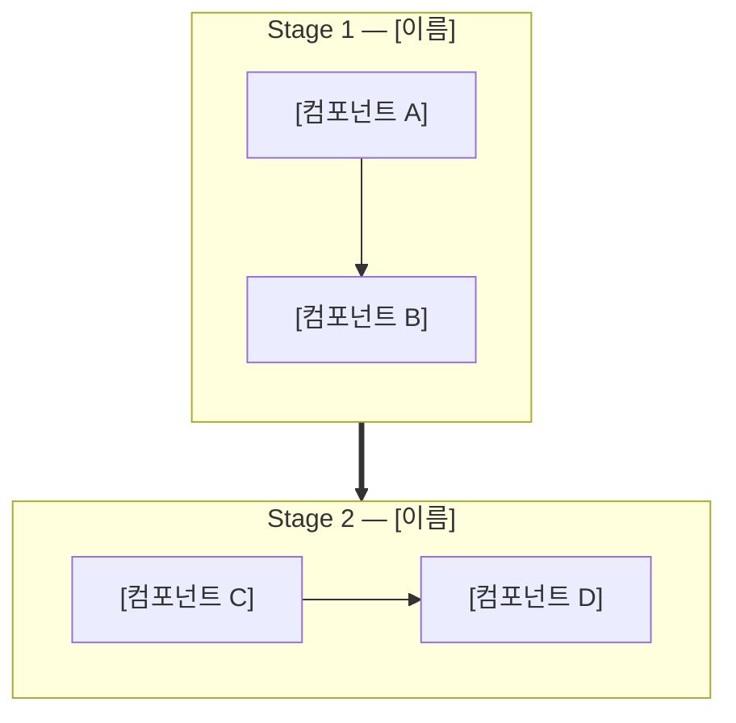

# [프로젝트명] — 아키텍처 설계 명세서

> **[핵심 키워드 나열]**
>
> 문서 버전: v1.0 | 최종 수정일: YYYY-MM-DD | PRD: `plans/PRD.md`

---

## 이 문서의 역할

```
plans/
├── PRD.md               ← 무엇을 / 왜 / 수락 기준
├── ARCHITECTURE.md      ← 이 문서: 어떤 구조로 / 왜 이 구조 / 기술 스택
├── specs/               ← 기능별 구현 단위 (검증 기준 포함)
│   ├── SPEC-000-*.md
│   └── SPEC-NNN-*.md
└── tasks/               ← SPEC별 TDD 구현 계획
    └── TASK-NNN-*.md
```

- **PRD가 정의한 "무엇"을 "어떤 구조"로 만들 것인지** 기술적으로 설계한다
- **개별 SPEC이 이 문서의 해당 절을 참조**하여 구현한다 (예: `→ ARCHITECTURE.md 3.2절`)
- **검증 기준과 완료 조건은 이 문서에 넣지 않는다** — 각 SPEC에서 정의한다

---

## 1. 개요

### 1.1 목적

[이 시스템이 무엇을 하는지 2~3문장. PRD의 "한 줄 설명"을 기술적 관점으로 확장]

### 1.2 설계 원칙

- **[원칙 1]:** [설명 — 예: "LLM은 판단만, 도구는 실행만"]
- **[원칙 2]:** [설명]
- **[원칙 3]:** [설명]
- **[원칙 4]:** [설명]
- **[원칙 5]:** [설명]

### 1.3 버전 이력

| 버전 | 주요 변경 |
|------|-----------|
| v1.0 | 초기 설계 |

---

## 2. 전체 아키텍처

### 2.1 메인 파이프라인

| Stage | 이름 | 역할 | 핵심 패턴 |
|-------|------|------|-----------|
| 1 | [이름] | [역할] | [예: ReAct, 병렬 실행] |
| 2 | [이름] | [역할] | [예: Classical Planning] |
| 3 | [이름] | [역할] | [예: 4레이어 실행] |
| 4 | [이름] | [역할] | [예: 분석 + 리포트] |

### 2.2 횡단 시스템

| 시스템 | 역할 | 데이터 특성 | 연결 대상 |
|--------|------|-------------|-----------|
| [시스템 1] | [역할] | [특성] | [연결 Stage] |
| [시스템 2] | [역할] | [특성] | [연결 Stage] |

### 2.3 전체 구조 다이어그램



---

## 3. Stage 간 인터페이스 계약

> **이 섹션은 아키텍처의 핵심이다.** Stage 간 데이터 형식이 확정되어야 각 Stage를 독립적으로
> 개발할 수 있다. 모든 모델은 Pydantic BaseModel로 구현한다.

### 3.1 Stage 1 → Stage 2

```python
class ReconOutput(BaseModel):
    """Stage 1의 최종 출력. Stage 2 플래너의 입력."""
    # [Stage 1이 생성하는 모든 데이터를 하나로 묶는 래퍼]
    # 예:
    # knowledge_graph: KnowledgeGraph
    # attack_surface: AttackSurface
    # scanner_results: dict[str, ScanResult]
```

### 3.2 Stage 2 → Stage 3

```python
class AttackPlan(BaseModel):
    """Stage 2의 최종 출력. Stage 3 실행기의 입력."""
    # [여러 공격 체인을 랭킹한 목록]
    # 예:
    # chains: list[AttackChain]
    # ranked_order: list[UUID]
    # total_hypotheses: int
```

### 3.3 Stage 3 → Stage 4

```python
class ExploitResult(BaseModel):
    """Stage 3의 최종 출력. Stage 4 분석기의 입력."""
    # [실행 결과 + 증거 + Reflexion 메모리]
    # 예:
    # findings: list[Finding]
    # chain_results: list[ChainResult]
    # reflexion_memory: list[ReflexionEntry]
```

### 3.4 인터페이스 계약 원칙

- **래퍼 모델 필수:** Stage 출력은 반드시 하나의 Pydantic 모델로 묶는다 (dict 전달 금지)
- **Optional 명시:** 아직 구현되지 않은 필드는 `| None`으로 선언하고 기본값 `None`
- **직렬화 가능:** 모든 모델은 `.model_dump_json()`으로 JSON 저장 가능해야 한다
- **역호환:** 필드 추가는 OK, 필드 삭제/타입 변경은 버전 올리고 마이그레이션

---

## 4. [Stage 1 이름] 상세

### 4.1 [컴포넌트 A]

| 항목 | 상세 |
|------|------|
| 패턴 | [예: 순차 ReAct] |
| 이유 | [이 패턴을 선택한 근거] |
| LLM 사용 | [O/X] — [근거] |
| 입력 | [어디서 뭘 받는지] |
| 출력 | [뭘 생성하는지 — 3절의 어느 모델에 포함되는지 명시] |

### 4.2 [컴포넌트 B]

| 항목 | 상세 |
|------|------|
| 패턴 | [패턴명] |
| 이유 | [근거] |
| LLM 사용 | [O/X] |
| 입력 | [입력] |
| 출력 | [출력] |

<!-- 서브 컴포넌트가 있으면 필요한 만큼 확장 -->

---

## 5. [Stage 2 이름] 상세

### 5.1 구성 요소

| 컴포넌트 | 역할 | LLM 사용 |
|----------|------|----------|
| [컴포넌트명] | [역할] | O/X |
| [컴포넌트명] | [역할] | O/X |

### 5.2 [핵심 로직 설명]

[필요한 만큼 서브섹션 추가]

---

## 6. [Stage 3 이름] 상세

<!-- 필요한 만큼 서브섹션 추가 -->

---

## 7. [Stage 4 이름] 상세

<!-- 필요한 만큼 서브섹션 추가 -->

---

## 8. [횡단 시스템 1 — 예: Skill 시스템]

### 8.1 [유형 분류]

| 유형 | 설명 | 사용 위치 |
|------|------|-----------|
| [유형 1] | [설명] | [Stage N] |
| [유형 2] | [설명] | [Stage N] |

### 8.2 [파일 구조 또는 예시]

```
[예시 파일 내용]
```

---

## 9. [횡단 시스템 2 — 예: 미들웨어]

### 9.1 핵심 기능

| 기능 | 설명 |
|------|------|
| [기능 1] | [설명] |
| [기능 2] | [설명] |

---

## 10. [UI/대시보드 — 있는 경우]

### 10.1 아키텍처

[코어와 UI의 분리 원칙, 통신 방식]

### 10.2 핵심 원칙

[UI가 죽어도 코어 동작, 실시간 통신 등]

---

## 11. 안전장치 + 경계

### 11.1 안전 메커니즘

| 안전장치 | 상세 | 구현 위치 |
|----------|------|-----------|
| [장치 1] | [설명] | [위치] |
| [장치 2] | [설명] | [위치] |

### 11.2 경계 (3단계)

- ✅ **항상:**
  - [항상 해야 할 것 1]
  - [항상 해야 할 것 2]

- ⚠️ **먼저 확인 (사용자 승인 후):**
  - [승인 후 할 것 1]
  - [승인 후 할 것 2]

- 🚫 **절대 금지:**
  - [금지 사항 1]
  - [금지 사항 2]

### 11.3 비기능 요구사항

| 항목 | 요구사항 | 근거 |
|------|----------|------|
| 성능 | [구체적 수치] | [이유] |
| 안정성 | [구체적 조건] | [이유] |
| 보안 | [구체적 규칙] | [이유] |
| 확장성 | [구체적 방식] | [이유] |

---

## 12. 아키텍처 요약

### 12.1 컴포넌트별 LLM 사용 여부

| 컴포넌트 | LLM | 근거 |
|----------|-----|------|
| [컴포넌트 1] | O | [이유] |
| [컴포넌트 2] | **X** | [이유] |

### 12.2 비용 최적화 포인트

| 최적화 | 상세 | 절감 효과 |
|--------|------|-----------|
| [최적화 1] | [방법] | [효과] |

### 12.3 설계 검증 근거

| 설계 결정 | 근거 출처 |
|-----------|-----------|
| [결정 1] | [논문/벤치마크/실험 출처] |
| [결정 2] | [논문/벤치마크/실험 출처] |

---

## 13. 프로젝트 구조

### 13.1 전체 디렉토리 구조

```
project-root/
├── src/
│   ├── [모듈1]/          # [역할]
│   ├── [모듈2]/          # [역할]
│   └── [모듈3]/          # [역할]
├── [데이터 디렉토리]/     # [가변 데이터 · .gitignore]
├── tests/                 # src/ 미러 구조
├── plans/                 # 문서 계층
│   ├── PRD.md
│   ├── ARCHITECTURE.md    # 이 문서
│   ├── specs/
│   ├── tasks/
│   └── templates/
├── [설정파일]
└── README.md
```

### 13.2 설계 원칙

- **아키텍처 = 디렉토리:** 이 명세서의 각 컴포넌트가 디렉토리에 1:1 매핑
- **코드와 데이터 분리:** `src/`(불변)와 [데이터 디렉토리](가변) 완전 분리
- **독립 배포 단위:** [어떤 모듈이 독립적으로 테스트/교체 가능한지]

### 13.3 `src/` 상세

| 디렉토리 | 역할 | 아키텍처 매핑 |
|----------|------|---------------|
| `[dir1]/` | [역할] | [이 문서 N절 컴포넌트명] |
| `[dir2]/` | [역할] | [이 문서 N절 컴포넌트명] |

---

## 14. 기술 스택

### 14.1 개요

| 분류 | 기술 | 선정 사유 |
|------|------|-----------|
| 언어 | [예: Python 3.11+] | [사유] |
| 프레임워크 | [예: FastAPI] | [사유] |
| [분류] | [기술] | [사유] |

### 14.2 [핵심 기술 상세 — 예: 프레임워크 선정]

[왜 이 기술을 선택했는지 상세. 대안과 비교. 기각 사유]

### 14.3 주요 패키지

| 패키지 | 역할 | 사용 위치 |
|--------|------|-----------|
| `[패키지1]` | [역할] | [위치] |
| `[패키지2]` | [역할] | [위치] |

### 14.4 커맨드

```bash
# 개발 환경
[설치 커맨드]
[실행 커맨드]

# 품질 관리
[테스트]
[린트]
[타입 체크]

# 패키지 관리
[추가]
[제거]
```

### 14.5 코드 스타일

산문 설명 대신 실제 코드로 보여준다.

#### 좋은 예시 (이렇게 작성)

```python
# ✅ [원칙 설명]
[실제 코드 예시]
```

#### 나쁜 예시 (이렇게 작성하지 않기)

```python
# ❌ [안티패턴 설명]
[실제 안티패턴 코드]
```

#### 컨벤션 요약

- [규칙 1]
- [규칙 2]
- [규칙 3]

---

## 15. [데이터/세션 관리 — 해당 시]

### 15.1 디렉토리 구조

```
[데이터 디렉토리]/
└── [세션 ID]/
    ├── [설정 파일]
    ├── [단계별 결과 디렉토리]/
    └── [로그 디렉토리]/
```

### 15.2 핵심 원칙

- [원칙 1 — 예: 세션 간 격리]
- [원칙 2 — 예: 재개 가능]
- [원칙 3 — 예: 코드와 데이터 분리]

---

## 16. 개발 로드맵

### 16.1 Phase → SPEC 매핑

> 각 Phase의 상세 검증 기준과 완료 조건은 해당 SPEC에서 정의한다.
> 이 표는 전체 흐름만 보여준다.

| Phase | 범위 | 해당 SPEC | 의존성 |
|-------|------|-----------|--------|
| 0 | 테스트 인프라 | SPEC-000 | 없음 |
| 0 | 기반 인프라 | SPEC-001~005 | SPEC-000 |
| 1 | [Stage 1] | SPEC-010~014 | Phase 0 |
| 2 | [Stage 2] | SPEC-020~022 | Phase 1 |
| 3 | [Stage 3 핵심] | SPEC-030~034 | Phase 2 |
| 4 | [Stage 3 확장] | SPEC-040~042 | Phase 3 |
| 5 | [Stage 4] | SPEC-050~052 | Phase 3 |
| 6 | [UI/대시보드] | SPEC-060~065 | Phase 5 |

### 16.2 개발 순서 원칙

- **SPEC-000(테스트 인프라)이 가장 먼저.** 다른 모든 SPEC의 검증이 이에 의존
- 각 Phase가 CLI로 완전히 동작한 뒤 다음 Phase로 진행
- Phase 내 SPEC 순서는 의존성 그래프가 결정
- [프로젝트별 추가 원칙]

---

## 부록 A: 웹 서비스 개발 순서 (해당 시)

> CLI 도구 → API 서버 → 프론트엔드 순서로 개발하는 프로젝트에 해당.

### A.1 Phase 분리 원칙

```
Phase 1: 코어 엔진 (CLI 동작 가능)
  └── 유닛테스트로 검증
  └── SPEC-001~034

Phase 2: REST API 레이어 (프론트 없이 동작 가능)
  └── API 통합테스트 + OpenAPI 계약테스트(schemathesis)로 검증
  └── SPEC-050~055

Phase 3: 프론트엔드 (확정된 API를 소비)
  └── E2E 테스트(Playwright)로 검증
  └── SPEC-060~065
```

### A.2 테스트 피라미드

| 계층 | 테스트 종류 | 비중 | 도구 예시 |
|------|------------|------|-----------|
| L1 | 유닛테스트 | 70% | pytest |
| L2 | API 통합테스트 | 20% | pytest + httpx |
| L3 | E2E 테스트 | 10% | Playwright |

### A.3 API 계약

OpenAPI 스펙을 먼저 정의하고, 이것이 프론트-백엔드 "계약"이 된다.
백엔드와 프론트엔드를 동시에 개발하지 않는다.

---

## 부록 B: 벤치마크 전략 (해당 시)

> 도구의 정확도/성능을 측정해야 하는 프로젝트에 해당.

### B.1 벤치마크 계층

| 계층 | 벤치마크 | 용도 | 우선순위 |
|------|----------|------|----------|
| L1 유닛 | 직접 작성 마이크로 픽스처 | 기능별 정확도 (ground truth 100%) | 필수 |
| L2 정확도 | [업계 표준 벤치마크] | F1 score 측정 | 필수 |
| L3 실전 | [실전 유사 환경] | E2E 정성적 검증 | 권장 |

### B.2 SPEC-000과의 관계

SPEC-000(테스트 인프라)에서 위 벤치마크 환경을 docker-compose로 구축한다.
각 SPEC의 검증 기준이 이 벤치마크를 참조한다.